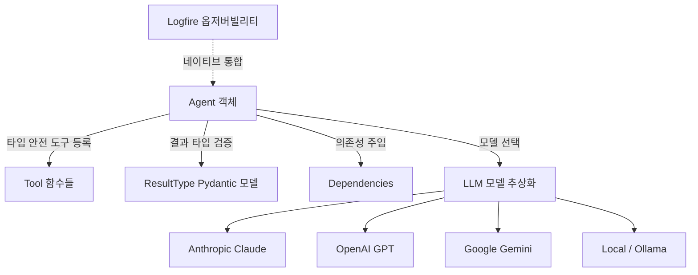
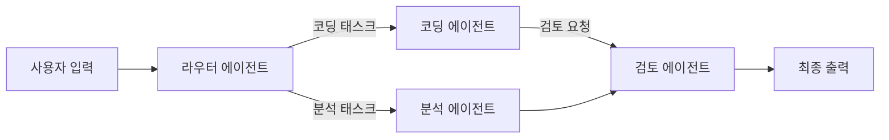

# Pydantic AI

FastAPI식 개발 경험을 가진 타입 안전 Python 에이전트 프레임워크. Samuel Colvin(Pydantic 창시자)이 주도한다.

## 개요

Pydantic AI는 Pydantic의 타입 검증 철학을 AI 에이전트 개발로 확장한 프레임워크다. FastAPI가 웹 API 개발에서 "타입 힌트 = 런타임 검증 = 문서화"를 실현한 것처럼, Pydantic AI는 에이전트의 입력·출력·도구 계약을 Python 타입 시스템으로 정의한다.

2026년 4월까지 수십 번의 릴리스를 거치며 durable execution(내구성 있는 실행), 그래프 기반 오케스트레이션, MCP(Model Context Protocol), Agent2Agent 프로토콜까지 품어 "파이썬 에이전트의 FastAPI"로 자리잡았다.

## 핵심 아키텍처



## 주요 컴포넌트

| 컴포넌트 | 설명 |
|---|---|
| `Agent` | 에이전트의 핵심 추상화. 모델, 도구, 결과 타입, 의존성을 선언 |
| `@agent.tool` | Python 함수를 도구로 등록하는 데코레이터. Pydantic으로 입출력 자동 검증 |
| `ResultType` | 에이전트의 최종 출력 타입. Pydantic 모델 또는 기본 타입 |
| `RunContext` | 실행 컨텍스트. 의존성 주입, 메시지 이력, 모델 설정에 접근 |
| `Graph` | 여러 에이전트를 노드로 연결하는 DAG 기반 오케스트레이션 |

## 기본 사용 예시

```python
from pydantic import BaseModel
from pydantic_ai import Agent

class AnalysisResult(BaseModel):
    summary: str
    confidence: float
    tags: list[str]

agent = Agent(
    'claude-opus-4-6',
    result_type=AnalysisResult,
    system_prompt="당신은 텍스트 분석 전문가입니다."
)

@agent.tool
async def search_knowledge_base(query: str) -> str:
    """지식 베이스에서 관련 정보를 검색합니다."""
    # 실제 검색 로직
    return f"검색 결과: {query}"

result = await agent.run("이 뉴스 기사를 분석해주세요: ...")
print(result.data.summary)  # 타입 안전하게 접근
```

## Graph 기반 멀티 에이전트

2026년 Pydantic AI의 핵심 업데이트 중 하나는 `pydantic_graph`를 통한 에이전트 그래프 지원이다:



각 노드(에이전트)의 입출력이 Pydantic 모델로 타입 정의되므로, 에이전트 간 데이터 흐름이 컴파일 시점에서 검증된다.

## 경쟁 프레임워크 비교

| 항목 | Pydantic AI | LangChain | [[dspy-gepa|DSPy]] | CrewAI |
|---|---|---|---|---|
| 타입 안전 | 강함 (Pydantic) | 약함 | 중간 (Signature) | 약함 |
| 최적화 | 없음 (수동) | 없음 | 자동 (컴파일러) | 없음 |
| 런타임 검증 | 강함 | 약함 | 없음 | 약함 |
| 옵저버빌리티 | Logfire 네이티브 | LangSmith | 별도 설정 | 없음 |
| MCP 지원 | 공식 통합 | 별도 패키지 | 없음 | 없음 |
| 학습 곡선 | FastAPI 익숙하면 낮음 | 높음 | 중간 | 낮음 |

## Durable Execution (내구성 있는 실행)

Pydantic AI는 Temporal, DBOS, Prefect 등 워크플로 엔진과 통합하여 **에이전트 실행의 내구성**을 보장한다:

- 중단 후 재개 (checkpoint/resume)
- 실패 시 자동 재시도 (retry)
- 실행 이력 감사 (audit trail)

이는 단발성 API 호출이 아닌 수 시간 걸리는 에이전트 워크플로를 안정적으로 운영하기 위한 기반이다.

## Logfire 옵저버빌리티

Pydantic이 직접 개발한 옵저버빌리티 플랫폼 Logfire와 네이티브 통합된다:

- 에이전트 실행 트레이스 자동 기록
- 도구 호출 및 LLM 응답 로깅
- 성능 메트릭 및 비용 추적

```python
import logfire
logfire.configure()  # 이것만으로 Pydantic AI 트레이싱 활성화
```

## 왜 지금 중요한가

FastAPI식 개발 경험을 가진 타입 안전 Python 에이전트 프레임워크로, Samuel Colvin(Pydantic 창시자)이 주도하여 2026년 4월까지 수십 번의 릴리스를 거치며 durable execution, 그래프, MCP, Agent2Agent까지 품어 "파이썬 에이전트의 FastAPI"로 자리잡았다.

## 대표 자료

- [Pydantic AI Official Docs](https://ai.pydantic.dev/)
- [pydantic-ai PyPI](https://pypi.org/project/pydantic-ai/)
- [pydantic/pydantic-ai GitHub](https://github.com/pydantic/pydantic-ai)
- [Agent Engineering with Pydantic + Graphs -- Samuel Colvin (Latent Space)](https://www.latent.space/p/pydantic)

## 관련 문서

- [[dspy-gepa|DSPy + GEPA]]
- [[the-2026-mcp-roadmap|The 2026 MCP Roadmap]]
- [[orchestrator-worker-pattern|Orchestrator-Worker 패턴]]
