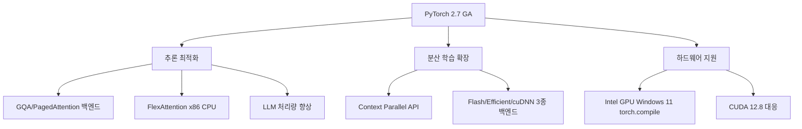

# PyTorch 2.7 출시 노트 - FlexAttention CPU 지원 및 추론 최적화

PyTorch 2.7은 3,262개 커밋과 457명의 기여자가 참여한 대규모 릴리스로, LLM(대규모 언어 모델) 추론 처리량 개선에 집중한 버전이다. GQA(Grouped Query Attention), FlexAttention CPU 지원, 컨텍스트 병렬화 API가 핵심 추가 사항이며, Intel GPU 지원 범위도 확장됐다.

## 릴리스 개요



위 다이어그램은 PyTorch 2.7의 주요 개선 영역 세 가지(추론 최적화, 분산 학습, 하드웨어 지원)와 각 하위 기능 간의 계층 관계를 보여준다.

## 주요 변경 사항

### 1. GQA / PagedAttention 지원 추론 백엔드

PyTorch 2.7에서는 LLM 서빙에서 자주 쓰이는 GQA(Grouped Query Attention)와 PagedAttention을 네이티브 추론 백엔드 수준에서 지원한다.

- **GQA**: MHA(Multi-Head Attention) 대비 KV 캐시 메모리를 절감하는 구조. Llama 3, Gemma 계열 등 최신 모델 대부분이 채택 중
- **PagedAttention**: vLLM이 처음 도입한 방식으로, KV 캐시를 페이지 단위로 관리해 메모리 단편화를 줄임
- 두 기능 모두 `torch.nn.attention` 모듈에서 직접 활용 가능하도록 API가 정비됐다

```python
import torch
from torch.nn.attention import SDPBackend, sdpa_kernel

# GQA 방식 MHA — 쿼리 헤드 수 != KV 헤드 수
q = torch.randn(1, 32, 512, 128)   # (배치, 쿼리 헤드, 시퀀스, 헤드 차원)
k = torch.randn(1, 8, 512, 128)    # KV는 8헤드 (GQA)
v = torch.randn(1, 8, 512, 128)

with sdpa_kernel(SDPBackend.FLASH_ATTENTION):
    out = torch.nn.functional.scaled_dot_product_attention(q, k, v)
```

실무 포인트: PyTorch 2.7 이전에는 GQA를 쓰면 일부 백엔드가 자동 fallback 되거나 경고가 발생했다. 2.7부터는 FLASH_ATTENTION, EFFICIENT_ATTENTION 백엔드 모두 GQA를 명시적으로 지원한다.

### 2. FlexAttention x86 CPU 지원 강화

FlexAttention은 PyTorch 2.5에서 GPU 전용으로 도입된 커스터마이즈 가능한 어텐션 메커니즘이다. 2.7에서는 x86 CPU 백엔드까지 지원 범위가 확장됐다.

- **C++ micro-GEMM 템플릿** 기반으로 구현되어, SIMD(AVX-512 등)를 최대한 활용
- 슬라이딩 윈도우, 인과적 마스킹(causal masking), 상대적 위치 인코딩 등 커스텀 어텐션 패턴을 CPU에서도 실행 가능
- 온디바이스 추론, 엣지 서버 환경에서 GPU 없이 FlexAttention 패턴을 쓸 수 있게 됨

```python
from torch.nn.attention.flex_attention import flex_attention, create_block_mask

# 슬라이딩 윈도우 마스크 (윈도우 크기 512)
def sliding_window(b, h, q_idx, kv_idx):
    return q_idx - kv_idx < 512

block_mask = create_block_mask(sliding_window, B=1, H=1, Q_LEN=2048, KV_LEN=2048)

# CPU에서도 동작 (PyTorch 2.7+)
output = flex_attention(query, key, value, block_mask=block_mask)
```

### 3. Context Parallel API

긴 시퀀스 학습 시 시퀀스 차원을 여러 디바이스에 분할하는 컨텍스트 병렬화(Context Parallelism) API가 공식화됐다.

| 백엔드 | 특징 |
|--------|------|
| FlashAttention | Ring Attention 방식, 시퀀스 청크를 순환 전달 |
| EfficientAttention | xformers 기반, 메모리 효율 중시 |
| cuDNN Attention | NVIDIA 하드웨어 최적화, 높은 처리량 |

3종 백엔드를 선택적으로 쓸 수 있으며, 분산 학습 설정에서 `context_parallel_size` 파라미터 하나로 제어된다.

```python
from torch.distributed.tensor.parallel import parallelize_module
from torch.distributed._tensor import DeviceMesh

mesh = DeviceMesh("cuda", [[0, 1, 2, 3]])  # 4-GPU ring
# context_parallel_size=4 로 시퀀스를 4개 GPU에 분할
```

### 4. Intel GPU Windows 11 torch.compile 지원

- Intel Arc / Xe GPU에서 Windows 11 환경의 `torch.compile` 지원
- DirectML 백엔드와 별개로, PyTorch 네이티브 컴파일 경로를 통해 그래프 최적화 적용 가능
- 기업 환경에서 Intel 워크스테이션을 활용하는 추론 워크로드에 유의미

## 성능 영향

LLM 추론 처리량 기준 개선 수치(공식 블로그 발표):

| 시나리오 | 개선폭 |
|----------|--------|
| GQA 활성화 후 SDPA 처리량 | 최대 1.8x (Llama-3-8B 기준) |
| FlexAttention CPU (슬라이딩 윈도우) | 기존 사용자 구현 대비 ~1.3x |
| Context Parallel (4-GPU, 32K 시퀀스) | 선형 스케일링에 근접 |

## 업그레이드 시 주의사항

- **Python 3.9 지원 종료**: PyTorch 2.7부터 Python 3.9는 지원하지 않음. 3.10 이상 권장
- **CUDA 최소 버전**: CUDA 11.8+ 필요. CUDA 12.x 계열(특히 12.4, 12.8) 최적화됨
- **torch.compile 변경**: `torch._dynamo.config` 일부 내부 옵션 경로가 변경됨. 공식 마이그레이션 가이드 확인 필요

```bash
# 업그레이드
pip install --upgrade torch==2.7.0 torchvision==0.22.0 torchaudio==2.7.0

# CUDA 버전 확인
python -c "import torch; print(torch.version.cuda)"
```

## 이 릴리스의 위치

PyTorch 로드맵상 2.7은 "추론 중심 전환점"으로 볼 수 있다. 2.x 시리즈 초기(2.0~2.3)가 `torch.compile` 도입과 트레이닝 최적화에 집중했다면, 2.5 이후부터는 서빙/추론 측 개선이 두드러진다.

- [[vllm]] — vLLM v0.18/v0.19가 PyTorch 2.7의 GQA/PagedAttention API를 활용
- [[vllm-v018-v019-updates]] — FlexKV 오프로딩 등 vLLM 측 개선과 연계
- [[pytorch-deep-learning]] — PyTorch 기반 딥러닝 학습 가이드 (기초)

## 관련 문서

- [[vllm]] — PagedAttention 최초 도입 프레임워크
- [[vllm-v018-v019-updates]] — 동기간 vLLM 업데이트
- [[pytorch-deep-learning]] — PyTorch 전반 개요
- [[flashinfer]] — FlexAttention과 유사한 커스텀 어텐션 커널 라이브러리
