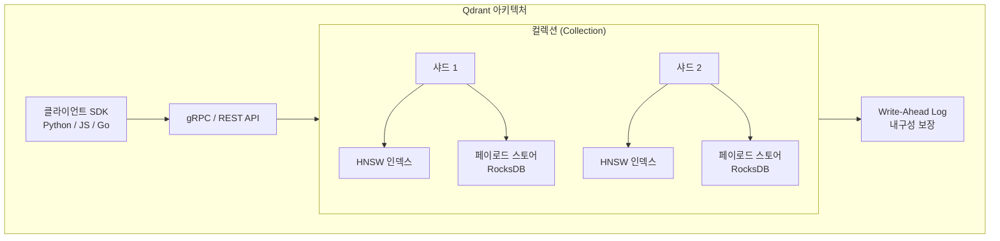
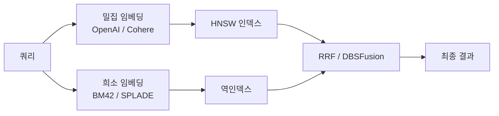

# Qdrant

Rust로 작성된 오픈소스 고성능 벡터 검색 엔진. 2021년 Andrey Vasnetsov가 설립한 Qdrant Solutions GmbH가 개발한다. 메모리 안전성과 성능을 동시에 추구하는 Rust의 특성을 바탕으로, 대용량 프로덕션 워크로드에 적합한 벡터 데이터베이스를 지향한다.

## 개요

| 항목 | 내용 |
|---|---|
| 이름 | Qdrant |
| 개발사 | Qdrant Solutions GmbH (독일) |
| 라이선스 | Apache 2.0 |
| 저장소 | github.com/qdrant/qdrant |
| 코어 언어 | Rust |
| 클라이언트 | Python, JavaScript/TypeScript, Go, Rust, Java |
| 배포 형태 | 로컬(Docker), 클라우드(Qdrant Cloud) |

## 핵심 설계 원칙



Qdrant는 각 컬렉션을 샤드로 분할하며, 벡터 인덱스(HNSW)와 페이로드(메타데이터) 스토어를 분리하여 관리한다.

## 핵심 개념

### 포인트 (Point)

Qdrant의 기본 저장 단위는 "포인트"다. 각 포인트는 ID, 벡터, 페이로드(임의 JSON)로 구성된다.

```python
from qdrant_client import QdrantClient
from qdrant_client.models import Distance, VectorParams, PointStruct

client = QdrantClient(url="http://localhost:6333")

# 컬렉션 생성
client.create_collection(
    collection_name="articles",
    vectors_config=VectorParams(size=1536, distance=Distance.COSINE),
)

# 포인트 업로드
client.upsert(
    collection_name="articles",
    points=[
        PointStruct(
            id=1,
            vector=[0.1, 0.2, ...],
            payload={"title": "Qdrant 소개", "category": "tooling", "year": 2026},
        ),
    ],
)
```

### 페이로드 필터링

Qdrant의 필터링 시스템은 풍부한 조건식을 지원한다.

```python
from qdrant_client.models import Filter, FieldCondition, MatchValue, Range

results = client.search(
    collection_name="articles",
    query_vector=query_embedding,
    query_filter=Filter(
        must=[
            FieldCondition(key="category", match=MatchValue(value="tooling")),
            FieldCondition(key="year", range=Range(gte=2025)),
        ]
    ),
    limit=10,
)
```

`must`, `should`, `must_not` 논리 연산자와 `match`, `range`, `geo_bounding_box`, `values_count` 등 다양한 조건을 지원한다.

## 하이브리드 검색

Qdrant는 밀집 벡터(Dense)와 희소 벡터(Sparse)를 단일 컬렉션에서 함께 운용하는 하이브리드 검색을 지원한다.



```python
from qdrant_client.models import SparseVector, SparseIndexParams

# 희소 벡터 필드 추가 (컬렉션 생성 시)
client.create_collection(
    collection_name="hybrid",
    vectors_config={"dense": VectorParams(size=1536, distance=Distance.COSINE)},
    sparse_vectors_config={"sparse": SparseIndexParams()},
)
```

## 양자화 (Quantization)

메모리 사용량과 검색 속도를 최적화하는 양자화 기능을 내장한다.

| 방식 | 압축률 | 정확도 손실 | 특징 |
|---|---|---|---|
| Scalar Quantization (SQ) | ~4x | 최소 | float32 → int8 변환 |
| Product Quantization (PQ) | ~16x~64x | 중간 | 부분 벡터 코드북 압축 |
| Binary Quantization (BQ) | ~32x | 높음 | 단일 비트 인코딩, 극단적 압축 |

## Qdrant vs 경쟁 제품

| 항목 | Qdrant | [[faiss|FAISS]] | [[weaviate|Weaviate]] | [[pinecone|Pinecone]] |
|---|---|---|---|---|
| 코어 언어 | Rust | C++ | Go | 비공개 |
| 페이로드 필터 | 풍부 | 없음 | 중간 | 중간 |
| 하이브리드 검색 | 내장 (Dense+Sparse) | 없음 | 내장 (BM25) | 없음 |
| 양자화 | SQ/PQ/BQ 내장 | 일부 | 없음 | 관리형 |
| 스냅샷/백업 | 내장 | 없음 | 있음 | 관리형 |
| 온프레미스 | 지원 | 지원 | 지원 | 불가 |

## 멀티벡터 검색

Qdrant는 단일 포인트에 여러 벡터를 저장하는 멀티벡터를 지원한다. 문서의 제목, 본문, 요약 등을 각각 임베딩하여 함께 저장하고, 상황에 따라 적합한 벡터 필드로 검색할 수 있다.

## 실무 관점

Qdrant는 **Rust 기반의 메모리 안전성과 성능**이 필요한 대규모 프로덕션 환경에 적합하다. 풍부한 페이로드 필터링, Dense+Sparse 하이브리드 검색, 다양한 양자화 옵션이 강점이다. 자체 호스팅이 가능하므로 데이터 소유권이 중요한 환경에서 [[pinecone|Pinecone]] 대신 선택하는 경우가 많다. [[faiss|FAISS]]에 비해 완성된 DB 기능(필터, 페이로드, REST/gRPC API, 스냅샷)을 제공하지만, 단순 인메모리 ANN 검색은 FAISS가 더 가볍다.

## 관련 문서

- [[faiss|FAISS]]
- [[weaviate|Weaviate]]
- [[pinecone|Pinecone]]
- [[chroma-db|ChromaDB]]
- [[rag-pipeline|RAG 파이프라인]]
