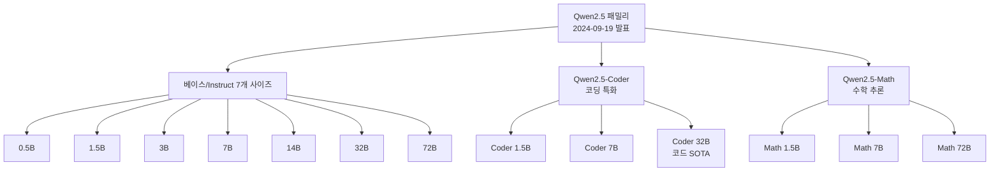
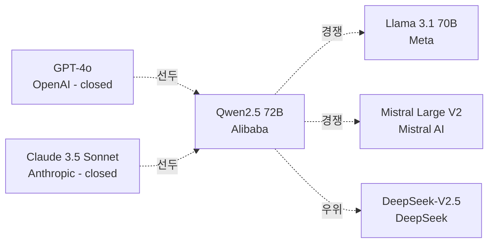

# Qwen 2.5

Qwen 2.5는 Alibaba Cloud Qwen 팀이 2024년 9월 19일 Apsara Conference에서 공개한 오픈웨이트 LLM 패밀리다. 0.5B부터 72B까지 7개 베이스 사이즈(0.5B / 1.5B / 3B / 7B / 14B / 32B / 72B)에 더해 코딩 특화 Qwen2.5-Coder, 수학 특화 Qwen2.5-Math 변종을 포함한다. 이전 세대 Qwen2의 7T 토큰 사전학습 대비 약 2.6배 늘어난 18조(18T) 토큰으로 훈련됐고, 29개 이상 언어 지원과 128K 컨텍스트(생성 8K)를 갖췄다. 대부분 모델이 Apache 2.0 라이선스로 공개되어 오픈웨이트 LLM 시장의 SOTA 베이스라인 중 하나로 자리 잡았다.

## 모델 라인업

7개의 베이스 모델은 모두 Instruct 변종을 함께 제공한다. 변종 중 3B와 72B는 라이선스 제약이 있지만 나머지는 모두 Apache 2.0이다. Qwen2.5-Coder는 5.5조 코드 토큰으로 추가 학습됐고, Qwen2.5-Math는 Chain-of-Thought, Program-of-Thought, Tool-Integrated Reasoning을 함께 활용해 수학 벤치마크에서 강한 성능을 낸다.

## 핵심 사양

| 항목 | Qwen 2.5 | Qwen 2 대비 |
|------|----------|-------------|
| 사전학습 토큰 | 최대 18조 | 약 2.6배 (Qwen2 7T) |
| 베이스 사이즈 | 0.5B / 1.5B / 3B / 7B / 14B / 32B / 72B | 라인업 확장 |
| 컨텍스트 길이 | 128K 입력 / 8K 생성 | 동일 패밀리 유지 |
| 다국어 지원 | 29+ 언어 | 강화 |
| MMLU | 85+ | 향상 |
| HumanEval | 85+ | 큰 폭 향상 |
| MATH | 80+ | 큰 폭 향상 |
| 라이선스 | Apache 2.0 (3B/72B 제외) | 동일 |

29개 이상 언어에는 중국어, 영어, 프랑스어, 스페인어, 포르투갈어, 독일어, 이탈리아어, 러시아어, 일본어, 한국어, 베트남어, 태국어, 아랍어 등이 포함된다. 구조화된 데이터(테이블) 이해와 JSON 등 구조화 출력 생성 능력이 Qwen2 대비 큰 폭으로 향상됐다.

## 위치 — 오픈웨이트 LLM 시장에서

Qwen 발표 자료에 따르면 Qwen2.5-72B는 Llama 3.1 70B, Mistral-Large-V2와 경쟁 가능하며, 클로즈드 API인 Qwen-Plus는 DeepSeek-V2.5를 앞서지만 GPT-4o와 Claude 3.5 Sonnet에는 미치지 못한다. 코드 영역에서는 Qwen2.5-Coder 32B가 출시 시점 오픈웨이트 코드 모델 중 SOTA로 평가됐다.

## 후속 — Qwen 3 라인

2025년 4월 이후 출시된 Qwen 3는 Dense 모델 0.6B-32B와 MoE 30B-A3B / 235B-A22B 변종을 포함하며, "Thinking" 모드와 일반 모드 전환이 가능해졌다. 컨텍스트는 256K 기본/1M 확장, 100개 이상 언어 지원으로 확장됐다. 즉 Qwen 2.5는 Qwen 3 이전 세대 마지막 메이저 릴리스이자, 현재까지도 많은 오픈소스 파인튜닝/리서치 베이스로 활용되는 세대다.

## 배포/통합 생태계

| 카테고리 | 옵션 |
|----------|------|
| 추론 서버 | vLLM, SGLang, TensorRT-LLM, MindIE (Ascend NPU) |
| 클라이언트 통합 | HuggingFace Transformers (4.51.0+), llama.cpp, Ollama, LMStudio |
| 모바일/엣지 | ExecuTorch, MLX LM, OpenVINO, MNN |
| 클라우드 API | Alibaba Cloud Model Studio (Qwen-Plus, Qwen-Max) |
| 다운로드 통계 | HuggingFace에서 누적 수억 다운로드 [교차검증 필요] |

다수의 오픈소스 프로젝트가 Qwen2.5를 RLHF/DPO 베이스라인으로 채택했고, 한국 오픈소스 커뮤니티(예: KoAlpaca 후속 프로젝트)에서도 Korean 파인튜닝 베이스로 활용됐다. [교차검증 필요: 한국어 특정 파인튜닝 사례는 개별 프로젝트별로 확인 필요.]

## 실무 관점

- **모델 사이즈 선택**: 소형(0.5B/1.5B)은 모바일/엣지 추론, 중형(7B/14B)은 단일 GPU 파인튜닝, 32B/72B는 멀티-GPU 추론과 SFT/DPO에 적합하다.
- **코드 워크로드**: Coder 32B가 GPT-4 클래스 코드 생성에 가장 근접한 오픈웨이트 모델 중 하나라 LLM 코딩 어시스턴트의 셀프호스팅 베이스로 자주 선택된다.
- **다국어 한국어 응답**: 한국어 표면적 품질은 양호하나 한국 문화/관용 표현은 추가 파인튜닝이 권장된다.
- **라이선스 주의**: 3B와 72B는 Apache 2.0이 아닌 Qwen 자체 라이선스다. 상업 적용 전 라이선스 조건 확인 필수.

## 관련 문서

- [[mixtral-paper]] — 동시기 오픈웨이트 MoE 베이스라인
- [[deepseek-v3-paper]] — Qwen2.5 이후 등장한 대형 오픈웨이트
- [[long-context-scaling]] — 128K 컨텍스트 학습/서빙 기법
- [[code-generation-llm]] — 코드 생성 LLM 일반론 (Qwen2.5-Coder 사례)
- [[qwen-25-training]] — Qwen2.5 학습 파이프라인 디테일
- [[qwen3-6-plus]] — Qwen3 계열 후속 모델
- [[qwen-3-5-omni]] — Qwen 멀티모달 라인
- [[mixtral-training]] — Mixtral 학습 비교

## 1차 소스

- Qwen Team Blog, "Qwen2.5: A Party of Foundation Models!" (qwenlm.github.io/blog/qwen2.5/, 2024-09-19)
- GitHub QwenLM/Qwen2.5 (모델 카드, 라이선스, 기술 보고서)
- Alibaba Cloud Community, "Qwen2.5: A Party of Foundation Models" (alibabacloud.com)
- DeepLearning.AI The Batch, "Alibaba Releases Qwen 2.5 Models, Raising the Bar for Open Weight LLMs"
- HuggingFace, Qwen 조직 페이지 (huggingface.co/Qwen)
