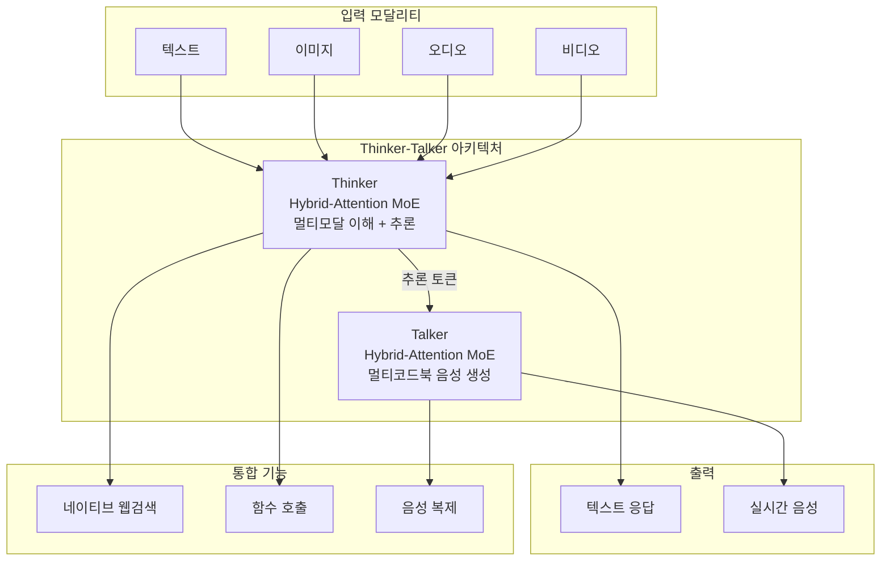

## 개요

Qwen 3.5 Omni는 Alibaba Qwen 팀이 2026년 3월 30일 출시한 네이티브 옴니모달 AI 모델이다. Thinker-Talker 아키텍처를 채택하여 텍스트, 이미지, 오디오, 비디오를 단일 추론 호출에서 입출력으로 처리한다. 256K 컨텍스트 윈도우, 113개 언어 음성인식, 36개 언어 음성생성을 지원하며, 실시간 웹검색과 함수 호출 기능을 내장했다.

## 핵심 특징

- **Thinker-Talker 아키텍처**: Thinker가 멀티모달 입력 이해/추론을 수행하고, Talker가 멀티코드북 기반 음성 응답을 생성한다. 두 컴포넌트 모두 Hybrid-Attention MoE(Mixture of Experts) 구조를 채택하여 효율성과 성능의 균형을 달성한다
- **256K 컨텍스트 윈도우**: 10시간 이상의 연속 오디오, 약 400초 분량의 720p 비디오(1FPS), 약 190,000단어(소설 분량)의 텍스트를 단일 추론에서 처리
- **113개 언어 음성인식**: 이전 세대(19개) 대비 약 6배 확대
- **36개 언어 음성생성**: 이전 세대(10개)에서 3.6배 확대
- **ARIA 기술**: 기술 용어, 제품명, 숫자의 오발음을 제거하는 동적 텍스트-음성 동기화 레이어. 일반 TTS에서 흔한 숫자/약어 오독 문제를 근본적으로 해결
- **시맨틱 인터럽션**: 네이티브 턴테이킹 의도 인식을 통해 맞장구(backchannel)와 실제 중단 명령을 구분하는 자연스러운 대화 흐름 구현
- **네이티브 웹검색**: 실시간 정보가 필요한 경우 자율적으로 웹검색을 수행하며, 함수 호출(function calling) 기능도 내장
- **음성 복제**: Plus/Flash 변형에서 API를 통해 사용자 지정 음성 샘플로 어시스턴트 목소리를 커스터마이징. 음성 안정성 지표(Seed-zh)에서 1.07을 기록하여 ElevenLabs(13.08)를 크게 능가

## 아키텍처

## 모델 변형

| 변형 | 용도 | 특징 |
|---|---|---|
| **Plus** | 최대 품질 | 30B MoE (토큰당 일부 파라미터만 활성화), 복잡한 추론, 음성 복제 지원. 40GB+ VRAM 필요 |
| **Flash** | 균형 속도/품질 | 프로덕션 API 권장. 비용 대비 성능 최적화 |
| **Light** | 저지연 | 모바일/엣지 배포 최적화. 실시간 응답 우선 |

세 변형 모두 전체 입력 모달리티 스택(텍스트, 이미지, 오디오, 비디오)을 지원한다. 과금은 모달리티별(오디오 토큰, 비디오 프레임, 텍스트 토큰) 단위로 청구되며, 웹 인터페이스는 무료 티어를 제공한다.

## 기술 상세

### 벤치마크

36개 오디오/시청각 벤치마크 중 32개에서 SOTA를 달성했으며, 22개에서는 신규 SOTA를 수립했다.

| 벤치마크 | Qwen 3.5 Omni | Gemini 3.1 Pro | 영역 |
|---|---|---|---|
| MMAU | 82.2 | 81.1 | 오디오 이해 |
| VoiceBench | 93.1 | 88.9 | 음성 품질 |
| LibriSpeech (clean/other) | 1.11 / 2.23 | 3.36 / 4.41 | 음성 인식 WER |
| MMMU-Pro | 73.9 | - | 비전 이해 |
| MMLU-Redux | 94.2 | - | 텍스트 추론 |

- 일반 오디오 이해, 추론, 번역에서 [[gemini-3-1-pro]]를 능가하며, 시청각 이해에서는 동등 수준이다
- 음성 생성 품질은 ElevenLabs, GPT-Audio, Minimax를 20개 언어에서 초과한다
- 음성 복제 유사도(multilingual)는 0.79-0.80으로 높은 화자 일치도를 보인다

### 오디오-비주얼 바이브 코딩

화면 녹화를 코드로 변환하는 독특한 기능을 제공한다. 개발자가 화면에서 보여주는 내용을 모델이 시각적 컨텍스트로 이해하고 작동하는 코드를 생성한다. 기존 스크린샷 기반 코드 생성과 달리, 영상의 시간축 변화를 추적하여 인터랙션 로직까지 추론한다.

### 음성 제어

종단 간(end-to-end) 음성 대화를 지원하며, 볼륨, 속도, 감정 톤(속삭임, 외침 등) 조절이 가능하다. Realtime API(WebSocket 기반)를 통해 실시간 오디오/비디오 인터랙션을 구현할 수 있어, 음성 어시스턴트, 콜센터 자동화, 실시간 번역 등에 적합하다.

## 접근 방법

- **Qwen Chat**: 웹 인터페이스(qwen.ai)
- **Alibaba Cloud DashScope API**: 프로덕션 환경
- **Realtime API**: WebSocket 기반 실시간 오디오/비디오 인터랙션
- **HuggingFace Hub**: 로컬 배포
- **ModelScope**: 중국 본토 사용자

## 관련 문서

- [[qwen3-6-plus]] - Qwen 텍스트 전용 최신 모델
- [[voxtral-tts]] - Mistral의 음성합성 모델
- [[gemini-3-1-pro]] - Google의 프론티어 모델
- [[gemma-4]] - Google의 오픈소스 멀티모달 모델
