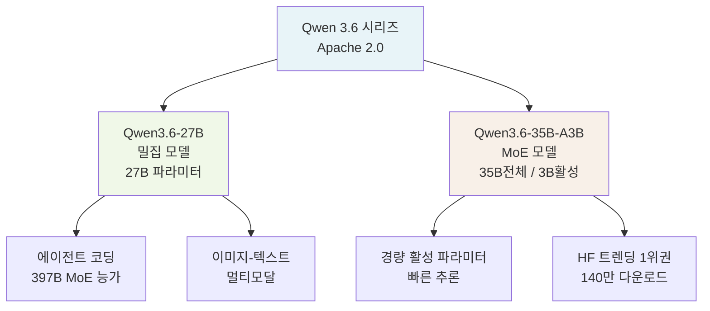
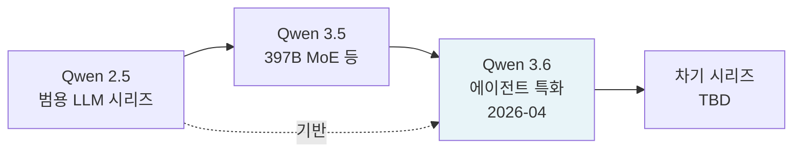

# Qwen 3.6 시리즈 - 에이전트 코딩 특화 오픈소스 멀티모달 모델

Qwen 3.6은 2026년 4월 Alibaba Qwen 팀이 공개한 오픈소스 AI 모델 시리즈다. 27B 밀집(dense) 모델과 35B-A3B MoE 모델 두 변형으로 구성되며, 에이전트 코딩(agentic coding) 벤치마크에서 훨씬 큰 모델들을 능가하는 뛰어난 효율을 보인다. 모두 Apache 2.0 라이선스로 공개된다.

## 개요

| 항목 | Qwen3.6-27B | Qwen3.6-35B-A3B |
|------|-------------|-----------------|
| 출시일 | 2026년 4월 21일 | 2026년 4월 15-16일 |
| 아키텍처 | Dense (밀집) | MoE |
| 전체 파라미터 | 27B | 35B |
| 활성 파라미터 | 27B | 3B |
| 멀티모달 | 이미지+텍스트 | 이미지+텍스트 |
| 라이선스 | Apache 2.0 | Apache 2.0 |
| HuggingFace 트렌딩 | 852점 | 140만 다운로드 |

## 시리즈 구성



## Qwen3.6-27B: 밀집 모델의 역설

### 에이전트 코딩 벤치마크 돌파

Qwen3.6-27B의 가장 주목할 특징은 **27B 파라미터 밀집 모델이 397B MoE 모델(Qwen3.5-397B-A17B)을 에이전트 코딩 벤치마크에서 능가**한다는 점이다. 이는 단순히 모델 크기가 성능을 결정하지 않는다는 것을 보여주며, 학습 데이터 구성과 파인튜닝 전략이 특정 태스크에서 결정적 역할을 함을 시사한다.

에이전트 코딩 태스크란 다음을 포함한다:
- 도구 호출(tool use) 및 함수 실행
- 멀티스텝 코드 작성 및 디버깅
- 환경 피드백을 반영한 반복 실행
- 장기 계획 수립 후 코드로 구현

### 멀티모달 지원

이미지-텍스트 입력을 동시에 처리하는 멀티모달 기능을 탑재한다. 화면 스크린샷을 분석하거나, 다이어그램을 해석하고 코드를 생성하는 등 에이전트 코딩의 시각적 컨텍스트 이해에 활용된다.

## Qwen3.6-35B-A3B: MoE 경량 변형

### 35B 전체 / 3B 활성 구조

전체 파라미터는 35B이지만 추론 시 3B만 활성화된다. 이는 [[mixture-of-experts]] 구조의 전형적 활용으로, 큰 지식 저장 용량과 빠른 추론 속도를 동시에 달성한다.

활성 파라미터가 3B에 불과하므로:
- 소비자급 GPU(24GB VRAM)에서 실행 가능
- 배치 처리 처리량(throughput) 높음
- 엣지/온디바이스 서빙 잠재력 있음

### HuggingFace 트렌딩 장악

출시 직후 HuggingFace 트렌딩 스코어 140만 다운로드를 기록하며 커뮤니티의 높은 관심을 받았다. DFlash([[dflash-block-diffusion-decoding]]) 등 커뮤니티 최적화 버전(`z-lab/Qwen3.6-35B-A3B-DFlash`)도 빠르게 등장했다.

## 학습 및 설계 철학

Qwen 시리즈는 [[qwen-2-5]]에서 확립한 방향을 계승하면서 다음을 강화했다:

1. **에이전트 데이터 특화 학습**: 에이전트 코딩 태스크 특화 데이터셋으로 사후 학습(post-training) 집중
2. **멀티모달 통합**: 텍스트-이미지 페어 데이터로 시각 이해 능력 내재화
3. **Apache 2.0 개방성**: 상업적 활용과 커뮤니티 파생 작업 전면 허용

## 실무 활용

### 에이전트 코딩 프레임워크 통합

```python
# LangGraph + Qwen3.6-27B 에이전트 코딩 예시 (개략)
from langchain_community.chat_models import ChatOllama
from langgraph.prebuilt import create_react_agent

# 로컬 ollama로 Qwen3.6-27B 실행 시
llm = ChatOllama(model="qwen3.6:27b", temperature=0)

tools = [python_repl_tool, file_read_tool, bash_tool]
agent = create_react_agent(llm, tools)

result = agent.invoke({
    "messages": [("human", "현재 디렉토리의 Python 파일에서 성능 병목을 찾아 최적화해줘")]
})
```

### 양자화 서빙

```python
# vLLM + AWQ 양자화로 35B-A3B 서빙
from vllm import LLM

llm = LLM(
    model="Qwen/Qwen3.6-35B-A3B",
    quantization="awq",
    tensor_parallel_size=2,
)
```

## Qwen 시리즈 진화



[[qwen-2-5]] 시리즈의 경험을 바탕으로, Qwen 3.6은 에이전트 코딩이라는 구체적 용도에 최적화된 방향으로 발전했다.

## 왜 중요한가

Qwen3.6 시리즈는 다음 시사점을 제공한다:

1. **크기 vs 전문화**: 27B 밀집 모델이 397B MoE를 이기는 것은 학습 데이터와 파인튜닝 전략의 중요성을 강조
2. **MoE 대중화**: 35B-A3B처럼 소비자급 GPU에서 실행 가능한 MoE 모델은 로컬 에이전트 개발 저변 확대
3. **오픈소스 에이전트 생태계**: Apache 2.0 라이선스로 기업 내 에이전트 코딩 시스템 구축에 직접 활용 가능

## 관련 문서

- [[qwen-2-5]] - Qwen 이전 세대 모델
- [[mixture-of-experts]] - MoE 아키텍처 개념
- [[dflash-block-diffusion-decoding]] - Qwen3.6-35B-A3B용 DFlash 최적화 버전 등장
- [[deepseek-v4-pro]] - 동시기 경쟁 오픈웨이트 대형 MoE 모델
- [[agentic-coding]] - 에이전트 코딩 개념
