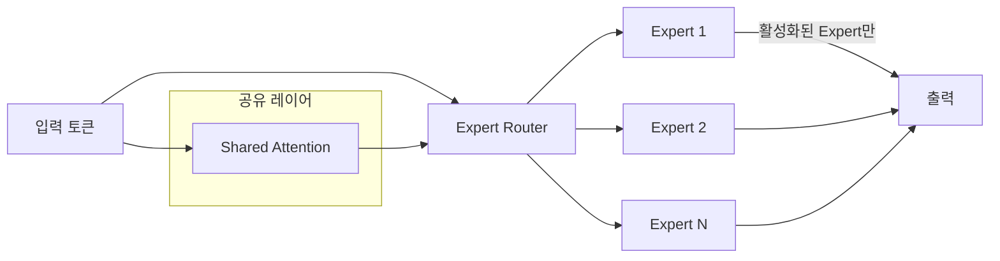

# Qwen3.6-Plus

2026년 4월 Alibaba가 공개한 Qwen 플래그십 (1M 컨텍스트, 항상 [[ai-reasoning-models|reasoning]]).

## 모델 개요

Qwen3.6-Plus는 Alibaba Cloud가 2026년 4월 2일 출시한 플래그십 언어 모델이다. 핵심 특징은 세 가지다.

1. **1M 토큰 컨텍스트**: 긴 문서, 대형 코드베이스, 멀티턴 대화를 단일 컨텍스트 창에서 처리 가능
2. **항상 활성화되는 추론(Always-on Reasoning)**: 별도 reasoning 모드 스위치 없이 모든 프롬프트에서 체인-오브-소트(chain-of-thought) 기반 추론이 기본 활성화
3. **MoE(Mixture-of-Experts) 아키텍처**: 추론 시 전체 파라미터 중 일부만 활성화하여 비용 대비 성능 최적화

## 아키텍처 특징

MoE 구조에서는 라우터가 각 토큰에 적합한 전문가(expert)를 선택한다. Qwen3.6-Plus는 전체 파라미터 수 대비 활성화 파라미터 수를 낮게 유지해 추론 비용을 절감한다.

## 주요 사양 및 벤치마크

| 항목 | 값 |
|---|---|
| 컨텍스트 길이 | 1,000,000 토큰 |
| 아키텍처 | MoE (Mixture of Experts) |
| 추론 모드 | Always-on (모든 쿼리에 CoT 적용) |
| 출시일 | 2026년 4월 2일 |
| OpenRouter 일일 트래픽 피크 | 1.4조 토큰 (출시 당일, 단일 모델 역대 최고) |

[교차검증 필요] 구체적인 전체/활성화 파라미터 수 및 개별 벤치마크 수치는 공식 발표 자료에서 직접 확인 권장.

## API 접근 및 가격

Alibaba Cloud Model Studio를 통해 API 제공. 구체적인 토큰 단가는 [공식 문서](https://www.alibabacloud.com/help/en/model-studio/models)에서 확인해야 하며, MoE 특성상 활성화 파라미터 기준으로 과금 구조가 설계될 가능성이 높다 [교차검증 필요].

## Always-on Reasoning의 의미

기존 모델들(예: o1, o3, Claude의 extended thinking)은 사용자가 명시적으로 "추론 모드"를 선택해야 했다. Qwen3.6-Plus는 이를 기본값으로 내장했다는 점에서 차별화된다. 장점은 복잡한 쿼리에서 별도 설정 없이 높은 정확도를 얻을 수 있다는 것이고, 단점은 단순 쿼리에서도 추론 오버헤드가 발생하여 지연시간(latency)과 비용이 증가한다는 점이다.

## 경쟁 모델 비교

| 모델 | 출시일 | 컨텍스트 | Reasoning | 아키텍처 |
|---|---|---|---|---|
| Qwen3.6-Plus | 2026-04 | 1M | Always-on | MoE |
| [[claude-opus-4-6|Claude Opus 4.6]] | 2026-02 | 1M | Extended Thinking | Dense |
| [[glm-5-1|GLM-5.1]] | 2026-04 | 128K | On-demand | MoE 754B |
| GPT-5.4 | - | - | On-demand | 미공개 |

## 왜 지금 중요한가

2026년 4월 2일 공식 출시. 기본 1M 토큰 컨텍스트와 모든 프롬프트에서 reasoning이 상시 활성화되는 구조로, 출시 당일 OpenRouter 단일 모델 일일 사용량 1.4조 토큰 역대 최고치를 기록하며 에이전트 코딩/멀티모달 워크로드를 흡수 중이다. [[glm-5-1]]과 비교하면 중국 빅테크 두 진영의 플래그십 경쟁이 보인다.

## 대표 자료

- [Alibaba Unveils Qwen3.6-Plus -- Alibaba Cloud Community](https://www.alibabacloud.com/blog/alibaba-unveils-qwen3-6-plus-to-accelerate-agentic-ai-deployment-for-enterprises-and-alibaba%E2%80%99s-ai-applications_603000)
- [Qwen -- Wikipedia](https://en.wikipedia.org/wiki/Qwen)
- [Qwen3-Max-Thinking Blog -- Qwen](https://qwen.ai/blog?id=qwen3-max-thinking)
- [Supported Models -- Alibaba Cloud Model Studio](https://www.alibabacloud.com/help/en/model-studio/models)

## 관련 문서

- [[glm-5-1|GLM-5.1]]
- [[claude-opus-4-6|Claude Opus 4.6]]
- [[ai-reasoning-models|AI 추론 모델]]
