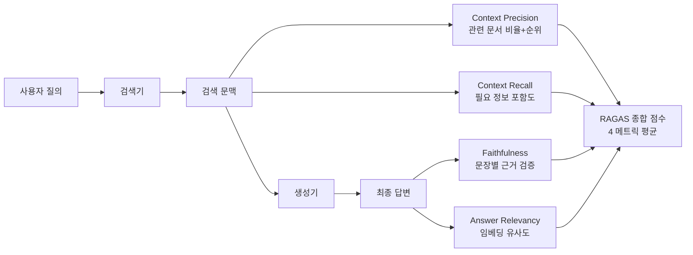

# Ragas (RAG Evaluation)

## 개요

Ragas는 검색 증강 생성([[rag-evaluation-and-observability|RAG]]) 파이프라인 전용 평가 프레임워크로, 참조 없는(reference-free) 평가를 핵심 설계 원칙으로 삼는다. 문맥 정밀도(Context Precision), 충실도(Faithfulness), 답변 관련성(Answer Relevancy), 문맥 재현율(Context Recall) 4개 메트릭을 결합하여 RAG 시스템의 검색-생성 품질을 다차원으로 측정한다.

기존 RAG 평가가 최종 답변의 정확도만 보았던 것과 달리, Ragas는 검색 단계와 생성 단계를 분리하여 어디서 품질 손실이 발생하는지 정밀하게 진단한다. DeepEval 생태계와 통합되어 pytest 기반 테스트 파이프라인에서 함께 사용할 수 있으며, CI/CD 환경에서의 자동화 평가를 지원한다. 2023년 RAG 특화 평가 연구에서 유래했으며, DeepEval과 함께 프로덕션 RAG 평가의 주류 도구로 자리잡았다. [[component-level-agent-evaluation|컴포넌트 수준 에이전트 평가]] 맥락에서는 검색기와 생성기를 독립 평가하는 가장 성숙한 방법론이며, [[error-analysis-for-evals|평가 에러 분석]]시 NaN 점수 문제나 hallucination 오탐 패턴을 구분하는 것이 중요하다.

## 핵심 특징

### 4대 핵심 메트릭

**Context Precision (문맥 정밀도)**
검색된 문서 중 실제로 답변 생성에 유용한 문서의 비율을 측정한다. 불필요한 문서가 많이 검색되면 점수가 낮아진다. 랭킹 품질도 평가하여, 관련 문서가 검색 결과에 존재하지만 순위가 낮으면 점수가 감소한다. 0.4 미만이면 리랭킹(re-ranking) 메커니즘 도입을 검토해야 한다.

**Faithfulness (충실도)**
생성된 답변이 검색된 문맥에서 실제로 뒷받침되는 정도를 측정한다. [[hallucination|환각(hallucination)]] 탐지의 핵심 메트릭이다. 답변을 개별 문장 단위로 분해한 뒤, 각 문장이 검색된 문맥에서 근거를 찾을 수 있는지 검증한다. 0.6 점수는 약 40%의 문장이 검색 자료에서 근거가 없음을 의미한다. 프로덕션 타겟: 일반 용도 0.8+, 규제 산업 0.9+.

**Answer Relevancy (답변 관련성)**
생성된 답변이 원래 질문과 얼마나 관련 있는지 평가한다. 정확하지만 질문과 무관한 답변을 걸러낸다. 임베딩 기반 코사인 유사도로 계산된다.

**Context Recall (문맥 재현율)**
답변에 필요한 정보가 검색 결과에 얼마나 포함되어 있는지 측정한다. 예상 답변(expected_output)이 필요한 유일한 메트릭이다. 타겟: 0.75+.

### 참조 없는 평가

Ragas의 핵심 강점은 대부분의 메트릭이 ground truth 없이 작동한다는 점이다. 실무에서 모든 질의에 대한 정답 레이블을 만드는 것은 비현실적이므로, 검색된 맥락과 생성된 출력 간의 관계만으로 품질을 추론한다. Context Recall만 예상 답변이 필요하다.

### 합성 테스트 데이터 생성

Ragas는 분포 기반 합성 테스트 데이터셋 생성을 내장 지원한다. 단순 질문, 다중 문맥 질문, 추론 질문 등의 유형 분포를 지정하여 평가 데이터를 자동 생성할 수 있다.

## 기술 상세

### DeepEval 통합

DeepEval 내에서 Ragas 메트릭을 직접 사용할 수 있다. RAGAS 종합 점수는 4개 개별 메트릭의 평균이다.

```python
from deepeval.metrics.ragas import RagasMetric
from deepeval.test_case import LLMTestCase

metric = RagasMetric(threshold=0.5, model="gpt-3.5-turbo")
test_case = LLMTestCase(
    input="사용자 질의",
    actual_output="생성된 답변",
    expected_output="기대 답변",  # Context Recall에만 필수
    retrieval_context=["검색된 문서 1", "검색된 문서 2"]
)
metric.measure(test_case)
print(metric.score)   # 0.0 - 1.0
print(metric.reason)  # 점수 산정 근거
```

개별 메트릭도 독립적으로 사용 가능:
- `RAGASAnswerRelevancyMetric` -- 임베딩 기반 답변 관련성
- `RAGASFaithfulnessMetric` -- 문장 단위 충실도 검증
- `RAGASContextualPrecisionMetric` -- 검색 정밀도
- `RAGASContextualRecallMetric` -- 검색 재현율



### 평가 입력 구조

| 필드 | 설명 | 필수 메트릭 |
|------|------|-----------|
| input | 사용자 질의 | 전체 |
| actual_output | 생성된 답변 | 전체 |
| expected_output | 기대 답변 | Context Recall만 |
| retrieval_context | 검색 문맥 | 전체 |

### DeepEval 구현의 차별점

- **평가 이유(reason) 생성**: 점수 산정 근거를 디버깅 가능하게 제공
- **JSON 제약 처리**: NaN 점수 문제 해결 (standalone Ragas의 알려진 한계 -- LLM 판정이 잘못된 JSON을 반환하면 전체 평가가 실패하며 graceful fallback이 없음)
- **메트릭 캐싱**: 동일 테스트 케이스의 반복 평가 시 비용 절감
- **pytest 통합**: `deepeval test run` 명령어로 CI/CD 파이프라인에서 자동화
- **Confident AI 플랫폼 연동**: 평가 결과 대시보드 및 히스토리 관리
- **커스텀 LLM 판정**: OpenAI 모델 또는 LangChain BaseChatModel 타입의 커스텀 모델 지정 가능
- **GEval**: 자연어로 평가 기준을 정의하는 커스텀 메트릭 생성 지원

### CI/CD 통합 패턴

프로덕션 환경에서의 권장 구성:

- **골든 데이터셋**: 50-200개 수동 큐레이션 질문을 버전 관리에 저장
- **임계값**: 처음에는 보수적으로 설정하여 개발자가 워크플로에서 평가를 삭제하는 것을 방지
- **프로덕션 모니터링**: 트래픽의 5-10%를 샘플링하여 지속적 평가
- **데이터 레지던시**: 셀프호스팅 모델로 로컬 추론 수행 가능

### 경쟁 도구 비교

| 도구 | 강점 | 약점 |
|------|------|------|
| Ragas | 참조 없는 평가, 합성 데이터 생성 | NaN 에러 취약, CI/CD 미최적화 |
| DeepEval | pytest 통합, GEval, 추론 투명성 | 학습 곡선 |
| TruLens | 계측 기반 모니터링, COT 추론 | 배치 테스트 미최적화 |

## 관련 문서

- [[deepeval]] -- DeepEval LLM 평가 프레임워크
- [[component-level-agent-evaluation]] -- 컴포넌트 수준 에이전트 평가
- [[error-analysis-for-evals]] -- 평가 에러 분석 (NaN/hallucination 오탐 패턴)
