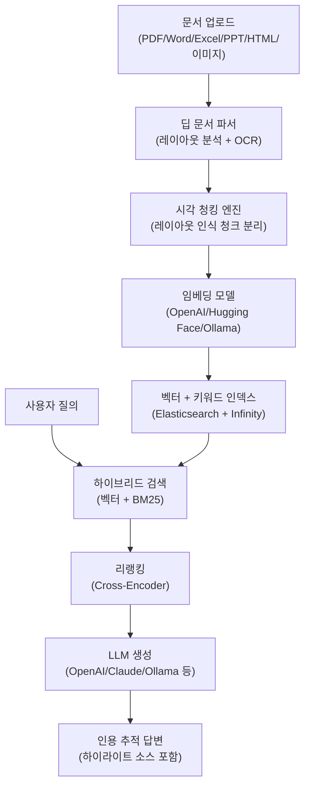
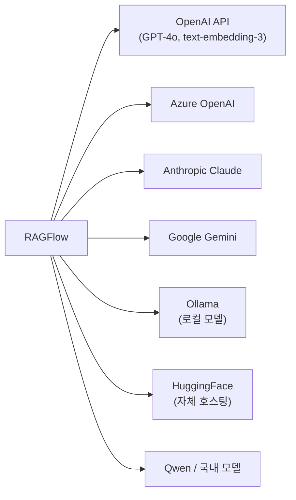
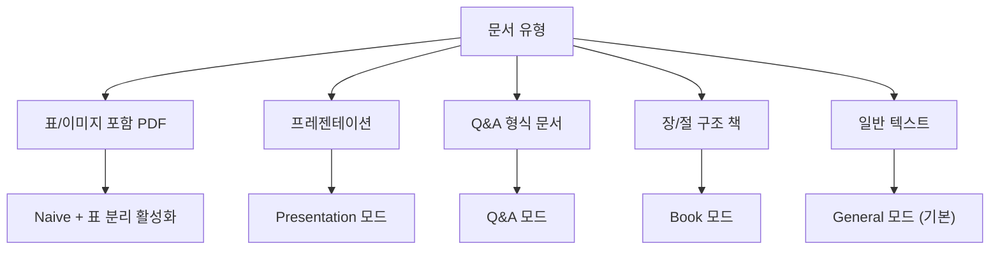

# RAGFlow

## 정체성

| 항목 | 내용 |
|------|------|
| 이름 | RAGFlow |
| 개발사 | InfinFlow (infiniflow.org) |
| 라이선스 | Apache 2.0 |
| GitHub | [infiniflow/ragflow](https://github.com/infiniflow/ragflow) |
| 출시 | 2024년 초 |
| 언어/스택 | Python (백엔드), TypeScript React (프론트엔드), Elasticsearch/MinIO 저장소 |
| 배포 방식 | Docker Compose (단일 명령), Kubernetes (엔터프라이즈) |

RAGFlow는 단순 RAG 파이프라인 구축 도구를 넘어서, **깊은 문서 이해(Deep Document Understanding)**를 핵심 가치로 내세운 엔터프라이즈급 오픈소스 RAG 플랫폼이다. PDF, Word, Excel, PPT, HTML, 이미지 등 비정형 문서를 시각적으로 분석해 구조 정보를 보존하면서 청킹하고, 생성된 답변에 소스 인용(citation)을 자동 추적한다.

---

## 아키텍처 개요



---

## 핵심 기능

### 1. 깊은 문서 이해 (Deep Document Understanding)

일반 RAG 도구가 텍스트를 단순 추출하는 것과 달리, RAGFlow는 **문서 레이아웃 분석**을 수행한다:

- **PDF 레이아웃 파싱**: 단/다단 구조, 표, 그림, 헤더/푸터 인식
- **표 구조 보존**: 행·열 관계를 Markdown 테이블로 변환
- **수식 인식**: LaTeX 변환 지원
- **이미지 내 텍스트**: OCR로 이미지 내 텍스트 추출 및 캡션 연결
- **슬라이드 파싱**: PowerPoint 슬라이드의 텍스트 박스 순서와 계층 보존

### 2. 시각 청킹 (Visual Chunking)

청크 경계를 고정 길이(글자 수)가 아닌 **문서 구조**에 맞게 결정:

```
일반 청킹:
  [표의 절반 + 다음 단락 시작부] → 의미 파괴

RAGFlow 시각 청킹:
  [완전한 표] + [완전한 단락] → 의미 보존
```

청킹 전략별 옵션:
- General (범용): 단락/문장 경계 존중
- Table (표 전용): 각 행을 독립 청크
- Presentation: 슬라이드 단위
- Q&A: Q/A 쌍 구조 인식
- Paper: 논문 섹션(Abstract, Introduction 등) 단위
- Book: 챕터/절 단위

### 3. 인용 추적 (Citation Tracing)

답변의 각 문장이 어느 문서의 몇 페이지, 어느 단락에서 왔는지 **하이라이트와 함께 표시**:

```
생성된 답변:
  "RAGFlow는 2024년에 출시되었습니다 [1].
   Apache 2.0 라이선스로 배포됩니다 [2]."

소스 추적:
  [1] document_A.pdf, 페이지 3, 단락 2 (하이라이트 표시)
  [2] README.md, 섹션 "License"
```

환각(hallucination) 검증과 감사(audit) 목적으로 엔터프라이즈 환경에서 특히 중요.

### 4. 하이브리드 검색

밀집 벡터 검색과 BM25 희소 검색을 결합:

- **벡터 검색**: 의미적 유사도 (Elasticsearch HNSW 또는 자체 Infinity 엔진)
- **키워드 검색**: 정확한 용어 매칭 (BM25)
- **가중치 조합**: 두 점수를 사용자가 조절 가능

### 5. 다양한 LLM/임베딩 백엔드 지원



---

## 차별점 (vs 경쟁 도구)

| 특성 | RAGFlow | LangChain | LlamaIndex | Dify |
|------|---------|-----------|------------|------|
| 문서 레이아웃 분석 | 심층 (전용 파서) | 기본 | 기본~중간 | 중간 |
| UI (No-Code 인터페이스) | 있음 | 없음 | 없음 | 있음 |
| 인용 추적 | 자동, 하이라이트 | 수동 구현 | 수동 구현 | 제한적 |
| 표/수식 보존 | 우수 | 미흡 | 중간 | 미흡 |
| 엔터프라이즈 배포 | Docker/K8s | 직접 구성 | 직접 구성 | Docker |
| 커스텀 파이프라인 | API + UI | 코드 우선 | 코드 우선 | UI 우선 |
| 라이선스 | Apache 2.0 | MIT | MIT | Apache 2.0 |

**RAGFlow의 강점**: 비정형 문서 처리 품질, 인용 추적, No-Code UI
**RAGFlow의 약점**: 코드 수준 커스터마이즈 유연성은 LangChain/LlamaIndex 대비 낮음

---

## 실무 사용 가이드

### Docker Compose 배포

```bash
# 최소 4 CPU, 16GB RAM 권장
git clone https://github.com/infiniflow/ragflow.git
cd ragflow/docker

# 기본 배포 (CPU only)
docker compose up -d

# GPU 지원 배포
docker compose -f docker-compose-gpu.yml up -d
```

기본 포트: 80 (웹 UI), 9380 (API)

### API 사용 예시

```python
import requests

BASE_URL = "http://localhost:9380"
API_KEY = "your-api-key"

# 1. 지식 베이스 생성
kb_response = requests.post(
    f"{BASE_URL}/api/v1/knowledgebase",
    json={"name": "company_docs", "description": "회사 내부 문서"},
    headers={"Authorization": f"Bearer {API_KEY}"},
)
kb_id = kb_response.json()["data"]["id"]

# 2. 문서 업로드
with open("policy.pdf", "rb") as f:
    upload_response = requests.post(
        f"{BASE_URL}/api/v1/document",
        files={"file": f},
        data={"kb_id": kb_id},
        headers={"Authorization": f"Bearer {API_KEY}"},
    )

# 3. 질의
chat_response = requests.post(
    f"{BASE_URL}/api/v1/conversation/completion",
    json={
        "kb_ids": [kb_id],
        "question": "휴가 정책에 대해 설명해주세요",
    },
    headers={"Authorization": f"Bearer {API_KEY}"},
)
print(chat_response.json()["data"]["answer"])
# 인용 소스도 함께 반환됨
```

### 청킹 전략 선택 가이드



---

## 한계 / 트레이드오프

### 인프라 요구사항

Elasticsearch, MinIO(객체 스토리지), Redis를 모두 포함하는 Docker Compose 스택으로 **최소 16GB RAM** 필요. 단순 프로토타이핑에는 무거움.

### 문서 파싱 속도

심층 레이아웃 분석이 강점이지만 일반 텍스트 추출보다 느림. 100페이지 PDF 파싱에 수 분 소요.

### 복잡한 파이프라인 커스터마이즈

UI를 통해 빠르게 구성할 수 있지만, LangChain/LlamaIndex처럼 파이프라인 단계를 코드로 세밀하게 제어하려면 API 수준의 작업 필요.

### 멀티모달 제한

이미지 설명 생성(image captioning)은 OCR 중심이며, 순수 멀티모달 임베딩(이미지-텍스트 공동 벡터 검색)은 아직 제한적.

---

## 엔터프라이즈 사용 패턴

- **내부 지식 베이스 Q&A**: 사내 정책, 기술 문서, 법률 계약서 검색
- **컴플라이언스 감사**: 인용 추적으로 답변 근거 문서 제시
- **다국어 문서 처리**: OCR + 임베딩 모델 선택으로 한국어/일본어/중국어 문서 처리
- **보안 온프레미스 배포**: 외부 API 사용 없이 Ollama + 자체 임베딩으로 완전 오프라인

---

## 관련 문서

- [[rag]] - RAG 개념 전반
- [[document-qa-agent]] - 문서 Q&A 에이전트 패턴
- [[citation-generation]] - 인용 생성 기법
- [[chroma-db]] - 가벼운 벡터 DB 대안
- [[llamaindex]] - 코드 기반 RAG 파이프라인 빌더
- [[langchain]] - 범용 LLM 파이프라인 프레임워크
