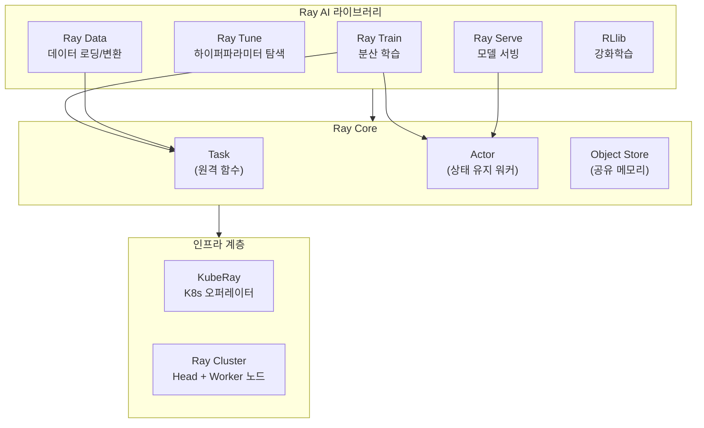
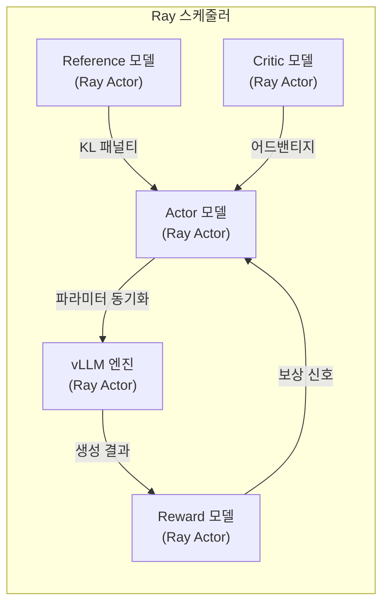

# Ray - 분산 컴퓨팅 프레임워크

## 개요

Ray는 Anyscale이 개발한 오픈소스 분산 컴퓨팅 프레임워크로, AI 워크로드의 스케일링을 위한 통합 인프라를 제공한다. UC Berkeley RISELab에서 시작하여 2017년 첫 공개된 이후 빠르게 성장했으며, 2026년 4월 기준 GitHub 약 39,000 스타, 누적 다운로드 2억 3,700만 건 이상을 기록하고 있다. 2025년 10월 PyTorch Foundation에 합류하여 PyTorch 생태계와의 통합을 공식화했다.

Ray의 핵심 가치는 단일 노트북에서 수천 노드 클러스터까지 동일한 코드로 확장 가능하다는 점이다. [[openrlhf]]와 [[verl-bytedance]] 등 주요 RL 학습 프레임워크가 Ray를 분산 스케줄링 백엔드로 채택하고 있으며, OpenAI가 ChatGPT 학습 조율에 Ray를 사용하는 것으로 알려져 있다.

- GitHub: [ray-project/ray](https://github.com/ray-project/ray)
- 공식 사이트: [ray.io](https://www.ray.io/)
- 라이선스: Apache 2.0

## 아키텍처

Ray는 핵심 런타임(Ray Core)과 그 위에 구축된 5개 AI 라이브러리로 구성된다.

### Ray Core: Task와 Actor

Ray Core는 두 가지 핵심 추상화를 제공한다.

**Task**는 클러스터의 임의 노드에서 실행되는 원격 함수(stateless)다. `@ray.remote` 데코레이터로 일반 Python 함수를 분산 태스크로 변환하며, 수백만 태스크를 초당 서브밀리초 지연으로 스케줄링할 수 있다.

**Actor**는 클러스터에 생성되는 상태 유지(stateful) 워커 프로세스다. Python 클래스에 `@ray.remote`를 적용하면 분산 객체가 되며, 메서드 호출을 통해 상태를 변경한다. RL 학습에서 Actor/Critic/Reward 모델을 각각 별도의 Ray Actor로 배치하는 패턴이 대표적이다.

두 추상화 모두 **Object Store**(Apache Arrow 기반 공유 메모리)를 통해 노드 간 데이터를 효율적으로 전달한다.

### Ray AI 라이브러리

| 라이브러리 | 역할 | 주요 통합 |
|-----------|------|----------|
| **Ray Train** | 분산 멀티노드/멀티코어 모델 학습, 장애 허용 | PyTorch, HuggingFace, DeepSpeed, FSDP |
| **Ray Tune** | 하이퍼파라미터 탐색 자동화 | Optuna, HyperOpt, ASHA 스케줄러 |
| **Ray Serve** | 온라인 추론 서빙, 마이크로배칭 | FastAPI, vLLM, Triton |
| **Ray Data** | 프레임워크 무관 데이터 로딩/변환 | Parquet, CSV, 커스텀 소스 |
| **RLlib** | 강화학습 라이브러리 | 다양한 RL 알고리즘 |

## KubeRay: Kubernetes 네이티브 운영

KubeRay는 Kubernetes에서 Ray 클러스터를 관리하는 오픈소스 오퍼레이터로, 3개의 CRD(Custom Resource Definition)를 제공한다.

| CRD | 역할 | 동작 방식 |
|-----|------|----------|
| **RayCluster** | Ray 클러스터 프로비저닝 | Head/Worker 노드 자동 구성, 오토스케일링 |
| **RayJob** | 배치 작업 제출 | 클러스터 자동 생성 -> 작업 실행 -> 완료 시 정리 |
| **RayService** | Ray Serve 배포 관리 | 무중단 업그레이드, 헬스 체크 |

2025년부터 Kueue(Kubernetes 네이티브 작업 큐잉 시스템)와의 통합이 진행되어, 쿼터 인식(quota-aware) 및 우선순위 기반 스케줄링이 가능해졌다. 이는 [[gpu-cluster-scheduling]]에서 다루는 클러스터 자원 관리 문제를 Ray 워크로드에 직접 적용하는 방식이다.

## RL 학습 프레임워크에서의 Ray

Ray가 LLM RL 학습 생태계에서 핵심 인프라가 된 이유는 RLHF/GRPO 등의 학습이 본질적으로 멀티모델 문제이기 때문이다.

[[openrlhf]]는 Ray를 사용하여 Actor, Critic, Reward, Reference 4개 모델을 서로 다른 GPU 그룹에 배치하고 비동기 스케줄링한다. [[verl-bytedance]]도 Ray를 분산 백엔드로 사용하되 NCCL 직접 제어를 추가하여 대규모 클러스터에서의 통신 효율을 높인다. 이처럼 Ray의 Actor 모델은 RL 학습의 복잡한 모델 간 의존성을 자연스럽게 표현할 수 있는 추상화를 제공한다.

## 성능 특성

| 지표 | 수치 |
|------|------|
| 태스크 스루풋 | 초당 수백만 태스크 |
| 태스크 지연 | 서브밀리초 |
| Spark 대비 AI 패턴 성능 | 약 10배 |
| 최대 검증 클러스터 | 수천 노드 |

[[elastic-training]]과 결합하면, Ray의 오토스케일링과 장애 허용(fault tolerance) 기능을 활용하여 학습 중 노드 추가/제거에 동적으로 대응할 수 있다.

## 주요 이정표

| 시점 | 이벤트 |
|------|--------|
| 2017 | UC Berkeley RISELab에서 첫 공개 |
| 2019 | Anyscale 설립, 상용 지원 시작 |
| 2023 | Ray 2.0 출시, AI 라이브러리 통합 강화 |
| 2025.10 | PyTorch Foundation 합류 |
| 2025.12 | OpenAI ChatGPT 학습 조율에 사용 확인 |
| 2026.04 | Ray 2.54.x, GitHub 39k+ 스타 |

## 대안 및 비교

| 항목 | Ray | Spark | Dask |
|------|-----|-------|------|
| 주 타겟 | AI/ML 워크로드 | 대규모 데이터 처리 | 과학 컴퓨팅, 분석 |
| 추상화 | Task/Actor | RDD/DataFrame | Delayed/Future |
| GPU 지원 | 네이티브 | 제한적 | 제한적 |
| RL 학습 지원 | RLlib, 외부 프레임워크 | 없음 | 없음 |
| K8s 통합 | KubeRay (전용 오퍼레이터) | Spark on K8s | Dask-Kubernetes |

## 제한 사항

- **학습 곡선**: Task/Actor 추상화는 직관적이나, 대규모 분산 환경에서의 디버깅과 리소스 튜닝은 경험이 필요하다
- **오버헤드**: 소규모 워크로드(단일 GPU)에서는 Ray 클러스터 자체의 오버헤드가 직접 실행 대비 비효율적일 수 있다
- **메모리 관리**: Object Store의 메모리 한도를 초과하면 성능이 급격히 저하되므로 대용량 데이터 전송 시 주의가 필요하다

## 대표 자료

- [Ray: A Distributed Framework for Emerging AI Applications (Moritz et al., OSDI 2018)](https://www.usenix.org/conference/osdi18/presentation/moritz)
- [Ray 공식 문서](https://docs.ray.io/en/latest/)
- [PyTorch Foundation Welcomes Ray (2025.10)](https://pytorch.org/blog/pytorch-foundation-welcomes-ray-to-deliver-a-unified-open-source-ai-compute-stack/)

## 관련 문서

- [[openrlhf]] -- Ray 기반 분산 RLHF 프레임워크
- [[verl-bytedance]] -- Ray를 분산 백엔드로 사용하는 ByteDance RL 프레임워크
- [[elastic-training]] -- Ray의 오토스케일링과 결합 가능한 탄력적 학습
- [[gpu-cluster-scheduling]] -- KubeRay/Kueue 통합과 GPU 스케줄링
- [[training-profiling]] -- Ray 분산 환경에서의 학습 프로파일링
- [[experiment-tracking]] -- Ray 워크로드의 실험 추적 통합
