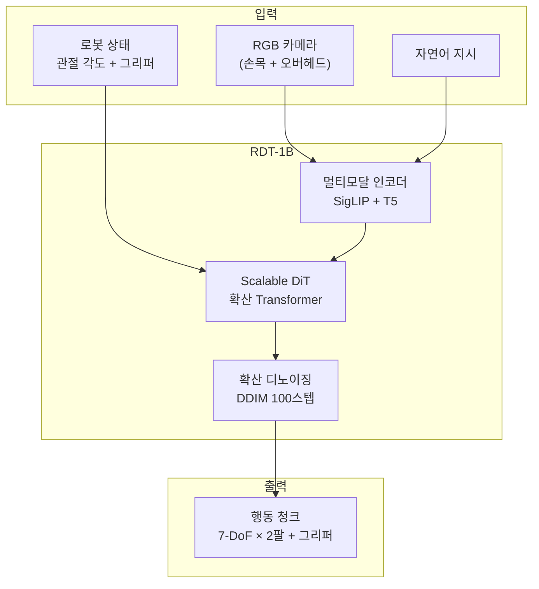
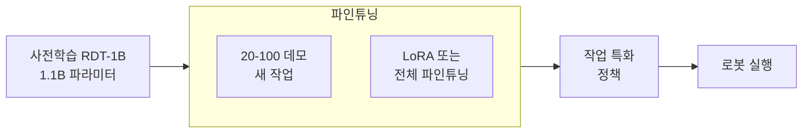

# RDT-1B

RDT-1B(Robotics Diffusion Transformer, 1B)는 칭화대학교 연구팀이 개발한 양팔 로봇 조작 전용 파운데이션 모델이다. 13억(1B) 파라미터 규모의 확산 기반 정책(diffusion policy)으로, 다양한 양팔 조작 작업에 빠른 파인튜닝만으로 적응할 수 있도록 설계되었다.

## 개요

## 핵심 설계 원칙

### 1. 물리적으로 해석 가능한 통합 행동 공간

양팔 로봇은 제조사마다 자유도(DoF)와 제어 인터페이스가 다르다. RDT-1B는 물리적으로 의미 있는 통합 행동 공간(Unified Action Space)을 정의하여 다른 로봇 플랫폼 간 전이 학습을 가능하게 한다.

- 위치/속도/토크 중 작업에 맞는 표현 선택
- 그리퍼 상태 통합 표현
- 좌·우팔 대칭성 활용

### 2. 확산 정책 (Diffusion Policy)

[[diffusion-policy]]의 원리를 대규모 Transformer 아키텍처에 적용한다.

$$
\pi_\theta(a_t | o_t) = \int p(a_t^{(0:K)} | o_t) \, da_t^{(1:K)}
$$

- 행동 분포를 가우시안 노이즈에서 점진적으로 디노이징
- 멀티모달 행동 분포(여러 실행 가능한 동작) 자연스럽게 표현
- ACT(Action Chunking Transformer)보다 분포 표현력 우수

### 3. 스케일러블 DiT 백본

[[dit-diffusion-transformer]] 구조를 로봇 정책에 적용. 이미지 생성 DiT와 달리 멀티모달 조건(언어 + 시각 + 상태)을 처리하도록 수정.

- 조건 주입: adaLN(adaptive layer normalization)으로 시간 스텝 임베딩
- 교차 어텐션으로 언어 및 시각 토큰 통합
- 1.1B 파라미터로 확장

## 학습 데이터 구성

대규모 사전학습 → 작업별 파인튜닝의 두 단계 전략.

| 데이터 소스 | 설명 | 규모 |
|------------|------|------|
| Open X-Embodiment | 다양한 로봇 플랫폼 데이터 | 수백만 에피소드 |
| LEROBOT | 양팔 조작 특화 | 수만 에피소드 |
| 자체 수집 (칭화대) | ALOHA 플랫폼 양팔 데이터 | 수천 에피소드 |

언어 지시는 GPT-4를 활용해 후향적으로(retrospectively) 생성.

## [[octo-robot-policy]]와 비교

| 항목 | RDT-1B | Octo |
|------|--------|------|
| 파라미터 | 1.1B | 93M |
| 아키텍처 | DiT (확산) | Transformer (회귀) |
| 행동 표현 | 확산 정책 | 행동 토크나이저 |
| 양팔 특화 | 전용 설계 | 범용 |
| 파인튜닝 데이터 | ~20 에피소드 | 수백 에피소드 |

## 주요 실험 결과

칭화대 ALOHA 양팔 플랫폼에서 평가:

- **케이블 연결**: 섬세한 삽입 작업 성공률 85%+
- **음식 조리**: 야채 자르기, 용기 이동 등 복합 조작
- **접기 작업**: 옷 접기, 수건 정리
- 파인튜닝 데이터 20개 에피소드만으로 새 작업 학습 가능

## 파인튜닝 방법

- **LoRA 파인튜닝**: 소수 파라미터만 수정, 빠른 적응
- **전체 파인튜닝**: 더 큰 분포 변화가 필요한 경우
- GPU 요구사항: A100 80GB × 1~4장

## 플랫폼 지원

- **ALOHA / ALOHA 2** (Stanford): 주 개발 플랫폼
- **Unitree H1/G1**: 인간형 로봇 팔
- **커스텀 양팔 셋업**: 통합 행동 공간을 통한 일반화

## 오픈소스 정보

- 코드: `thu-ml/RoboticsDiffusionTransformer` (GitHub)
- 모델 가중치: Hugging Face Hub 공개
- 라이선스: Apache 2.0

## 관련 문서

- [[diffusion-policy]] - RDT-1B의 기반이 되는 확산 기반 로봇 정책 원리
- [[octo-robot-policy]] - 비교 대상 범용 로봇 파운데이션 모델
- [[diffusion-policy-robot]] - 확산 정책의 로봇 조작 상세 적용 방법
- [[action-chunking-transformer]] - ACT 비교: 회귀 기반 행동 청킹 접근법
