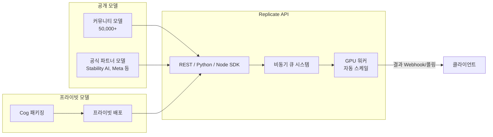
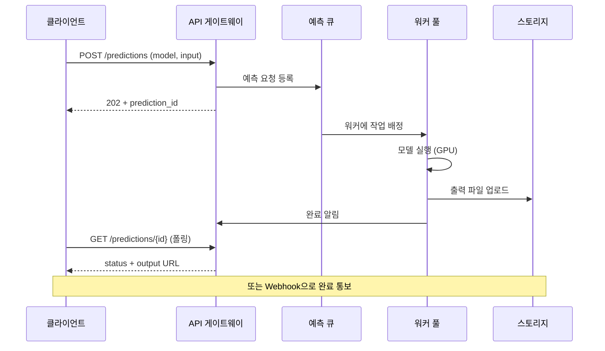
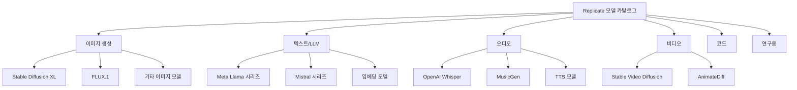
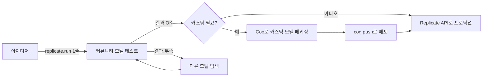

# Replicate - 클라우드 ML 모델 호스팅 플랫폼

Replicate는 ML 모델을 API로 즉시 노출하고, 커뮤니티가 공유한 수만 개의 오픈소스 모델을 한 줄의 코드로 호출할 수 있는 클라우드 플랫폼이다. Cog라는 오픈소스 패키징 도구를 사용해 어떤 모델이든 표준화된 컨테이너로 감쌀 수 있으며, 사용량 기반(per-second) 과금 모델로 소규모 실험부터 프로덕션까지 유연하게 사용할 수 있다.

## 플랫폼 개요



Replicate의 핵심 가치는 "모델을 찾아 즉시 API 호출"이다. 별도 배포 설정 없이 `replicate.run("stability-ai/sdxl", input={...})`처럼 모델 ID와 입력값만 넘기면 된다.

## 핵심 기능

### Cog 패키징

Cog는 Replicate가 개발한 오픈소스 ML 컨테이너화 도구다. `cog.yaml`과 `predict.py` 두 파일로 모든 의존성과 예측 인터페이스를 정의한다.

`cog.yaml` 예시:

```yaml
build:
  python_version: "3.11"
  python_packages:
    - torch==2.3.0
    - transformers==4.40.0
    - diffusers==0.27.0
  system_packages:
    - libgl1
  cuda: "12.1"
  cudnn: "8"

predict: "predict.py:Predictor"
```

`predict.py` 최소 구현:

```python
from cog import BasePredictor, Input, Path
from typing import Optional
import torch
from diffusers import StableDiffusionXLPipeline

class Predictor(BasePredictor):
    def setup(self):
        """모델 로드 - 컨테이너 시작 시 1회 실행"""
        self.pipe = StableDiffusionXLPipeline.from_pretrained(
            "stabilityai/stable-diffusion-xl-base-1.0",
            torch_dtype=torch.float16,
        ).to("cuda")

    def predict(
        self,
        prompt: str = Input(description="생성할 이미지 프롬프트"),
        negative_prompt: str = Input(description="제외할 요소", default=""),
        width: int = Input(description="이미지 너비", default=1024, ge=256, le=2048),
        height: int = Input(description="이미지 높이", default=1024, ge=256, le=2048),
        num_inference_steps: int = Input(description="추론 스텝 수", default=30, ge=1, le=100),
    ) -> Path:
        """이미지 생성 후 파일 경로 반환"""
        image = self.pipe(
            prompt=prompt,
            negative_prompt=negative_prompt,
            width=width,
            height=height,
            num_inference_steps=num_inference_steps,
        ).images[0]
        output_path = Path("/tmp/output.png")
        image.save(output_path)
        return output_path
```

`Input()` 타입 힌트는 Replicate 웹 UI와 API 스키마를 자동 생성하는 역할을 한다.

배포 명령:

```bash
pip install cog
cog login
cog push r8.im/<username>/<model-name>
```

### 오픈소스 모델 즉시 호출

등록된 모든 모델은 Python, Node.js SDK 또는 HTTP API로 즉시 호출 가능하다.

```python
import replicate

# 텍스트 → 이미지
output = replicate.run(
    "stability-ai/sdxl:39ed52f2a78e934b3ba6e2a89f5b1c712de7dfea535525255b1aa35c5565e08b",
    input={
        "prompt": "서울 야경, 드라마틱한 조명, 4K",
        "width": 1024,
        "height": 1024,
    }
)
print(output)  # 이미지 URL 반환

# LLM 텍스트 생성 (스트리밍)
for event in replicate.stream(
    "meta/meta-llama-3-8b-instruct",
    input={"prompt": "파이썬으로 퀵소트를 구현해줘"},
):
    print(str(event), end="")
```

Node.js:

```javascript
import Replicate from "replicate";
const replicate = new Replicate();

const output = await replicate.run("stability-ai/sdxl", {
  input: { prompt: "cyberpunk city at night" }
});
```

### 비동기 예측(Prediction) 객체

오래 걸리는 작업은 예측 객체를 생성하고 나중에 결과를 폴링하거나 Webhook으로 받는다:

```python
import replicate

# 비동기 예측 생성
prediction = replicate.predictions.create(
    model="stability-ai/sdxl",
    input={"prompt": "낙조가 지는 한강, 수채화 스타일"},
    webhook="https://my-server.com/webhooks/replicate",
    webhook_events_filter=["completed"],
)
print(prediction.id)  # 예측 ID 저장

# 나중에 상태 확인
prediction.reload()
print(prediction.status)   # "starting" | "processing" | "succeeded" | "failed"
print(prediction.output)   # 완료 시 결과
```

Webhook 페이로드:

```json
{
  "id": "xyz789",
  "status": "succeeded",
  "output": ["https://replicate.delivery/pbxt/...output.png"],
  "metrics": {
    "predict_time": 4.2
  }
}
```

### 모델 버전 핀닝

Replicate 모델은 내용이 바뀔 수 있으므로, 프로덕션에서는 반드시 버전 해시를 고정해야 한다:

```python
# 위험 - 최신 버전이 변경되면 결과가 달라질 수 있음
replicate.run("stability-ai/sdxl", input={...})

# 안전 - 특정 버전 해시로 고정
replicate.run(
    "stability-ai/sdxl:39ed52f2a78e934b3ba6e2a89f5b1c712de7dfea535525255b1aa35c5565e08b",
    input={...}
)
```

## 플랫폼 아키텍처



### 콜드스타트와 워커 재사용

Replicate는 동일 모델의 요청이 들어오면 기존 워커 컨테이너를 재사용(hot instance)한다. 장시간 요청이 없으면 워커가 종료되고 다음 요청에 콜드스타트가 발생한다.

- 일반적인 콜드스타트: 15초~2분 (모델 크기, 가중치 로딩 시간에 따라 다름)
- 빠른 API 응답이 필요한 경우 [[baseten-deployment]]의 `min_replica` 전략을 고려할 것

## 지원 모델 카테고리



## 경쟁 플랫폼과 비교

| 기능 | Replicate | [[baseten-deployment\|Baseten]] | [[modal-com-runtime\|Modal]] | [[huggingface-inference-endpoints\|HuggingFace Endpoints]] |
|------|-----------|---------|-------|---------------------|
| 오픈소스 모델 수 | 50,000+ | 마켓플레이스 있음 | 없음 | Hub 연동 |
| 커스텀 모델 배포 | Cog 사용 | TrussML 사용 | 데코레이터 | Docker/HF 모델 |
| 무료 티어 | 있음 | 없음 | 있음 | 없음 |
| 진입 장벽 | 매우 낮음 | 낮음 | 낮음 | 낮음 |
| 엔터프라이즈 기능 | 제한적 | 강함 | 중간 | 강함 |
| 모델 공개 기능 | 지원 | 미지원 | 미지원 | 지원 |
| 과금 단위 | 실행 시간 | 실행 시간 | 컴퓨팅 초 | 시간/토큰 |

### Replicate의 강점

1. **가장 낮은 진입 장벽**: 계정 생성 후 5분 안에 SDXL 이미지를 생성할 수 있다.
2. **커뮤니티 생태계**: 다른 연구자/개발자가 업로드한 최신 모델을 즉시 실험 가능.
3. **모델 공개 가능**: 내가 만든 모델을 마켓플레이스에 공개하고 수익화할 수 있다.
4. **웹 UI 자동 생성**: Cog `Input()` 타입 정보로 웹 인터페이스가 자동 생성된다.

### Replicate의 약점

1. **콜드스타트 불가피**: 프라이빗/커스텀 모델 전용 상시 실행 인스턴스 없음.
2. **멀티-GPU 제한**: 단일 GPU 추론 중심, 대규모 분산 추론 불가.
3. **지역 선택 없음**: 데이터 거주지(data residency) 제약이 있는 기업에 부적합.
4. **SLA 부재**: 엔터프라이즈 SLA가 없어 미션-크리티컬 서비스에는 위험.

## 실무 사용 가이드

### 프로토타이핑 워크플로우



### 비용 관리 팁

- **모델 탐색 단계**: 웹 UI 데모를 먼저 사용하면 SDK 호출 없이 무료로 테스트 가능.
- **버전 고정 필수**: 동일 버전을 반복 호출하면 캐시가 활성화되어 응답이 빠를 수 있음.
- **입력 최적화**: `num_inference_steps`를 줄이면 실행 시간과 비용이 비례해서 감소.
- **파일 출력 주의**: 이미지/오디오 파일은 Replicate CDN에 24시간만 보관되므로, 결과를 즉시 자체 스토리지에 저장할 것.

### Cog 로컬 개발

```bash
# 로컬 빌드 및 예측 테스트
cog build -t my-model
cog predict -i prompt="테스트 프롬프트"

# Docker 직접 실행
docker run -d -p 5000:5000 my-model
curl http://localhost:5000/predictions -X POST \
  -H "Content-Type: application/json" \
  -d '{"input": {"prompt": "hello"}}'
```

## 한계 / 트레이드오프

| 항목 | 내용 |
|------|------|
| 콜드스타트 | 항상 존재. 핫 인스턴스 유지 옵션 제한적 |
| 결과물 보관 기간 | 출력 파일은 기본 24시간 후 만료 |
| 모델 크기 제한 | 매우 큰 모델(70B+)은 배포 가능하나 설정 복잡 |
| 네트워크 지연 | 결과를 URL로 받는 구조라 다운로드 단계 추가 |
| 프라이빗 모델 비용 | 공개 모델보다 비쌀 수 있음 |
| GPU 선택 제한 | 특정 GPU 타입을 직접 지정하기 어려움 |

## 관련 문서

- [[baseten-deployment]] - 엔터프라이즈 ML 배포 중심 플랫폼, TrussML 패키징
- [[modal-com-runtime]] - Python 데코레이터 방식의 서버리스 GPU 실행
- [[bento-cloud-mlops]] - BentoML 기반 프로덕션 ML 배포
- [[huggingface-hub]] - HuggingFace 모델 허브 및 Inference Endpoints
- [[stable-diffusion]] - Replicate에서 가장 많이 사용되는 이미지 모델
