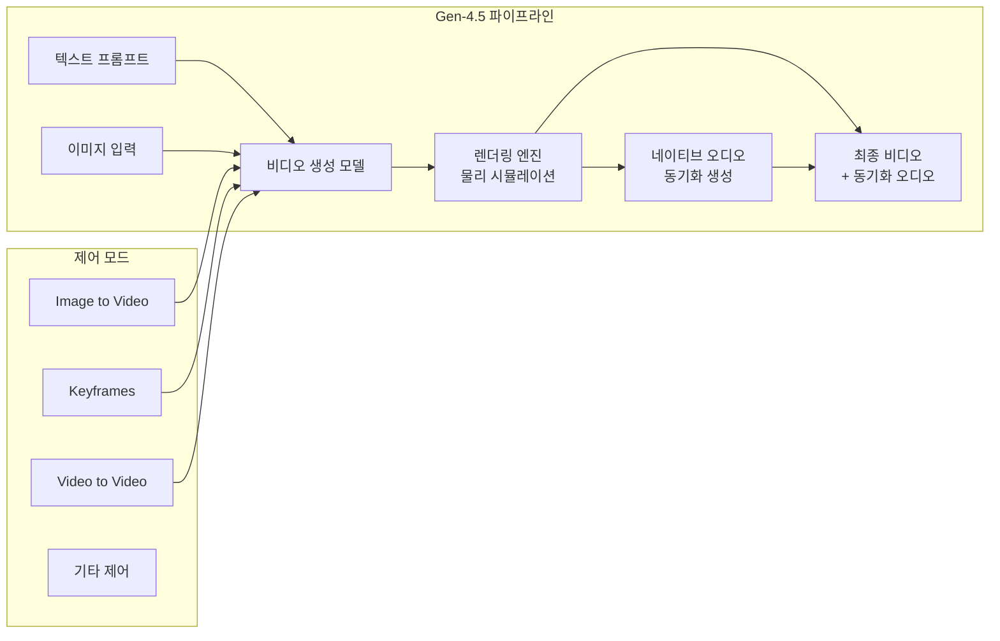

## 개요

Runway Gen-4.5는 Runway가 2025년 12월 1일 출시한 텍스트-투-비디오(Text-to-Video) AI 모델이다. Artificial Analysis Text-to-Video 벤치마크에서 1,247 Elo를 기록하며 1위를 차지했다. 네이티브 오디오 생성, 멀티샷(Multi-shot) 편집, 캐릭터 일관성(Character Consistency) 유지가 핵심 차별점이다.

물리적으로 정확한 객체 운동(무게, 운동량, 힘), 자연스러운 액체 역학, 미묘한 감정 표현과 얼굴 제스처를 구현한다. [[nvidia-cosmos|NVIDIA]] Hopper/Blackwell GPU 인프라 위에서 동작하며, 포토리얼리즘부터 스타일화 애니메이션까지 다양한 미학을 지원한다.

[[sora-2-shutdown|OpenAI의 Sora 2]]가 2026년 3월 종료된 이후, AI 비디오 생성 분야에서 사실상의 산업 표준으로 자리잡고 있다.

## 핵심 특징

- **Elo 1위 (1,247점)**: Artificial Analysis Text-to-Video 벤치마크에서 경쟁 모델 전체를 상회
- **네이티브 오디오**: 비디오와 동기화된 오디오를 모델 내부에서 직접 생성. 별도 오디오 파이프라인 불필요
- **멀티샷 편집**: 여러 쇼트를 연결한 시퀀스 생성. 장면 전환, 카메라 앵글 변화를 자연스럽게 처리
- **캐릭터 일관성**: 동일 캐릭터가 여러 장면에 걸쳐 일관된 외형과 특징을 유지
- **물리 정확도**: 객체의 현실적인 무게, 운동량, 힘 시뮬레이션. 충돌과 액체 역학을 자연스럽게 표현
- **표현력 있는 캐릭터**: 미묘한 감정, 자연스러운 제스처, 생생한 얼굴 표정

## 기술 상세

### 생성 파이프라인

### 제어 모드

Gen-4.5는 기존 Gen-4의 모든 제어 모드를 지원하며, 추가적으로 멀티샷 시퀀스 제어가 가능하다.

| 모드 | 설명 |
|---|---|
| Text to Video | 텍스트 프롬프트로 비디오 생성 |
| Image to Video | 참조 이미지 기반 비디오 생성 |
| Keyframes | 키프레임 지정으로 움직임 제어 |
| Video to Video | 기존 비디오 변환/스타일 적용 |
| Multi-shot | 여러 쇼트를 연결한 시퀀스 생성 |

### 스타일 제어

다양한 미학적 스타일을 일관되게 유지하며 생성할 수 있다.

- **포토리얼리즘**: 사진과 구분하기 어려운 수준의 현실적 표현
- **시네마틱**: 영화적 색감, 조명, 구도 자동 적용
- **스타일화 애니메이션**: 일관된 시각적 언어를 유지하면서 다양한 애니메이션 스타일 구현

### 인프라

| 항목 | 사양 |
|---|---|
| GPU | NVIDIA Hopper, Blackwell 시리즈 |
| 용도 | R&D, 사전학습, 후학습, 추론 전 과정 |
| 최적화 | NVIDIA GPU 전체 활용 최적화 |

### Gen-4 대비 개선점

| 항목 | Gen-4 | Gen-4.5 |
|---|---|---|
| 비디오 품질 | 높음 | 획기적 향상 |
| 물리 정확도 | 기본 | 현실적 운동/충돌/액체 |
| 오디오 | 별도 필요 | 네이티브 동기화 |
| 멀티샷 | 미지원 | 지원 |
| 캐릭터 일관성 | 제한적 | 장면 간 유지 |
| 속도/효율성 | 기준 | 동등 수준 유지 |

## 벤치마크

### Artificial Analysis Text-to-Video

| 모델 | Elo 점수 | 비고 |
|---|---|---|
| **Runway Gen-4.5** | **1,247** | **1위** |
| 기타 경쟁 모델 | 하위 | - |

### 알려진 한계

공식 연구 페이지에서 인정한 제한사항이다.

- **인과 추론 부족**: 결과가 원인보다 먼저 나타나는 경우 발생
- **객체 항상성(Object Permanence) 문제**: 가려진 후 물체가 소실되는 현상
- **성공 편향**: 현실에서 실패할 행동도 성공하는 경향

### 가격

모든 Runway 유료 요금제에서 동등한 가격으로 이용 가능하다. 기업용 커스텀 모델은 별도 문의가 필요하다.

## Sora 2 종료와 시장 영향

OpenAI의 Sora 2가 2026년 3월 24일 종료를 발표하면서(활성 사용자 500K 미만, 일일 운영비 ~$1M), Gen-4.5는 AI 비디오 생성 시장의 주도적 위치를 더욱 공고히 했다. Sora 2의 앱은 4월 26일, API는 9월 24일 종료 예정이다.

오픈소스 진영에서는 [[ltx-2|LTX-2]](Lightricks, 19B 파라미터, 4K@50fps + 동기화 오디오)가 대안으로 부상하고 있다.

### AI 비디오 시장 지형 변화

Sora 2의 종료는 AI 비디오 생성 시장의 경쟁 구도를 크게 변화시켰다. Runway Gen-4.5가 상용 시장에서 1위를 유지하는 가운데, 오픈소스 진영과 신규 진입자들이 빠르게 성장하고 있다.

| 포지션 | 모델 | 특징 |
|---|---|---|
| 상용 1위 | **Runway Gen-4.5** | Elo 1위, 네이티브 오디오, 멀티샷 |
| 오픈소스 선두 | LTX-2 (Lightricks) | 19B, 4K@50fps, 오디오 동기화 |
| 종료 | Sora 2 (OpenAI) | 2026.03 종료 발표 |
| 멀티모달 통합 | [[deepseek-v4]] | 비디오 생성 포함 예정 |

### 크리에이티브 워크플로우 통합

Gen-4.5는 단순 텍스트-투-비디오 생성을 넘어, 전문 영상 제작 워크플로우에 통합되는 것을 목표로 한다. Image to Video, Keyframes, Video to Video 등 기존 제어 모드에 멀티샷 시퀀스가 추가되면서, 광고, 영화 프리비주얼라이제이션, 소셜 미디어 콘텐츠 등 다양한 영역에서 활용 가능성이 확대되었다. 캐릭터 일관성 유지 기능은 시리즈 콘텐츠나 브랜드 캐릭터를 활용한 반복적 콘텐츠 생성에 핵심적인 역할을 한다.

Gen-4.5는 기업용 커스텀 모델도 지원하며, 특정 브랜드나 스타일에 맞춤화된 비디오 생성이 가능하다. 모든 Runway 유료 요금제에서 동등한 가격으로 이용할 수 있어, 개인 크리에이터부터 대형 스튜디오까지 접근성이 보장된다.

## 관련 문서

- [[gpt-6-spud]] - OpenAI (Sora 2 종료 후 GPT-6에 집중)
- [[nvidia-cosmos]] - NVIDIA Cosmos 비디오 모델
- [[deepseek-v4]] - DeepSeek V4 (멀티모달 비디오 지원 예정)
