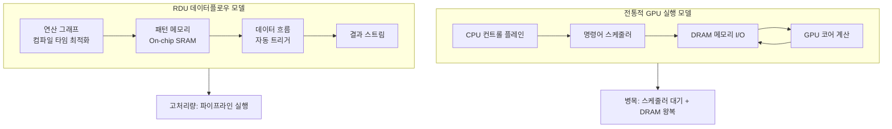
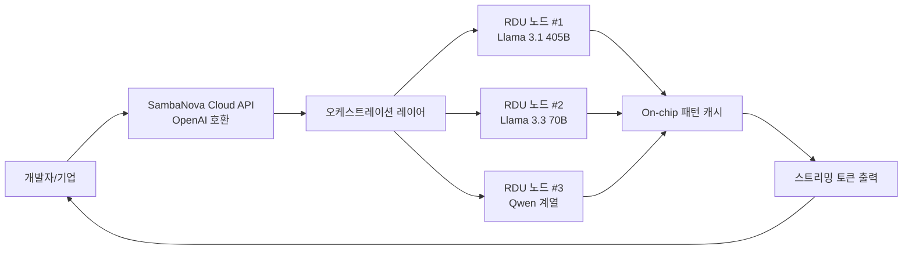
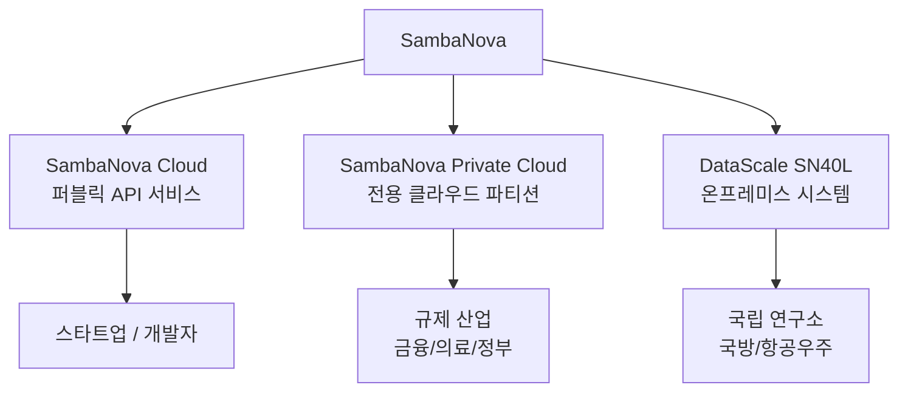

# SambaNova Cloud

## 정체성

| 항목 | 내용 |
|------|------|
| 회사 | SambaNova Systems (미국 캘리포니아, 2017년 창립) |
| 제품 유형 | 엔터프라이즈 AI 추론/학습 클라우드 + 하드웨어 |
| 핵심 하드웨어 | RDU (Reconfigurable Dataflow Unit) SN40L |
| 서비스명 | SambaNova Cloud |
| 라이선스 | 독점 상용 서비스 |
| API 호환성 | OpenAI API 호환 |
| 웹사이트 | sambanova.ai |

SambaNova Systems는 데이터플로우(dataflow) 아키텍처 기반의 독자 AI 칩 RDU를 개발하고, 이를 활용한 클라우드 추론 서비스와 엔터프라이즈 온프레미스 솔루션을 제공한다. 초창기 주요 고객으로 Argonne, Lawrence Livermore, Los Alamos 등 미국 국립 연구소가 있으며, 정부/국방 분야와 금융권 엔터프라이즈에 강점이 있다.

## 핵심 기술: RDU (재구성 가능 데이터플로우 유닛)

RDU는 기존 GPU의 명령어-스케줄링(instruction-scheduling) 방식과 달리 **데이터플로우(dataflow) 실행 모델**을 채택한다. 데이터플로우란 연산이 필요한 데이터가 도착했을 때 즉시 실행되는 방식으로, 제어 흐름 오버헤드를 제거하고 메모리-연산 간 이동을 최소화한다.



위 다이어그램은 GPU가 명령어를 순차 스케줄링하는 반면, RDU는 컴파일 타임에 연산 그래프를 정적으로 매핑해 실행 시 오버헤드를 최소화함을 보여준다.

### SN40L 칩 특성

| 사양 | 내용 |
|------|------|
| 칩 이름 | SN40L (4세대) |
| 타입 | Reconfigurable Dataflow Unit (RDU) |
| 온칩 메모리 | 520 MB (HBM 외 별도 스크래치패드) |
| HBM 용량 | 64 GB HBM2E |
| 인터커넥트 | SambaNova 전용 RoCE 기반 |
| 집적 기술 | TSMC 7nm |

[교차검증 필요] 위 사양은 공개된 자료를 기반으로 작성했으나, 세부 수치는 공식 데이터시트에서 확인하라.

## SambaNova Cloud 서비스 구조



### 지원 모델 (2026년 4월 기준)

SambaNova Cloud의 주요 지원 모델은 다음과 같다. 특히 대용량 모델에서 강점을 보인다.

| 모델 | 특징 |
|------|------|
| Meta Llama 3.1 405B | 플래그십 오픈소스, 높은 품질 |
| Meta Llama 3.3 70B | 고성능 중형 모델 |
| Meta Llama 3.1 8B | 빠른 응답용 소형 모델 |
| Qwen 2.5 72B | 다국어 강세 |

[교차검증 필요] 실제 지원 모델 목록은 cloud.sambanova.ai에서 확인하라.

## 16조 토큰 모델 처리 역량

SambaNova가 강조하는 특징 중 하나는 매우 큰 파라미터 수를 가진 모델(수천억 이상)을 단일 추론 경로로 처리할 수 있다는 점이다. RDU의 온칩 메모리 계층 구조와 데이터플로우 파이프라인이 이를 가능하게 한다.

특히 Llama 3.1 405B 같은 대형 모델에서 GPU 클러스터 대비 낮은 레이턴시를 보고하며, 이는 칩 간 통신 없이 단일 노드에서 처리하는 아키텍처 덕분이다.

[교차검증 필요] "16T 토큰 모델 가능"은 마케팅 문구로 사용되는 표현이며, 정확한 기술적 의미는 공식 문서에서 확인이 필요하다.

## 실무 사용 가이드

### Python 빠른 시작

SambaNova Cloud는 OpenAI 클라이언트와 호환된다.

```python
from openai import OpenAI

client = OpenAI(
    api_key="your-sambanova-api-key",
    base_url="https://api.sambanova.ai/v1"
)

response = client.chat.completions.create(
    model="Meta-Llama-3.1-405B-Instruct",
    messages=[
        {"role": "system", "content": "당신은 유용한 AI 어시스턴트입니다."},
        {"role": "user", "content": "대규모 언어 모델의 작동 원리를 설명해주세요."}
    ],
    max_tokens=2048,
    temperature=0.1,
)
print(response.choices[0].message.content)
```

### 스트리밍

```python
stream = client.chat.completions.create(
    model="Meta-Llama-3.3-70B-Instruct",
    messages=[{"role": "user", "content": "안녕하세요"}],
    stream=True,
)

for chunk in stream:
    delta = chunk.choices[0].delta
    if delta.content:
        print(delta.content, end="", flush=True)
```

### API 키 발급

1. cloud.sambanova.ai 접속
2. 계정 생성 (기업 이메일 권장)
3. API 키 발급
4. 환경변수 설정: `export SAMBANOVA_API_KEY="..."`

## 엔터프라이즈 배포 모델

SambaNova는 클라우드 서비스 외에 두 가지 추가 배포 옵션을 제공한다.



- **SambaNova Cloud**: 일반 API 사용, 종량제
- **SambaNova Private Cloud**: 격리된 전용 환경, 데이터 주권 요구 고객
- **DataScale 시스템**: 자체 데이터센터에 물리 장비 설치

미국 Argonne 국립 연구소, 에너지부 산하 연구 기관 등이 DataScale 시스템 고객으로 알려져 있다.

## 경쟁 서비스 비교

| 항목 | SambaNova | Cerebras | Groq | Together AI |
|------|-----------|---------|------|------------|
| 핵심 칩 | RDU (데이터플로우) | WSE-3 (웨이퍼스케일) | LPU | GPU |
| 405B 모델 지원 | 있음 | 제한적 | 없음 | 있음 |
| 엔터프라이즈 온프레미스 | 있음 (DataScale) | 있음 (CS-3) | 제한 | 없음 |
| 오픈소스 집중도 | Llama 위주 | Llama 위주 | Llama 위주 | 다양 |
| 정부/국방 경험 | 풍부 | 있음 | 제한 | 없음 |

SambaNova의 차별점은 특히 **대형 모델(70B 이상)에서의 추론 효율**과 **엔터프라이즈/규제 산업 대응력**이다. 반면 일반 개발자 접근성은 Groq보다 낮은 편이다.

## 한계 및 트레이드오프

### 알려진 제약

- **모델 다양성**: Llama, Qwen 등 오픈 웨이트 모델 중심. 독점 모델 없음.
- **생태계 성숙도**: OpenAI, Google 대비 커뮤니티와 문서가 적음.
- **온프레미스 비용**: DataScale 시스템 도입 비용은 수백만 달러 수준.
- **컨텍스트 길이**: [교차검증 필요] 지원 최대 컨텍스트는 모델별로 확인 필요.

### 권장 사용 시나리오

- Llama 3.1 405B 급 대형 모델을 낮은 레이턴시로 서비스해야 하는 경우
- 데이터 주권(data sovereignty) 요구사항이 있는 규제 산업
- 정부/국방 분야로 엔터프라이즈 계약이 필요한 경우

## 관련 문서

- [[cerebras-cloud-inference]] -- WSE-3 웨이퍼스케일 기반 초고속 추론 서비스
- [[groq-cloud-api]] -- LPU 아키텍처, 가장 넓은 사용자층의 고속 추론 서비스
- [[ai-accelerators]] -- GPU 외 AI 가속기 전체 생태계
- [[d-matrix-corsair]] -- 인메모리 컴퓨팅 기반 추론 전용 ASIC
- [[tenstorrent-grayskull]] -- 오픈소스 철학의 차세대 AI 칩
