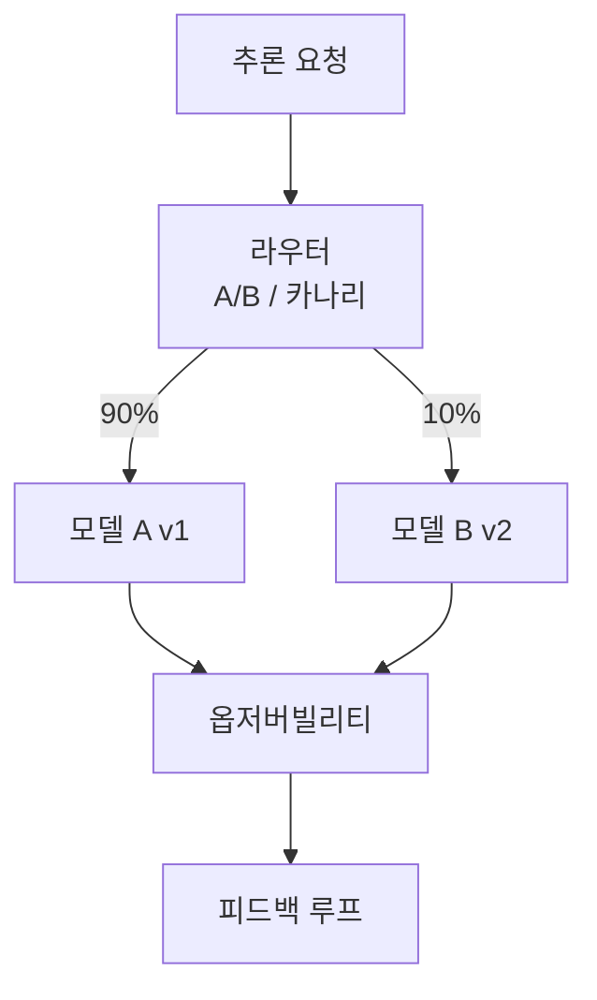

# Seldon Core

Kubernetes 기반 ML 모델 서빙 플랫폼. A/B 테스트, 카나리 배포, 멀티모델 서빙, Explainability를 네이티브 지원한다. [[kserve|KServe]]와 함께 K8s 환경의 양대 모델 서빙 솔루션.

## KServe와의 비교

| 측면 | Seldon Core | KServe |
|------|------------|--------|
| 초점 | 전체 MLOps 파이프라인 | 모델 서빙 표준화 |
| A/B 테스트 | 네이티브 | 제한적 |
| 그래프 추론 | 복잡 DAG 지원 | 단순 체인 |
| Explainability | Alibi 통합 | 별도 |
| 라이선스 | Apache 2.0 + Enterprise | Apache 2.0 |

## 관련 문서

- [[kserve]] -- KServe
- [[model-serving]] -- 모델 서빙
- [[kubernetes-for-ml]] -- Kubernetes for ML
- [[docker-for-ml]] -- Docker for ML
