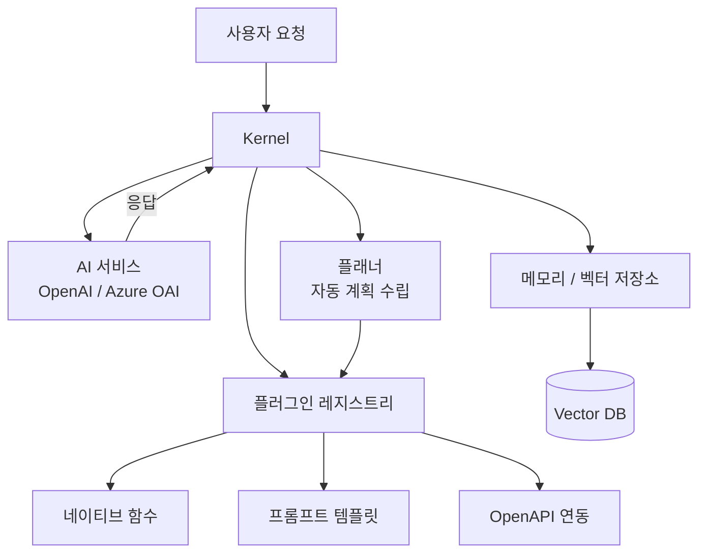

# Semantic Kernel

Microsoft가 2023년 초에 오픈소스로 공개한 엔터프라이즈급 LLM SDK. C#, Python, Java 세 언어를 공식 지원하며, OpenAI, Azure OpenAI, Hugging Face, Mistral 등 다양한 모델 프로바이더를 동일한 추상화 레이어로 다룰 수 있다. "AI 오케스트레이션 레이어"를 표방하며, 기존 애플리케이션에 LLM 기능을 플러그인 방식으로 통합하는 데 최적화되어 있다.

## 프로젝트 개요

| 항목 | 내용 |
|---|---|
| 이름 | Semantic Kernel |
| 개발사 | Microsoft |
| 공개 | 2023년 초 (오픈소스) |
| 지원 언어 | C#, Python, Java |
| 라이선스 | MIT |
| 저장소 | github.com/microsoft/semantic-kernel |
| 주요 타겟 | 엔터프라이즈 .NET / Python 생태계 |

## 핵심 아키텍처

Semantic Kernel의 설계는 세 개의 핵심 개념으로 구성된다.

### Kernel

모든 기능의 중심 컨테이너. AI 서비스(모델 프로바이더)와 플러그인(기능)을 등록하고, 요청 시 이들을 조합하여 실행한다. 의존성 주입(Dependency Injection) 패턴을 채택하여 .NET 생태계와 자연스럽게 통합된다.

### Plugin (플러그인)

기존 코드를 LLM이 호출할 수 있는 함수로 만드는 단위. C# 어노테이션(`[KernelFunction]`)이나 Python 데코레이터(`@kernel_function`)로 일반 함수를 AI 도구로 등록한다. 네이티브 함수뿐 아니라 OpenAPI 명세, 프롬프트 템플릿도 플러그인으로 등록 가능하다.

### Planner (플래너)

목표(goal)가 주어졌을 때 어떤 플러그인을 어떤 순서로 호출할지 LLM이 계획을 세우도록 돕는 컴포넌트. Handlebars Planner, Function Calling Stepwise Planner 등 여러 구현체가 있으며, 최신 버전에서는 OpenAI Function Calling 기반 자동 플래닝이 주류다.

위 다이어그램은 Kernel을 중심으로 AI 서비스, 플러그인, 플래너, 메모리가 어떻게 연결되는지를 보여준다.

## 지원 모델 프로바이더

| 프로바이더 | 비고 |
|---|---|
| Azure OpenAI | 엔터프라이즈 우선 지원 |
| OpenAI | GPT-4o, GPT-4o mini 등 |
| Hugging Face | 로컬/클라우드 모델 |
| Mistral AI | mistral-large 등 |
| Google Gemini | 실험적 지원 |
| Ollama | 로컬 자체 호스팅 |

## 메모리 및 RAG 통합

Semantic Kernel은 텍스트 임베딩과 벡터 저장소를 내장 추상화로 지원한다. `ITextEmbeddingGenerationService` 인터페이스로 임베딩 모델을 교체할 수 있으며, Azure AI Search, Chroma, Qdrant, Weaviate 등을 메모리 백엔드로 연결할 수 있다. `VectorStore` API(SK v1.x 이후)는 임베딩 생성부터 검색까지를 단일 추상화로 묶는다.

## [[langchain]]과의 비교

| 항목 | Semantic Kernel | [[langchain]] |
|---|---|---|
| 주요 언어 | C# (Python/Java 지원) | Python (JS/TS 지원) |
| 타겟 생태계 | 엔터프라이즈 .NET | 연구/스타트업 Python |
| 추상화 철학 | 플러그인/Kernel 중심 | 체인/파이프라인 중심 |
| 플래닝 | 내장 Planner | LangGraph로 별도 구성 |
| Azure 통합 | 네이티브 | 서드파티 |

[[openai-agents-sdk]]가 OpenAI 생태계에 특화된 경량 에이전트 SDK라면, Semantic Kernel은 멀티 프로바이더를 지원하는 엔터프라이즈 SDK에 가깝다.

## 실무 활용 패턴

1. **기존 .NET 서비스 AI화**: 수십 년된 C# 비즈니스 로직을 플러그인으로 등록해 LLM이 호출하게 만드는 경로가 가장 흔하다.
2. **Azure AI Foundry 통합**: Azure AI Foundry(구 Azure ML Studio)와의 공식 통합으로 프롬프트 플로우, 평가 파이프라인을 Semantic Kernel 앱에서 직접 사용할 수 있다.
3. **Copilot 스타일 애플리케이션**: Microsoft 365 Copilot의 내부 오케스트레이션 레이어로 Semantic Kernel이 사용된다고 알려져 있다.

## 관련 문서

- [[langchain]] - Python/JS 생태계의 대표적 LLM 프레임워크
- [[openai-agents-sdk]] - OpenAI 공식 에이전트 SDK (경량, 함수 호출 중심)
- [[langgraph]] - 상태 기반 에이전트 그래프 구성 도구
- [[structured-output]] - LLM 출력 구조화 기법
