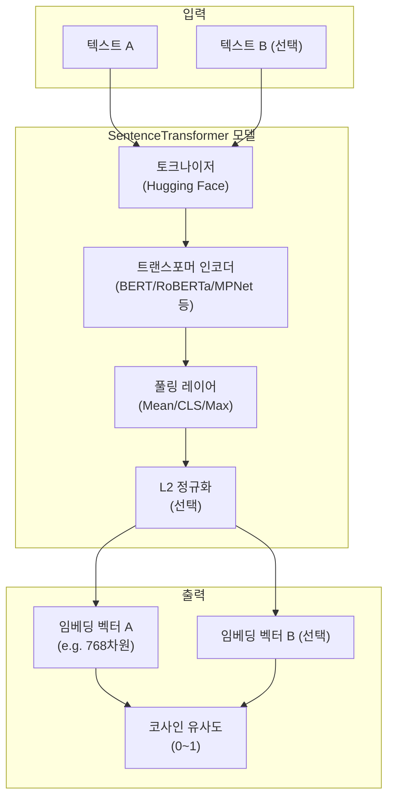
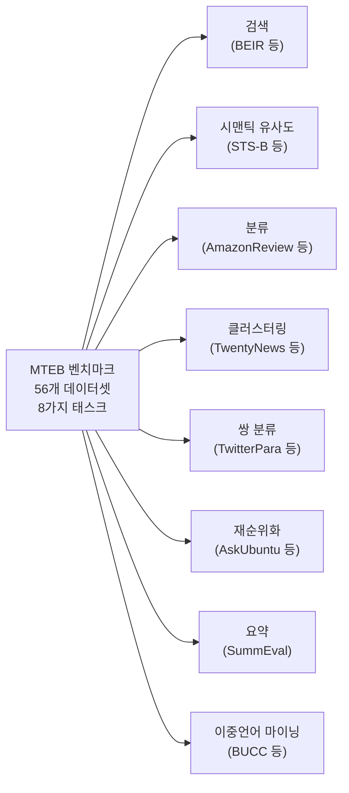

# sentence-transformers 라이브러리

## 개요

**sentence-transformers**는 Nils Reimers와 Iryna Gurevych가 개발한 Python 라이브러리로, 텍스트/이미지를 고품질 밀집 벡터(dense vector)로 변환하는 **임베딩 모델의 사실상 표준 인터페이스**를 제공한다. 2019년 SBERT(Sentence-BERT) 논문과 함께 공개되었으며, Hugging Face 생태계 위에 구축되어 100개 이상의 사전학습 모델을 바로 사용할 수 있다.

2025-2026년 현재 RAG(Retrieval-Augmented Generation) 파이프라인, 시맨틱 검색, 문서 클러스터링, 중복 탐지 등에서 가장 널리 사용되는 임베딩 라이브러리 중 하나다.

## 핵심 아키텍처



핵심 구성은 **트랜스포머 인코더 + 풀링 레이어**의 조합이다. 풀링 방식(Mean Pooling이 기본값)에 따라 토큰 임베딩을 하나의 고정 크기 문장 벡터로 변환한다.

## SBERT vs 순수 BERT의 차이

BERT를 그대로 문장 유사도에 사용하면 두 문장을 함께 인코딩(cross-encoder 방식)해야 하므로 문장 쌍 수에 비례해 연산량이 폭발적으로 증가한다.

| 방식 | 방법 | 10,000문장 쌍 비교 시 | 코사인 유사도 |
|------|------|----------------------|-------------|
| BERT (크로스인코더) | [CLS] A [SEP] B [SEP] 입력 | ~65시간 | 불가 (직접 벡터 없음) |
| SBERT (바이인코더) | A, B 각각 인코딩 후 비교 | ~5초 | 가능 |

SBERT는 두 문장을 **독립적으로 인코딩**하여 비교 가능한 벡터를 생성한다. 오프라인 인덱싱 후 실시간 검색이 가능해진다.

## 설치 및 기본 사용

```python
# 설치
# pip install sentence-transformers

from sentence_transformers import SentenceTransformer

# 모델 로드 (Hugging Face Hub에서 자동 다운로드)
model = SentenceTransformer("all-MiniLM-L6-v2")

# 문장 임베딩
sentences = [
    "This is an example sentence",
    "Each sentence is converted",
]
embeddings = model.encode(sentences)
print(embeddings.shape)  # (2, 384)
```

## 주요 API

### `SentenceTransformer.encode()`

```python
embeddings = model.encode(
    sentences,                  # str 또는 List[str]
    batch_size=32,              # 배치 크기
    show_progress_bar=False,    # tqdm 진행바
    convert_to_numpy=True,      # numpy 배열 반환 (기본값)
    convert_to_tensor=False,    # torch.Tensor 반환
    normalize_embeddings=False, # L2 정규화 여부
    precision="float32",        # "float32" | "float16" | "bfloat16"
)
```

### `util.cos_sim()` / `util.semantic_search()`

```python
from sentence_transformers import util

# 코사인 유사도 행렬
cos_scores = util.cos_sim(embeddings_a, embeddings_b)

# 시맨틱 검색 (쿼리 vs 코퍼스)
query_embedding = model.encode("What is AI?", convert_to_tensor=True)
corpus_embeddings = model.encode(corpus, convert_to_tensor=True)

hits = util.semantic_search(
    query_embedding,
    corpus_embeddings,
    top_k=5,  # 상위 k개 결과
)
# hits: [{"corpus_id": int, "score": float}, ...]
```

### `CrossEncoder` (재순위화)

```python
from sentence_transformers import CrossEncoder

# 크로스인코더로 재순위화 (biencoder 검색 후 정밀도 향상)
cross_encoder = CrossEncoder("cross-encoder/ms-marco-MiniLM-L-6-v2")

pairs = [["query", "passage1"], ["query", "passage2"]]
scores = cross_encoder.predict(pairs)
```

## 주요 사전학습 모델

### 범용 영어 임베딩

| 모델 | 차원 | 최대 토큰 | 용도 |
|------|-----|---------|------|
| `all-MiniLM-L6-v2` | 384 | 256 | 빠른 범용 임베딩 |
| `all-mpnet-base-v2` | 768 | 384 | 고품질 범용 임베딩 |
| `all-distilroberta-v1` | 768 | 512 | DistilRoBERTa 기반 |

### 다국어 임베딩

| 모델 | 차원 | 언어 수 | 특징 |
|------|-----|--------|------|
| `paraphrase-multilingual-mpnet-base-v2` | 768 | 50+ | 패러프레이즈 최적화 |
| `paraphrase-multilingual-MiniLM-L12-v2` | 384 | 50+ | 경량 다국어 |
| `LaBSE` | 768 | 109 | 최대 다국어 커버리지 |

### 최신 고성능 모델 (외부 연계)

sentence-transformers 인터페이스를 통해 사용 가능한 최신 모델:

| 모델 | 조직 | 특징 | 위키 링크 |
|------|------|------|---------|
| `BAAI/bge-m3` | BAAI | 다국어, 다기능 | [[bge-m3-embedding]] |
| `intfloat/e5-large-v2` | Microsoft | 영어 고품질 | [[e5-text-embeddings]] |
| `thenlper/gte-large` | Alibaba | GTE 아키텍처 | [[gte-text-embeddings]] |

## 학습 (Fine-tuning)

sentence-transformers는 커스텀 데이터로 모델을 파인튜닝하는 전체 훈련 파이프라인을 제공한다.

```python
from sentence_transformers import SentenceTransformer, InputExample, losses
from torch.utils.data import DataLoader

# 훈련 데이터 준비
train_examples = [
    InputExample(texts=["문장1", "문장2"], label=0.8),  # 유사도 레이블
    InputExample(texts=["문장3", "문장4"], label=0.1),
]

model = SentenceTransformer("all-MiniLM-L6-v2")
train_loader = DataLoader(train_examples, shuffle=True, batch_size=16)

# 손실 함수: CosineSimilarityLoss (유사도 회귀)
train_loss = losses.CosineSimilarityLoss(model)

# 학습
model.fit(
    train_objectives=[(train_loader, train_loss)],
    epochs=1,
    warmup_steps=100,
    output_path="./my-fine-tuned-model",
)
```

### 주요 손실 함수

| 손실 함수 | 훈련 데이터 형태 | 용도 |
|---------|---------------|------|
| `CosineSimilarityLoss` | (문장1, 문장2, 유사도 점수) | 유사도 회귀 |
| `SoftmaxLoss` | (문장1, 문장2, 클래스) | 문장 쌍 분류 |
| `TripletLoss` | (앵커, 긍정, 부정) | 트리플릿 학습 |
| `MultipleNegativesRankingLoss` | (앵커, 긍정) 쌍 | 대조 학습 (NLI/QA) |
| `MatryoshkaLoss` | 임의 | 다차원 임베딩 학습 |

`MultipleNegativesRankingLoss`는 긍정 쌍만 있어도 배치 내 다른 샘플을 자동 부정 샘플로 사용하여 효율적으로 학습한다.

## MTEB 평가 표준

**MTEB(Massive Text Embedding Benchmark)**는 임베딩 모델의 품질을 측정하는 표준 벤치마크로, sentence-transformers 팀이 주도적으로 개발했다.



MTEB 리더보드에서 상위를 차지하는 모델이 실무에서도 강력하다는 경험 법칙이 있다. 현재 `bge-m3`, `e5-mistral-7b-instruct` 등이 상위권을 유지하고 있다.

## 실무 RAG 파이프라인 통합 패턴

```python
from sentence_transformers import SentenceTransformer
import numpy as np


class SimpleSemanticSearch:
    """RAG 파이프라인의 검색 컴포넌트 예시"""

    def __init__(self, model_name: str = "all-MiniLM-L6-v2"):
        self.model = SentenceTransformer(model_name)
        self.corpus: list[str] = []
        self.embeddings: np.ndarray | None = None

    def index(self, documents: list[str]) -> None:
        """문서 코퍼스 인덱싱"""
        self.corpus = documents
        self.embeddings = self.model.encode(
            documents,
            batch_size=64,
            normalize_embeddings=True,  # 코사인 유사도 = 내적으로 단순화
            show_progress_bar=True,
        )

    def search(self, query: str, top_k: int = 5) -> list[dict]:
        """쿼리 검색"""
        query_emb = self.model.encode(
            [query],
            normalize_embeddings=True,
        )
        # 정규화된 벡터끼리 내적 = 코사인 유사도
        scores = (query_emb @ self.embeddings.T)[0]
        top_indices = np.argsort(scores)[::-1][:top_k]
        return [
            {"doc": self.corpus[i], "score": float(scores[i])}
            for i in top_indices
        ]
```

## 성능 최적화

- **배치 크기**: `encode()` 시 `batch_size=64` 이상으로 설정하면 GPU 활용도 향상
- **정밀도**: `precision="float16"` 또는 `"bfloat16"` 사용 시 메모리 절반, 속도 향상
- **정규화**: `normalize_embeddings=True` 시 이후 내적 연산으로 코사인 유사도 계산 가능 (더 빠름)
- **GPU**: `model.encode()` 자동으로 가능한 경우 GPU 사용

## 관련 문서

- [[sentence-transformer]] - SBERT 알고리즘 원리
- [[bge-m3-embedding]] - BAAI BGE-M3 다국어 임베딩 모델
- [[gte-text-embeddings]] - Alibaba GTE 임베딩 계열
- [[e5-text-embeddings]] - Microsoft E5 임베딩 계열
- [[rag]] - RAG 파이프라인 전체 구조
- [[semantic-search]] - 시맨틱 검색 일반 개념
