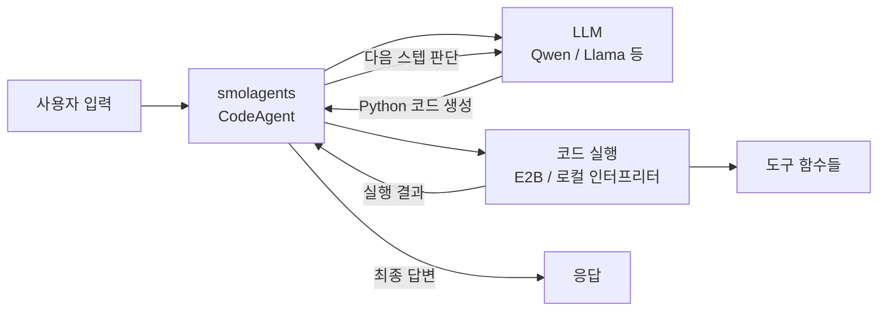

# smolagents

HuggingFace가 2024년 말에 공개한 경량 에이전트 라이브러리. "smol"(작은)이라는 이름처럼, 핵심 코드베이스를 극도로 단순하게 유지한다. 대부분의 에이전트 프레임워크가 도구 호출(tool calling)을 JSON 함수 명세로 처리하는 데 비해, smolagents는 에이전트가 **Python 코드를 직접 작성해 도구를 호출**하는 "코드 퍼스트(code-first)" 접근법을 기본으로 삼는다.

## 프로젝트 개요

| 항목 | 내용 |
|---|---|
| 이름 | smolagents |
| 개발사 | HuggingFace |
| 공개 | 2024년 12월 |
| 언어 | Python |
| 라이선스 | Apache 2.0 |
| 저장소 | github.com/huggingface/smolagents |
| 주요 의존성 | transformers, huggingface_hub |

## 두 가지 에이전트 유형

smolagents는 두 가지 에이전트 타입을 제공한다.

### CodeAgent (기본)

LLM이 Python 코드 스니펫을 생성하고, 이를 안전한 인터프리터(E2B 또는 로컬 sandbox)에서 실행한다. 도구는 일반 Python 함수로 정의되며, 에이전트가 직접 함수를 임포트하고 호출하는 코드를 작성한다.

```python
from smolagents import CodeAgent, HfApiModel

agent = CodeAgent(
    tools=[my_tool],
    model=HfApiModel("Qwen/Qwen2.5-Coder-32B-Instruct")
)
agent.run("데이터를 분석하고 차트를 그려줘")
```

### ToolCallingAgent

전통적인 JSON 기반 tool calling 방식을 사용하는 에이전트. OpenAI function calling 호환 모델과 함께 쓸 때 적합하다.



위 흐름에서 에이전트가 도구를 "호출"하는 방식이 JSON 명세가 아닌 Python 코드라는 점이 핵심이다.

## 코드 퍼스트 방식의 장점

HuggingFace 팀이 코드 기반 접근법을 선택한 근거:

1. **표현력**: Python 코드는 조건 분기, 반복, 변수 재사용이 자유로워 복잡한 로직을 자연스럽게 표현할 수 있다.
2. **도구 합성**: 여러 도구의 출력을 코드로 조합할 수 있어 다단계 처리가 유연하다.
3. **디버깅 용이**: 에이전트가 실제로 실행한 코드가 로그에 남아 추적이 쉽다.
4. **모델 크기 효율**: JSON 스키마보다 코드를 생성하는 것이 작은 모델에서도 더 안정적이라는 주장이 있다.

## 모델 지원

smolagents는 HuggingFace Hub의 모든 텍스트 생성 모델을 기본 지원하며, 외부 API도 플러그인 방식으로 연결할 수 있다.

| 클래스 | 연결 대상 |
|---|---|
| `HfApiModel` | HuggingFace Inference API / Endpoints |
| `TransformersModel` | 로컬 transformers 모델 |
| `LiteLLMModel` | LiteLLM을 통한 100+ 프로바이더 |
| `OpenAIServerModel` | OpenAI 호환 엔드포인트 |

## [[coding-agent]] 패턴과의 관계

smolagents의 CodeAgent는 [[coding-agent]] 개념의 실제 구현체 중 하나다. 에이전트가 코드를 작성하고 실행하며 피드백을 받는 REPL 루프를 라이브러리 수준에서 추상화한다. [[langchain]]의 PythonREPLTool이나 [[openai-agents-sdk]]의 코드 인터프리터 도구와 유사한 목표를 달성하지만, smolagents는 코드 실행을 "하나의 도구"가 아닌 "에이전트의 기본 동작 방식"으로 격상시킨다는 차이가 있다.

## 보안 고려사항

코드 실행은 강력한 만큼 위험하다. smolagents는 다음 두 가지 실행 환경을 제공한다.

- **LocalPythonInterpreter**: 로컬에서 직접 실행. 프로토타입/실험용. 위험한 임포트를 차단하는 allowlist를 제공하지만 완전한 격리는 아니다.
- **E2BSandbox**: E2B(Engineer to Business) 클라우드 샌드박스에서 격리 실행. 프로덕션 권장.

## 관련 문서

- [[coding-agent]] - 코드 실행 기반 에이전트 패턴 일반론
- [[langchain]] - LLM 애플리케이션 프레임워크 (Python/JS)
- [[openai-agents-sdk]] - OpenAI 공식 에이전트 SDK
- [[subagents]] - 서브에이전트 분기 패턴
