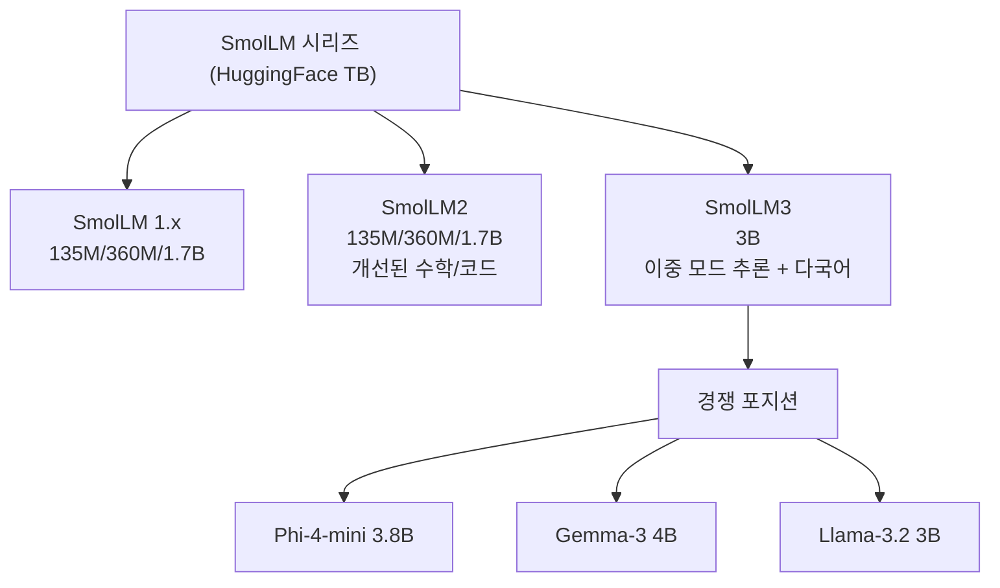
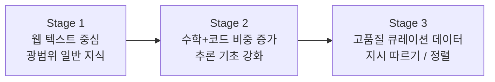

# HuggingFace SmolLM3 출시 - 이중 모드 추론 지원 3B 경량 다국어 모델

SmolLM3는 HuggingFace TB(Technology & Benchmarks)팀이 개발한 3B 파라미터 경량 언어 모델이다. 11.2조(T) 토큰을 3단계 커리큘럼 방식으로 학습했으며, "이중 모드(dual mode)" 추론을 지원한다. 즉, 일반 응답 모드와 단계적 추론 모드를 단일 모델로 처리한다. 6개 언어 지원, 긴 컨텍스트 처리, 완전 오픈 소스 공개가 특징이다.

## SmolLM 시리즈 내 포지셔닝



이전 SmolLM 시리즈(최대 1.7B)에서 3B로 처음 스케일업됐다. 소형 모델의 상한을 넓히는 것이 이 프로젝트의 연구 목표다.

## 모델 스펙

| 항목 | 값 |
|------|-----|
| 파라미터 수 | 3B (3억) |
| 아키텍처 | Transformer Decoder-only |
| 어텐션 | GQA (Grouped Query Attention) |
| 컨텍스트 길이 | 8,192 토큰 (롱 컨텍스트 확장: 32K) |
| 훈련 토큰 | 11.2T (11.2조 토큰) |
| 지원 언어 | 영어, 프랑스어, 독일어, 스페인어, 이탈리아어, 포르투갈어 |
| 라이선스 | Apache 2.0 |

## 3단계 커리큘럼 학습

SmolLM3의 핵심 학습 전략은 **3단계 커리큘럼**이다. 단계별로 데이터 혼합 비율을 바꿔가며 능력을 쌓는다.



| 단계 | 토큰 수 | 데이터 구성 |
|------|---------|------------|
| 1단계 | ~8T | 웹 텍스트 70%, 코드 15%, 수학 5%, 기타 10% |
| 2단계 | ~2.5T | 웹 텍스트 40%, 코드 25%, 수학 25%, 기타 10% |
| 3단계 | ~0.7T | 고품질 큐레이션 데이터 (명령 따르기, 추론 집중) |

이 전략은 [[meta-llama]] 3.1 이후 대형 모델에서 검증된 "데이터 비율 점진 조정" 방식을 소형 모델에 적용한 것이다.

## 이중 모드(Dual Mode) 추론

SmolLM3의 가장 특징적인 기능이다. 단일 모델로 두 가지 응답 방식을 지원한다.

### 일반 모드 (Standard Mode)

빠른 단답형 응답에 적합. 추론 과정을 생략하고 즉각 답변한다.

```python
from transformers import AutoModelForCausalLM, AutoTokenizer

model_id = "HuggingFaceTB/SmolLM3-3B"
tokenizer = AutoTokenizer.from_pretrained(model_id)
model = AutoModelForCausalLM.from_pretrained(model_id, torch_dtype="auto")

# 일반 모드 (system prompt 없음 or "일반" 지시)
messages = [
    {"role": "user", "content": "파이썬에서 리스트 컴프리헨션이란?"}
]
input_ids = tokenizer.apply_chat_template(
    messages, add_generation_prompt=True, return_tensors="pt"
)
output = model.generate(input_ids, max_new_tokens=256)
print(tokenizer.decode(output[0][input_ids.shape[1]:], skip_special_tokens=True))
```

### 추론 모드 (Reasoning Mode)

복잡한 수학 문제, 논리 퍼즐, 코딩 과제에서 단계적 사고 과정을 거쳐 답변한다. `<think>...</think>` 태그로 내부 추론 과정을 명시한다.

```python
# 추론 모드 활성화 (system prompt에 명시)
messages = [
    {"role": "system", "content": "You are a helpful assistant that thinks step by step."},
    {"role": "user", "content": "1부터 100까지 소수의 합은?"}
]
input_ids = tokenizer.apply_chat_template(
    messages,
    add_generation_prompt=True,
    return_tensors="pt",
)
output = model.generate(
    input_ids,
    max_new_tokens=1024,
    do_sample=False,  # 추론은 greedy가 일반적으로 안정적
)
response = tokenizer.decode(output[0][input_ids.shape[1]:], skip_special_tokens=True)
# <think>
# 소수는 2, 3, 5, 7, 11, ...
# 100 이하 소수를 모두 나열하면...
# 합계: 1060
# </think>
# 1부터 100까지 소수의 합은 **1060**입니다.
```

이 이중 모드 방식은 QwQ나 DeepSeek-R1의 "thinking" 모드와 유사하지만, 3B 소형 모델에서 구현됐다는 점이 차별점이다.

## 롱 컨텍스트 지원

기본 컨텍스트 8K 토큰에서, 확장 시 32K 토큰까지 지원한다.

```python
# RoPE 스케일링을 통한 컨텍스트 확장
model = AutoModelForCausalLM.from_pretrained(
    model_id,
    torch_dtype="auto",
    rope_scaling={
        "type": "dynamic",
        "factor": 4.0,  # 8K -> 32K
    }
)
```

## 온디바이스 배포

3B 모델은 스마트폰 및 엣지 기기에서 실행 가능한 마지막 크기대이다. [[on-device-llm]] 시나리오에서 SmolLM3의 활용:

| 기기 | 정밀도 | 메모리 | 토큰/초 |
|------|--------|--------|---------|
| iPhone 16 Pro (A18) | INT4 | ~2GB | ~35 t/s |
| Android (Snapdragon 8 Gen 3) | INT4 | ~2GB | ~20 t/s |
| MacBook Air M3 | FP16 | ~6GB | ~55 t/s |
| RTX 4060 (8GB) | FP16 | ~6GB | ~120 t/s |

```python
# llama.cpp / MLX를 통한 온디바이스 실행
# (GGUF 변환 후)
# ollama run smollm3:3b
```

## SmolLM3 vs. 유사 크기 경쟁 모델

| 모델 | 파라미터 | 추론 모드 | 다국어 | 컨텍스트 |
|------|----------|----------|--------|---------|
| SmolLM3 | 3B | 이중 모드 | 6개 언어 | 32K |
| Llama 3.2 | 3B | 없음 | 영어 중심 | 128K |
| Phi-4-mini | 3.8B | 없음 | 영어 중심 | 128K |
| Gemma 3 | 4B | 없음 | 다국어 | 128K |
| Qwen 2.5 | 3B | 없음 | 다국어 | 32K |

컨텍스트 길이에서는 Llama 3.2나 Phi-4-mini에 뒤지지만, 이중 모드 추론을 지원하는 3B급 오픈소스 모델은 SmolLM3가 처음이다.

## HuggingFace TB팀의 연구 의의

TB(Technology & Benchmarks)팀은 HuggingFace 내에서 모델 개발보다는 벤치마크, 평가 도구, 작은 참조 모델(reference model)을 만드는 것에 집중하는 팀이다. SmolLM3는:

1. **소형 모델 한계 탐구**: 3B 이하에서 추론 모드가 실용적으로 가능한지 검증
2. **오픈 재현 가능성**: 훈련 데이터, 코드, 레시피를 모두 공개해 커뮤니티가 재현/개선 가능
3. **엣지 AI 기반**: 온디바이스 LLM의 참조 구현으로서 역할

[[meta-llama]] 3.2의 3B 모델이 단순 지시 따르기에 집중했다면, SmolLM3는 추론 능력과 다국어를 동시에 소형 모델에서 검증하려는 야심찬 실험이다.

## 관련 문서

- [[on-device-llm]] — 온디바이스 LLM 배포 전략
- [[meta-llama]] — Llama 3.2 3B와 비교 참조
- [[small-language-model]] — 소형 언어 모델 전반 트렌드
- [[smollm]] — SmolLM 이전 버전 개요 (1.x, 2.x)
- [[dual-mode-reasoning]] — 이중 모드 추론 개념 [교차검증 필요: 별도 concept 페이지 생성 필요]
- [[huggingface-hub]] — HuggingFace Hub에서 모델 배포/공유
