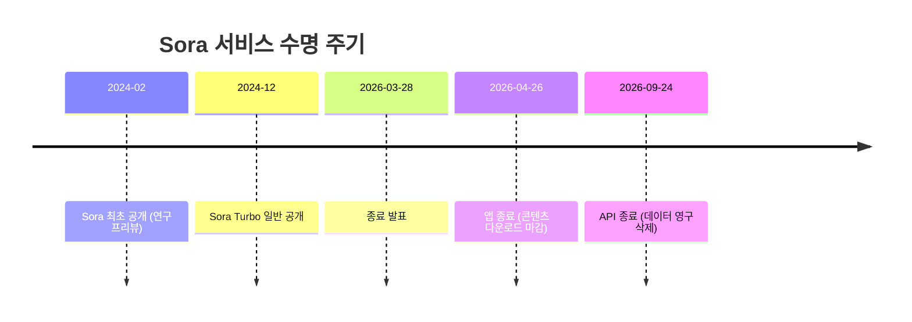
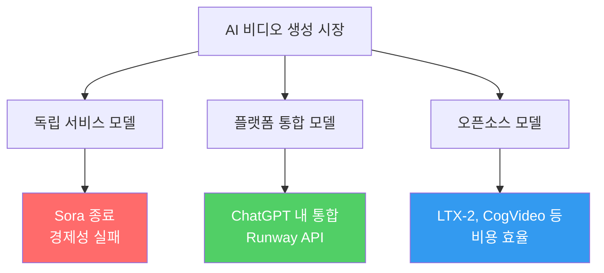

# Sora 2 Shutdown

OpenAI가 자사 AI 비디오 생성 서비스 Sora를 2026년 3월 28일부로 공식 종료 발표한 사건. 앱은 04.26, API는 09.24에 순차 종료되며, 컴퓨팅 자원을 코딩 도구와 기업 고객 쪽으로 재배치하겠다는 전략적 결정이다.

## 왜 지금 중요한가

프론티어 AI 기업이 수억 달러를 투자한 제품을 사용자 50만 미만, 일일 운영비 약 $1M이라는 경제성 문제로 18개월 만에 철수한 첫 사례다. AI 비디오 생성 시장에서 [[runway-gen-4-5|Runway Gen-4.5]]와 오픈소스 모델들이 빠르게 우위를 점하면서, "모든 모달리티를 직접 서비스"하는 전략의 한계를 보여준다.

## 종료 타임라인

## 종료 배경

### 경제적 요인
- 활성 사용자 50만 미만으로 ChatGPT(수억 사용자) 대비 극히 적은 규모
- 일일 운영 비용 약 $1M -- 비디오 생성의 높은 컴퓨팅 비용이 주요 부담
- 수익 대비 인프라 비용 비율이 지속 불가능한 수준

### 전략적 전환
- OpenAI가 "초앱(super app)" 전략으로 전환하면서 [[gpt-5-architecture|ChatGPT]] 중심 통합 추진
- 컴퓨팅 자원을 [[codex-cli|코딩 도구(Codex)]]와 기업 고객향 서비스에 집중 재배치
- 비디오 생성은 독립 서비스 대신 ChatGPT 내 기능으로 흡수 가능성

### 경쟁 환경
- Runway Gen-4.5가 Artificial Analysis Text-to-Video Elo 1위(1,247) 달성
- 오픈소스 LTX-2(19B)가 네이티브 4K@50fps + 동기화 오디오 지원
- Google Veo 2, Meta Movie Gen 등 경쟁 모델 급속 성장

## 사용자 영향과 데이터 처리

- 앱 종료(04.26) 전까지 Sora 라이브러리에서 비디오/이미지 직접 내보내기 가능
- 최종 내보내기 기간에 이메일 알림 제공
- 모든 기한 이후 사용자 데이터 영구 삭제
- 얼굴 업로드 기능에 대한 데이터 수집 우려도 종료 논의에 포함

## 후속 영향

### 월드 모델 연구 존속
OpenAI는 Sora를 "물리적 경제 자동화"를 목표로 하는 월드 모델 연구 프로젝트로 계속 진행할 것임을 밝혔다. 제품은 종료하되 기반 연구는 유지하는 분리 전략이다.

### 시장 교훈

- AI 비디오 생성은 독립 제품보다 플랫폼 내 기능으로 통합되는 방향이 경제적
- 오픈소스 모델이 품질 격차를 빠르게 좁히면서 프리미엄 가격 정당화 어려움
- "모든 모달리티 직접 서비스" 전략의 한계 -- 선택과 집중의 필요성 입증

## 관련 페이지

- [[runway-gen-4-5|Runway Gen-4.5]] -- 현재 AI 비디오 생성 1위 모델
- [[gpt-5-architecture|GPT-5 Architecture & System Card]] -- OpenAI의 핵심 투자 방향
- [[ai-venture-bubble-2026|AI Venture Bubble]] -- AI 제품의 경제성 문제 맥락

## 대표 레퍼런스

- [What to know about the Sora discontinuation -- OpenAI Help](https://help.openai.com/en/articles/20001152-what-to-know-about-the-sora-discontinuation)
- [Why OpenAI really shut down Sora -- TechCrunch](https://techcrunch.com/2026/03/29/why-openai-really-shut-down-sora/)
- [OpenAI sets two-stage Sora shutdown -- The Decoder](https://the-decoder.com/openai-sets-two-stage-sora-shutdown-with-app-closing-april-2026-and-api-following-in-september/)
