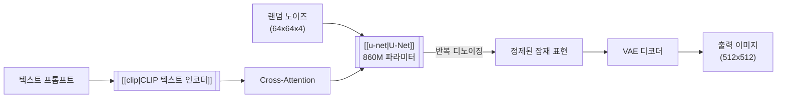
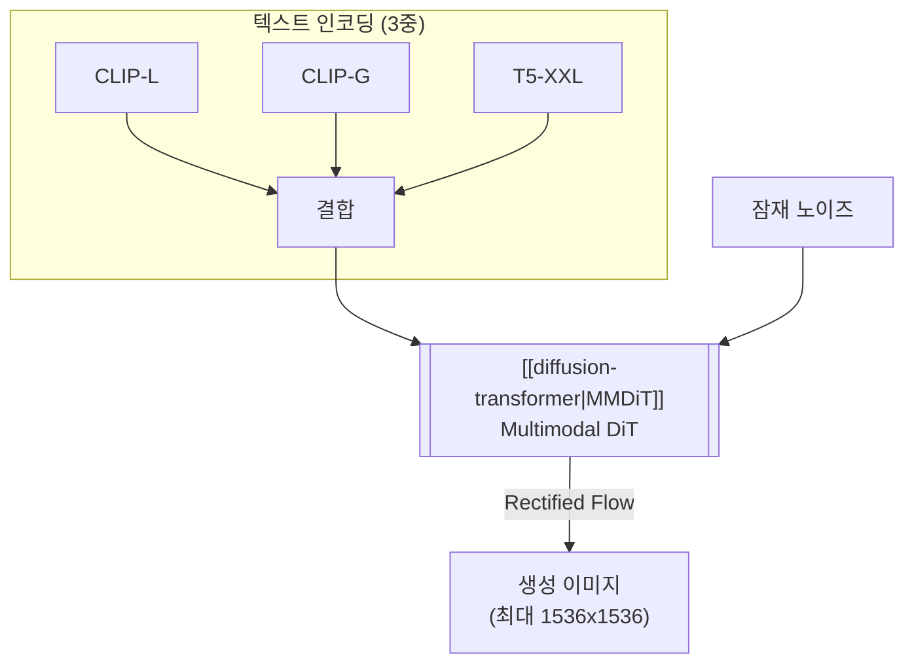

# Stable Diffusion

## 개요

Stable Diffusion은 Runway, CompVis Group(LMU 뮌헨), Stability AI가 공동 개발한 오픈소스 [[ai-image-generation|AI 이미지 생성]] 모델이다. 2022년 8월 22일 최초 공개된 이후, SD 1.5에서 SDXL, SD 3.5까지 세대를 거듭하며 발전했다. 핵심 기술은 Rombach et al.(2022)의 Latent Diffusion Model(LDM)로, [[diffusion-models|확산 과정]]을 픽셀 공간이 아닌 VAE의 잠재 공간(latent space)에서 수행하여 소비자 GPU에서도 이미지 생성이 가능하도록 연산 비용을 대폭 절감했다.

DALL-E, Midjourney 등 독점 서비스와 달리 코드와 가중치를 공개하여 [[ai-image-generation|AI 이미지 생성]]의 민주화를 이끌었으며, AUTOMATIC1111 WebUI, ComfyUI, Fooocus 등 풍부한 커뮤니티 생태계를 탄생시켰다. SD 3.0부터는 [[u-net|U-Net]]을 [[diffusion-transformer|DiT(Diffusion Transformer)]]로 전환하며 아키텍처의 세대 교체를 완료했다.

## 버전 진화

### SD 1.x - 2.1: Latent Diffusion + U-Net

초기 세대는 VAE 인코더/디코더, [[u-net|U-Net]] 노이즈 예측기, [[clip|CLIP]] 텍스트 인코더 세 컴포넌트로 구성된다.

텍스트 프롬프트가 CLIP 인코더를 거쳐 U-Net에 주입되고, 잠재 공간에서 반복 디노이징 후 VAE 디코더가 최종 이미지를 복원하는 구조다.

- **SD 1.5** (2022.10): 커뮤니티 표준 모델. 512x512 해상도. U-Net 860M + CLIP ViT-L/14 123M 파라미터
- **SD 2.0/2.1** (2022.11-12): OpenCLIP ViT-H/14로 텍스트 인코더 교체, 768x768 해상도 지원. 그러나 NSFW 필터링 강화와 프롬프트 호환성 차이로 커뮤니티 저항이 있었다

| 항목 | SD 1.5 | SD 2.1 |
|------|--------|--------|
| 해상도 | 512x512 | 512-768 |
| 텍스트 인코더 | CLIP ViT-L/14 | OpenCLIP ViT-H/14 |
| U-Net 파라미터 | ~860M | ~865M |
| 학습 데이터 필터링 | 최소 | NSFW 필터 강화 |

### SDXL (2023.07): 스케일 업

SDXL은 파라미터를 3.5B으로 대폭 확장하고, 네이티브 1024x1024 해상도를 지원한 메이저 업그레이드다.

- **이중 텍스트 인코더**: CLIP ViT-L과 OpenCLIP ViT-bigG를 동시 사용하여 프롬프트 이해력 향상
- **확장된 U-Net**: Transformer 블록 수와 채널을 증가시키고, 다양한 종횡비로 학습
- **리파이너 파이프라인**: 베이스 모델 출력을 2차 모델이 정제하는 2단계 생성 지원
- **마이크로 컨디셔닝**: 원본 해상도, 크롭 좌표, 타겟 해상도를 조건으로 추가하여 생성 품질 제어

### SD 3.0 - 3.5 (2024.02-): DiT 전환

SD 3.0은 [[u-net|U-Net]]을 [[diffusion-transformer|Diffusion Transformer(DiT)]]로 완전히 교체한 아키텍처 세대 전환이다.

3중 텍스트 인코더(CLIP-L, CLIP-G, T5-XXL)가 MMDiT에 멀티모달 토큰으로 입력되며, Rectified Flow 샘플링으로 효율적 생성을 수행한다.

- **MMDiT(Multimodal DiT)**: 텍스트와 이미지 토큰이 독립 스트림을 거치되, joint attention에서 상호 참조한다
- **3중 텍스트 인코더**: [[clip|CLIP]]-L, CLIP-G, T5-XXL로 다양한 수준의 텍스트 이해를 결합
- **Rectified Flow**: 노이즈와 데이터를 직선 경로로 연결하는 flow matching 기법. 기존 DDPM 대비 빠르고 안정적
- **파라미터 범위**: 800M ~ 8B 변형

### 버전별 아키텍처 비교

| 항목 | SD 1.5 | SDXL | SD 3.5 |
|------|--------|------|--------|
| 백본 | [[u-net\|U-Net]] | U-Net (확장) | [[diffusion-transformer\|MMDiT]] |
| 텍스트 인코더 | CLIP ViT-L | CLIP ViT-L + ViT-bigG | CLIP-L + CLIP-G + T5-XXL |
| 파라미터 | ~1B | ~3.5B | 800M-8B |
| 네이티브 해상도 | 512x512 | 1024x1024 | 최대 1536x1536 |
| 샘플링 | DDPM/DDIM | DDPM/DDIM | Rectified Flow |
| 라이선스 | CreativeML OpenRAIL-M | OpenRAIL-M | Stability AI Community |

## 학습 데이터

Stable Diffusion은 LAION-5B 데이터셋(Common Crawl에서 수집한 50억 이미지-텍스트 쌍)의 필터링 서브셋으로 학습되었다:

- **laion2B-en**: 20억 영어 이미지-텍스트 쌍
- **laion-high-resolution**: 고해상도 서브셋
- **LAION-Aesthetics v2 5+**: 미적 점수 5 이상 필터링

초기 학습에 256대의 A100 GPU에서 약 150,000 GPU-시간(~$600,000)이 소요되었으며, 이는 독점 모델 대비 현저히 낮은 비용이다.

## 커뮤니티 생태계

Stable Diffusion의 오픈소스 공개는 독보적인 커뮤니티 생태계를 탄생시켰다:

- **AUTOMATIC1111 WebUI**: 가장 널리 사용된 웹 인터페이스. 확장 기능 생태계 보유
- **ComfyUI**: 노드 기반 워크플로우 에디터. SD 3.x 이후 주류로 부상
- **ControlNet**: 포즈, 깊이 맵, 엣지 등 공간 조건을 추가하는 어댑터
- **IP-Adapter**: 이미지를 참조 조건으로 사용하는 어댑터
- **LoRA 파인튜닝**: 소량의 이미지로 특정 스타일이나 인물을 학습
- **Civitai**: 커뮤니티 모델/LoRA 공유 플랫폼

이 생태계는 DALL-E, Midjourney 등 독점 서비스에서 불가능한 수준의 커스터마이징과 제어를 제공한다.

## 하드웨어 접근성

소비자 GPU에서 실행 가능하다는 점이 Stable Diffusion의 핵심 강점이다:

- **최소 요구**: 2.4GB VRAM (최적화 적용 시)
- **권장**: 8GB+ VRAM (RTX 3060 이상)
- **SD 1.5**: GTX 1060 6GB에서도 실행 가능
- **SDXL**: 8GB+ VRAM 권장
- **SD 3.5 Medium**: 8B 변형은 16GB+ VRAM 권장

## 한계와 논쟁

- **손/사지 생성 품질**: 초기 버전에서 두드러진 문제. SDXL 이후 개선되었으나 완전 해결은 아님
- **텍스트 렌더링**: 이미지 내 텍스트 생성이 부정확. SD 3.x에서 개선
- **저작권 소송**: Getty Images와 아티스트들이 학습 데이터 사용에 대해 소송 제기
- **문화적 편향**: 영어/서양 문화 중심 학습 데이터의 편향이 생성 결과에 반영
- **Stability AI 경영 위기**: CEO Robin Rombach와 Emad Mostaque의 리더십 교체, 재정 불안정

## 참고 자료

- Rombach, R. et al. (2022). [High-Resolution Image Synthesis with Latent Diffusion Models](https://arxiv.org/abs/2112.10752). CVPR 2022
- [Stable Diffusion - Wikipedia](https://en.wikipedia.org/wiki/Stable_Diffusion)
- [Stability AI](https://stability.ai/)

## 관련 문서

- [[clip]] -- SD 1.x~3.x의 텍스트 인코더
- [[diffusion-transformer]] -- SD 3.0+의 핵심 백본 (MMDiT)
- [[u-net]] -- SD 1.x~SDXL의 노이즈 예측 백본
- [[vision-transformer]] -- CLIP 이미지 인코더의 기반 아키텍처
