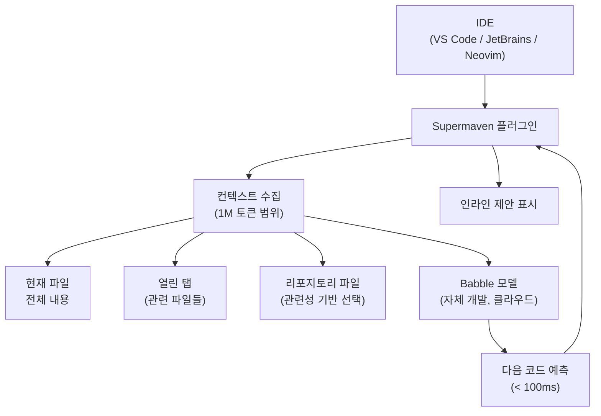
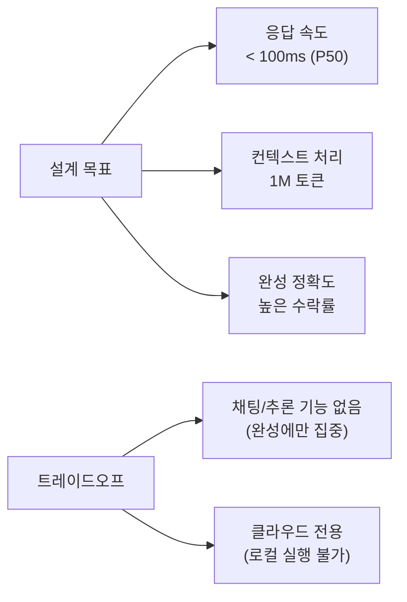
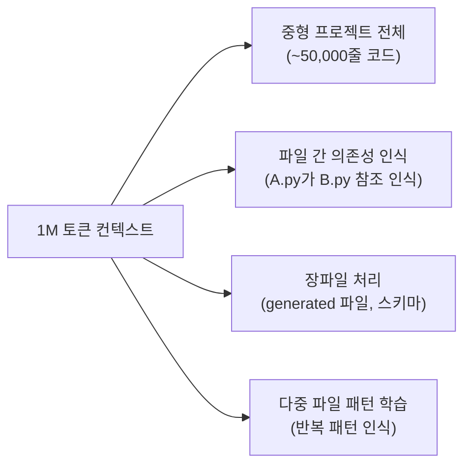
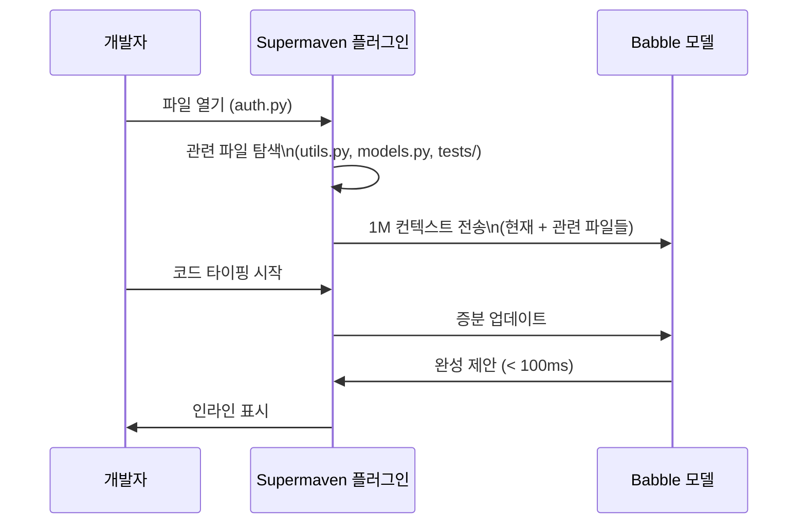
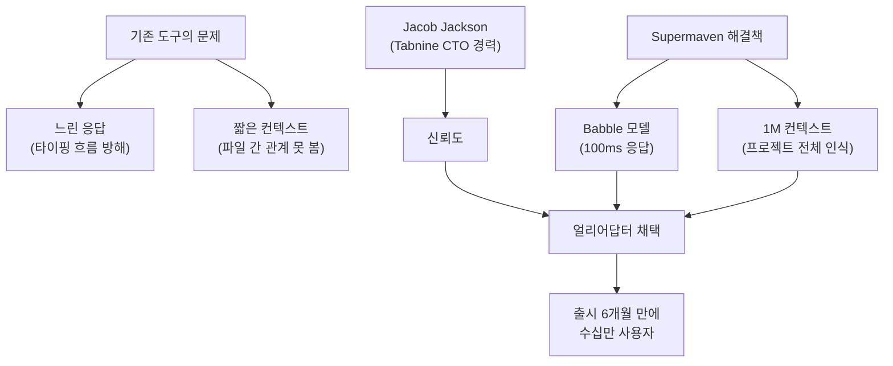
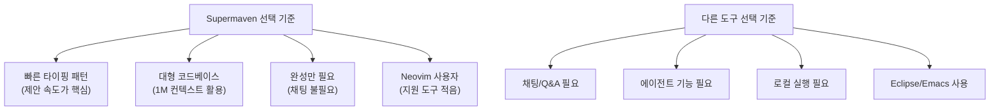

# Supermaven

## 정체성

| 항목 | 내용 |
|------|------|
| 이름 | Supermaven |
| 개발사 | Supermaven Inc. |
| 창업자 | Jacob Jackson (Tabnine 전 CTO) |
| 창업 | 2023년 말 |
| 라이선스 | 독점 |
| 웹사이트 | supermaven.com |
| 가격 | 무료 플랜 / Pro $10/월 / Enterprise 맞춤 |
| 지원 IDE | VS Code, JetBrains, Neovim |
| 핵심 모델 | Babble (자체 개발) |
| 컨텍스트 길이 | 1,000,000 토큰 (1M) |

Supermaven은 **코드 완성 속도와 컨텍스트 길이**를 핵심 차별점으로 내세우는 신생 AI 코딩 도구다. [[tabnine-completion|Tabnine]] 전 CTO였던 Jacob Jackson이 창업했으며, 기존 자동완성 도구들의 한계(짧은 컨텍스트, 느린 응답)를 해결하기 위해 **Babble**이라는 자체 모델을 개발했다. 출시 직후 빠른 응답 속도와 대규모 컨텍스트로 개발자 커뮤니티에서 주목을 받았다.

---

## 아키텍처 개요



Supermaven의 핵심 설계 원칙은 **최대한 많은 코드를 컨텍스트에 넣고, 최대한 빨리 응답하는 것**이다. 1M 토큰 컨텍스트는 일반적인 중형 프로젝트 전체를 한 번에 모델이 볼 수 있음을 의미한다.

---

## Babble 모델

Supermaven의 핵심 기술은 **Babble**이라는 자체 개발 모델이다. 범용 LLM이 아닌 코드 완성에 특화하여 설계되었다:



Babble은 범용 채팅 모델(GPT-4, Claude)을 코드 완성에 쓰는 것과 달리:
- **스펙디코딩(speculative decoding)** 유사 기법으로 다음 토큰 예측을 병렬화
- 코드 완성에 불필요한 파라미터를 제거한 경량 아키텍처
- 짧은 레이턴시(latency)를 위해 스트리밍 응답 최적화

---

## 핵심 기능

### 1. 1M 토큰 컨텍스트

경쟁 도구와의 컨텍스트 비교:

| 도구 | 컨텍스트 길이 |
|------|-------------|
| [[github-copilot|GitHub Copilot]] | ~8k-32k 토큰 |
| [[tabnine-completion|Tabnine]] | ~수천 토큰 |
| [[codeium-completion|Codeium]] | ~수만 토큰 |
| **Supermaven** | **1,000,000 토큰** |

1M 컨텍스트가 실무에서 의미하는 것:



### 2. 100ms 미만 응답

일반적인 코드 완성 도구의 응답 시간 비교:

| 도구 | P50 응답 시간 |
|------|-------------|
| [[github-copilot|GitHub Copilot]] | ~300-500ms |
| [[codeium-completion|Codeium]] | ~200-400ms |
| [[tabnine-completion|Tabnine]] 로컬 | ~50-100ms |
| **Supermaven** | **< 100ms (P50)** |

타이핑과 제안 사이의 지연이 인지되지 않는 수준을 목표로 한다. 개발자가 멈추지 않고 자연스럽게 코딩하는 흐름(flow state)을 유지할 수 있다.

### 3. 레포지토리 전체 인식



Supermaven 플러그인은 IDE에서 파일을 열면 관련 파일들을 자동으로 백그라운드에서 모델에 로드한다. 이후 타이핑 시에는 증분 업데이트만 전송하여 응답 시간을 최소화한다.

### 4. 자연스러운 인라인 제안

Supermaven은 GitHub Copilot과 유사한 **고스트 텍스트(ghost text)** 방식으로 제안을 표시한다:

```python
# 개발자가 입력:
def parse_config(file_path: str) -> dict:
    """YAML 설정 파일을 파싱하여 딕셔너리 반환"""
    # Supermaven이 고스트 텍스트로 표시 (회색):
    with open(file_path, "r") as f:
        return yaml.safe_load(f)
```

`Tab` 키 한 번으로 수락. `Ctrl+→`로 단어 단위 수락.

---

## 경쟁 도구 비교

| 항목 | Supermaven | [[github-copilot|GitHub Copilot]] | [[codeium-completion|Codeium]] | [[tabnine-completion|Tabnine]] |
|------|-----------|----------------|---------|---------|
| 창립 | 2023 | 2021 | 2022 | 2013/2019 |
| 핵심 차별점 | 속도 + 1M 컨텍스트 | GitHub 통합 | 무료 | 로컬 모델 |
| 컨텍스트 길이 | 1M 토큰 | ~32k | 중간 | 낮음 |
| 응답 속도 | 매우 빠름 (<100ms) | 보통 | 빠름 | 빠름 (로컬) |
| 로컬 실행 | 없음 | 없음 | 없음 | 있음 (차별점) |
| 코드 채팅 | 없음 | Copilot Chat | 있음 | 있음 |
| 무료 플랜 | 있음 (제한) | 없음 (학생 제외) | 완전 무료 | 제한적 |
| IDE 지원 | VS Code, JetBrains, Neovim | 주요 IDE | 40+ | 15+ |
| 에이전트 | 없음 | Copilot Agent | 없음 | 없음 |

---

## 실무 사용 가이드

### 설치 (VS Code)

```bash
# VS Code 마켓플레이스에서 "Supermaven" 검색
# 또는 CLI:
code --install-extension supermaven.supermaven
```

설치 후 우측 하단 상태바에서 Supermaven 아이콘 클릭 → 계정 로그인.

### Neovim 설치

```lua
-- lazy.nvim
{
  "supermaven-inc/supermaven-nvim",
  config = function()
    require("supermaven-nvim").setup({
      keymaps = {
        accept_suggestion = "<Tab>",
        clear_suggestion = "<C-]>",
        accept_word = "<C-j>",
      },
    })
  end,
}
```

### JetBrains 설치

JetBrains Marketplace → "Supermaven" 검색 → 설치 → IDE 재시작 → Settings에서 로그인.

### 효과적으로 사용하기

Supermaven은 컨텍스트가 넓을수록 더 정확하다. 따라서:

1. **관련 파일을 함께 열어두기**: 참조하는 파일들을 탭으로 열면 컨텍스트에 포함됨
2. **명확한 함수/변수명 사용**: 이름 자체가 모델에게 의도를 전달하는 컨텍스트
3. **docstring 선 작성**: 함수 설명을 먼저 쓰면 구현 제안이 더 정확해짐

---

## 성장 배경과 시장 위치

Supermaven이 2024년 빠르게 주목받은 배경:



---

## 한계 / 트레이드오프

| 항목 | 내용 |
|------|------|
| 채팅 없음 | 코드 완성에만 집중. 채팅/Q&A/리팩토링 지원 없음 |
| 에이전트 없음 | Cursor/Cline 같은 자율 에이전트 기능 없음 |
| 클라우드 전용 | 로컬 실행 불가. 코드가 서버로 전송됨 |
| 신생 기업 리스크 | 스타트업으로서 장기 지속성 불확실 |
| 제한적 IDE | VS Code, JetBrains, Neovim만 지원. Eclipse, Emacs 등 없음 |
| 고급 맥락 부족 | 의미론적 검색(RAG), 문서 참조 등 고급 컨텍스트 기능 없음 |
| 무료 플랜 한계 | 무료는 기본 기능만. 전체 기능은 Pro($10/월) 필요 |

---

## 어떤 개발자에게 적합한가



---

## 관련 문서

- [[github-copilot]] - GitHub/Microsoft AI 코드 완성
- [[codeium-completion]] - 무료 AI 코드 완성 (40+ IDE)
- [[tabnine-completion]] - 엔터프라이즈/로컬 모델 AI 코드 완성
- [[continue-vscode-extension]] - 오픈소스 모델 에그노스틱 코딩 보조
- [[cursor]] - AI 우선 코드 에디터 (에이전트 포함)
- [[cline-claude-coder]] - VS Code용 오픈소스 Claude 코딩 에이전트
