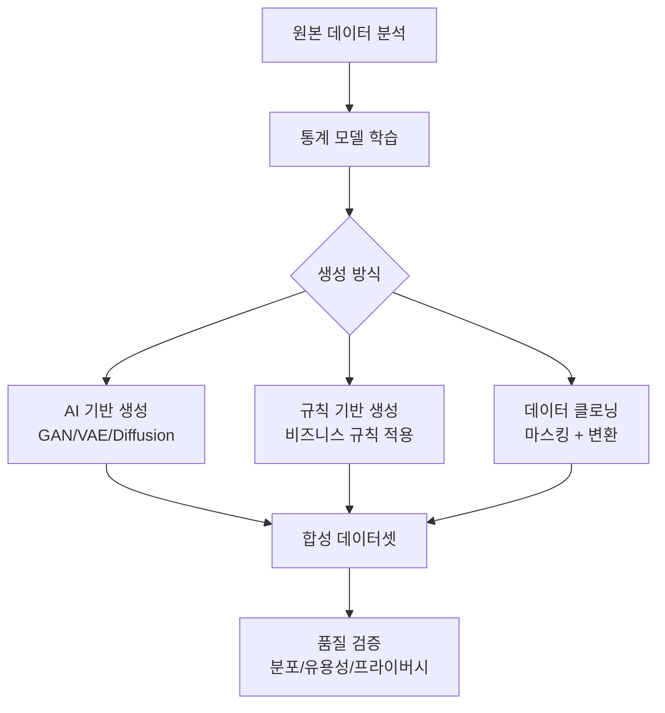

## 개요

합성 데이터 생성 도구는 실제 데이터의 통계적 특성을 유지하면서 개인정보를 보호하는 인공 데이터셋을 생성하는 플랫폼이다. Gartner는 기업 75%가 합성 고객 데이터를 생성하게 될 것으로 전망하며, 2030년까지 합성 구조화 데이터가 실제 데이터보다 3배 이상 빠르게 성장할 것으로 예측한다. 주요 도구로는 Gretel, MOSTLY AI, K2view, Syntho, YData, Hazy 등이 있다.

[[cicd-testing-with-synthetic-data|CI/CD 파이프라인]] 통합, GDPR/HIPAA 등 프라이버시 규정 준수, [[long-horizon-rl-training-for-agents|ML 학습 데이터]] 증강이 핵심 사용 사례다.

## 핵심 특징

### 주요 도구 비교

| 도구 | 강점 | 약점 | 타겟 산업 |
|------|------|------|-----------|
| **Gretel** | API 기반, 다양한 데이터 형식, 개발자 친화적 | 단순 데이터에 제한적 | AI/ML |
| **MOSTLY AI** | 높은 품질, 편향 제거, GDPR 최적화 | 구조화된 데이터만 지원 | 금융/의료 |
| **K2view** | 엔티티 기반, 참조 무결성 유지, 포괄적 | 설정 복잡, 높은 비용 | 엔터프라이즈 |
| **Syntho** | 유연한 모델링 | 학습곡선 복잡 | 범용 |
| **YData** | 자동화된 워크플로 | 대규모 확장성 제한 | 데이터 사이언스 |
| **Hazy** | 차등 프라이버시, 사실적 생성 | 고비용 | 금융 |

### 공통 기능

- **프라이버시 보존**: 차등 프라이버시, k-익명성, 데이터 마스킹 적용
- **통계적 충실도**: 원본 데이터의 분포, 상관관계, 패턴 유지
- **규정 준수**: GDPR, HIPAA, CCPA 등 데이터 보호 규정 자동 적용
- **CI/CD 통합**: 테스트 파이프라인에서 자동으로 합성 데이터 생성

## 기술 상세

### 생성 방식

**AI 기반 생성**: GAN(Generative Adversarial Network), VAE(Variational Autoencoder), Diffusion 모델 등을 사용하여 원본 데이터의 통계적 분포를 학습하고 새로운 데이터를 생성한다. 복잡한 상관관계와 패턴을 재현할 수 있지만, 학습에 충분한 원본 데이터가 필요하다.

**규칙 기반 생성**: 비즈니스 규칙과 도메인 제약 조건을 명시적으로 정의하여 데이터를 생성한다. 데이터의 의미적 정확성을 보장하기 쉽지만, 복잡한 통계적 패턴 재현에는 한계가 있다.

**데이터 클로닝**: 원본 데이터를 마스킹, 변환, 셔플링하여 새로운 데이터를 생성한다. 가장 간단하지만 프라이버시 보장 수준이 가장 낮다.

### 주요 사용 사례

- **ML 학습 데이터**: 소량/편향된 데이터를 증강하여 모델 성능 향상
- **테스트 환경**: 프로덕션 데이터 대신 합성 데이터로 개발/QA 수행
- **데이터 공유**: 조직 간 또는 외부 파트너와 안전한 데이터 공유
- **헬스케어**: Synthea 같은 도구로 임상 알고리즘 개발 검증 (오픈소스). 뇌성마비, 오피오이드 처방, 패혈증 등 다양한 임상 모듈 제공
- **컴퓨터 비전**: Synthesis AI 같은 도구가 자동차/로봇/의료 산업용 고품질 합성 이미지 생성

### 추가 도구

| 도구 | 유형 | 강점 |
|------|------|------|
| **Synthea** | 오픈소스 | 의료 전용, 상세한 환자 기록 생성, 무료 |
| **SDV (Synthetic Data Vault)** | 오픈소스 | 관계형/시계열 데이터, 다목적, 활발한 커뮤니티 |
| **Synthesis AI** | 상용 | 컴퓨터 비전용 고품질 합성 이미지, 현실적 데이터 생성 |
| **Tonic.ai** | 상용 | 데이터 마스킹 + 합성 데이터 통합 플랫폼 |

### 엔티티 기반 생성 (K2view)

K2view의 차별화 전략은 엔티티 기반(entity-based) 접근법이다. 고객, 주문 등 비즈니스 엔티티를 중심으로 합성 데이터를 생성하며, 모든 시스템에 걸쳐 **참조 무결성(referential integrity)**을 보장한다. 이는 단순 통계적 모방을 넘어 비즈니스 맥락의 정확성과 일관성을 유지하는 핵심 메커니즘이다.

### NVIDIA의 AI 에이전트용 합성 데이터

NVIDIA는 에이전트 AI 학습을 위한 합성 데이터 생성에 집중하고 있으며, 시뮬레이션 환경에서 에이전트 행동 데이터를 대규모로 생성하는 파이프라인을 제공한다. [[nvidia-cosmos]]의 Cosmos Predict/Transfer 모델이 로봇/자율주행용 합성 데이터 생성을 담당한다.

### 오픈소스 생태계

[[huggingface-synthetic-data|Hugging Face]]는 오픈소스 합성 데이터 생성기를 공개하여 커뮤니티 접근성을 높이고 있다. SDV(Synthetic Data Vault)는 관계형/시계열 데이터를 다루는 다목적 오픈소스 라이브러리로, 외래키 제약 조건을 유지하면서 합성 데이터를 생성한다.

### 전망

Gartner에 따르면 엔티티 기반 아키텍처를 채택하는 조직이 2026년 합성 데이터 활용에서 상당한 경쟁 우위를 확보할 것으로 전망된다. 합성 구조화 데이터는 2030년까지 실제 데이터보다 3배 이상 빠르게 성장할 것으로 예측된다.

## 프라이버시 보존 기법

합성 데이터의 핵심 가치는 프라이버시 보존이다. 주요 기법은 다음과 같다:

- **차등 프라이버시(Differential Privacy)**: 수학적 보장을 통해 개별 레코드의 존재 여부를 식별할 수 없도록 한다. 엡실론(epsilon) 파라미터로 프라이버시-유용성 트레이드오프를 조절한다.
- **k-익명성(k-Anonymity)**: 모든 레코드가 최소 k개의 다른 레코드와 동일한 준식별자(quasi-identifier)를 가지도록 보장한다.
- **데이터 마스킹**: PII(개인식별정보)를 합성 값으로 대체하면서 데이터 형식과 참조 관계를 유지한다.

### 품질 검증 3축

합성 데이터의 품질은 세 축으로 평가한다:

1. **통계적 충실도(Statistical Fidelity)**: 원본 데이터의 분포, 상관관계, 패턴과의 유사도
2. **유용성(Utility)**: ML 모델 학습, 분석, 테스트에서의 실제 활용 가능성
3. **프라이버시(Privacy)**: 원본 데이터의 개인정보가 합성 데이터에서 추론 불가능한지 여부

## 관련 문서

- [[agent-memory-systems]] - 에이전트 학습 데이터 관리
- [[long-horizon-rl-training-for-agents]] - 에이전트 RL 학습 데이터
- [[nvidia-cosmos]] - NVIDIA 물리 AI 합성 데이터 생성
