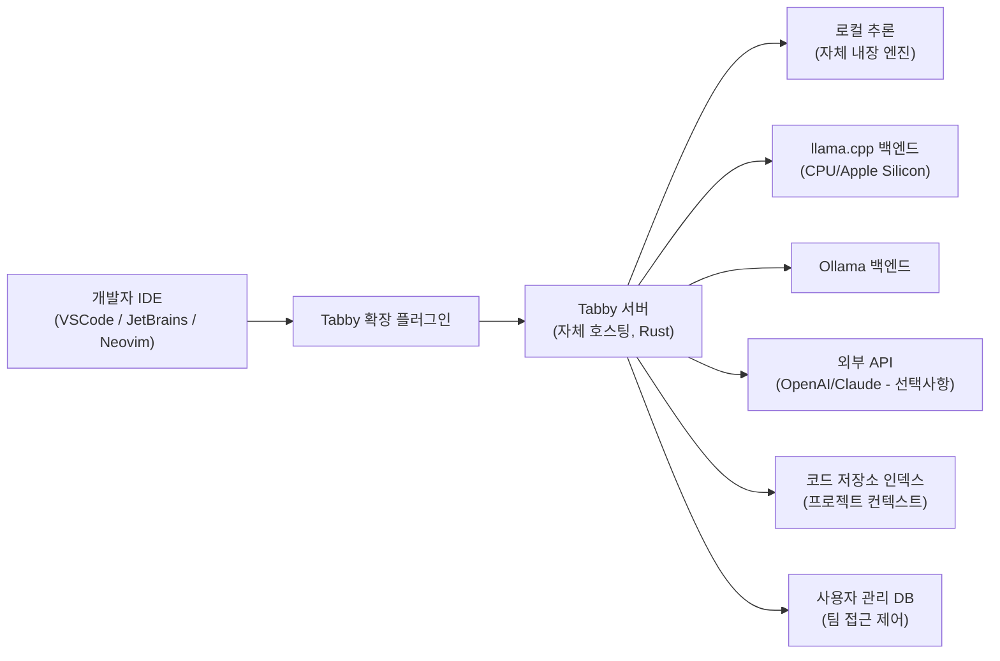
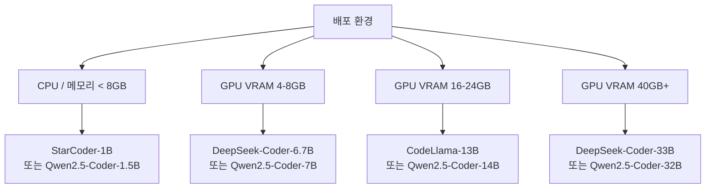

# Tabby

## 정체성

| 항목 | 내용 |
|------|------|
| 이름 | Tabby |
| 개발사 | TabbyML |
| 라이선스 | Apache 2.0 |
| GitHub | [TabbyML/tabby](https://github.com/TabbyML/tabby) |
| 웹사이트 | tabby.tabbyml.com |
| 출시 | 2023년 초 |
| 언어/스택 | Rust (서버), TypeScript (IDE 확장) |
| 배포 방식 | Docker, 바이너리 직접 실행, Homebrew (macOS) |

Tabby는 **완전 자체 호스팅(self-hosted) 코딩 AI 어시스턴트**로, GitHub Copilot과 같은 클라우드 기반 서비스의 온프레미스(on-premises) 대안이다. 코드 및 데이터가 외부로 나가지 않아야 하는 기업 보안 요구사항을 충족하면서, VSCode·JetBrains·Neovim 등 주요 IDE에서 코드 완성, 채팅 기반 코드 보조를 제공한다.

---

## 아키텍처 개요



---

## 핵심 기능

### 1. 코드 완성 (FIM - Fill-in-the-Middle)

커서 앞뒤 컨텍스트를 모두 활용하는 인필링(infilling) 완성:

```python
# 입력 (커서 위치: |)
def calculate_fibonacci(n):
    |

# Tabby 완성 제안
def calculate_fibonacci(n):
    if n <= 1:
        return n
    return calculate_fibonacci(n - 1) + calculate_fibonacci(n - 2)
```

FIM 지원 모델(StarCoder, CodeLlama, DeepSeek-Coder 등)에서 최적 성능.

### 2. 저장소 컨텍스트 (Repository Context)

단순 파일 단위 완성을 넘어 **전체 저장소를 인덱싱**해 프로젝트 전반의 함수, 클래스, 패턴을 인식:

```
기존 도구: 현재 열린 파일 컨텍스트만 참조
Tabby: utils/auth.py의 함수를 api/routes.py 편집 시 자동 참조
```

### 3. 코드 채팅 (Chat)

IDE 내에서 선택한 코드에 대해 채팅:
- 코드 설명 요청
- 버그 찾기
- 리팩토링 제안
- 테스트 코드 생성

### 4. 지원 코딩 모델

| 모델 | 코드 특화 | 크기 | 권장 환경 |
|------|----------|------|----------|
| StarCoder2 3B/7B/15B | O | 소~중 | GPU 없는 환경 |
| DeepSeek-Coder 1.3B/6.7B/33B | O | 소~대 | GPU 환경 |
| CodeLlama 7B/13B/34B | O | 중~대 | GPU 환경 |
| Qwen2.5-Coder 0.5B/1.5B/7B/32B | O | 소~대 | 다양 |
| TabbyML 자체 모델 | O | 소 | CPU 가능 |

### 5. 팀 관리 (Team Features)

Tabby는 개인 사용자뿐 아니라 팀 배포를 지원:

- **사용자 인증**: GitHub/GitLab OAuth 연동
- **팀 접근 제어**: 특정 저장소 인덱스에 대한 접근 권한 설정
- **사용 통계**: 완성 수락률, 사용자별 통계 대시보드
- **SSO 지원**: 엔터프라이즈 IdP 통합 [교차검증 필요]

---

## 배포 가이드

### Docker 빠른 시작

```bash
# CPU 전용 (가장 간단)
docker run -it \
  -v $HOME/.tabby:/data \
  -p 8080:8080 \
  tabbyml/tabby \
  serve --model TabbyML/StarCoder-1B

# CUDA GPU 지원
docker run -it \
  --gpus all \
  -v $HOME/.tabby:/data \
  -p 8080:8080 \
  tabbyml/tabby \
  serve --model TabbyML/DeepseekCoder-6.7B --device cuda
```

### Homebrew (macOS)

```bash
brew install tabbyml/tabby/tabby
tabby serve --model TabbyML/StarCoder-1B --device metal  # Apple Silicon
```

### 모델 선택 가이드



### VSCode 확장 설치

1. VSCode Marketplace에서 "Tabby" 검색 또는:
```bash
code --install-extension TabbyML.vscode-tabby
```

2. 설정에서 서버 URL 지정:
```json
{
  "tabby.api.endpoint": "http://localhost:8080"
}
```

---

## GitHub Copilot vs Tabby 비교

| 특성 | GitHub Copilot | Tabby |
|------|--------------|-------|
| 배포 방식 | 클라우드 (Microsoft) | 자체 호스팅 |
| 데이터 프라이버시 | 외부 전송 | 완전 로컬 |
| 비용 | $10~$19/월/사용자 | 인프라 비용만 |
| 모델 교체 | 불가 (Microsoft 고정) | 자유롭게 교체 |
| 저장소 컨텍스트 | GitHub 통합 | 자체 인덱스 |
| IDE 지원 | VSCode, JetBrains, Neovim 등 | VSCode, JetBrains, Neovim, Emacs |
| 오프라인 사용 | 불가 | 완전 오프라인 가능 |
| 초기 설정 복잡도 | 매우 낮음 | 중간~높음 (서버 운영 필요) |

---

## 한계 / 트레이드오프

### 초기 설정 부담

서버를 직접 운영해야 하므로 Docker 설정, 모델 다운로드, 네트워크 구성 등 Copilot 대비 진입 장벽이 높음.

### 모델 품질의 한계

최신 Copilot은 GPT-4o급 모델을 활용하지만, Tabby에서 실용적으로 운영 가능한 모델(7B~14B)은 대형 클라우드 모델 대비 완성 품질이 낮을 수 있음.

### 하드웨어 의존성

품질 있는 코드 완성을 위해 GPU가 권장됨. CPU 전용 서빙은 응답이 느려 실시간 완성 경험이 저하.

### 유지보수 책임

모델 업데이트, 서버 패치, 보안 관리가 모두 운영자 책임. 클라우드 서비스 대비 운영 비용.

---

## 엔터프라이즈 활용 패턴

- **보안 민감 산업**: 금융, 의료, 법률 등 코드가 외부로 나가면 안 되는 환경
- **Air-gapped 네트워크**: 인터넷 연결이 제한된 내부망 개발 환경
- **오픈소스 전략**: Copilot 라이선스 비용을 절감하면서 내부 코딩 어시스턴트 구축
- **사내 코드베이스 특화**: 내부 프레임워크, 사내 API를 인덱싱해 Copilot보다 높은 컨텍스트 이해 달성

---

## 관련 문서

- [[continue-vscode-extension]] - 또 다른 오픈소스 IDE AI 확장
- [[code-completion]] - 코드 완성 기법 개념
- [[cursor|cursor-editor]] - 클라우드 기반 AI 코딩 에디터
- [[ollama]] - Tabby 백엔드로 활용 가능한 로컬 LLM 런타임
- [[llama-cpp]] - CPU 기반 로컬 추론
