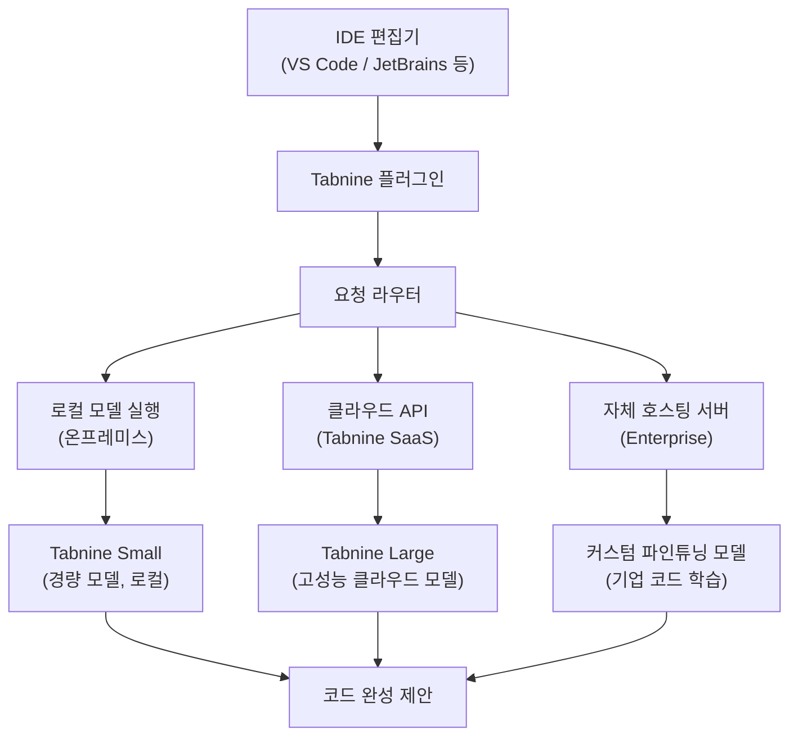
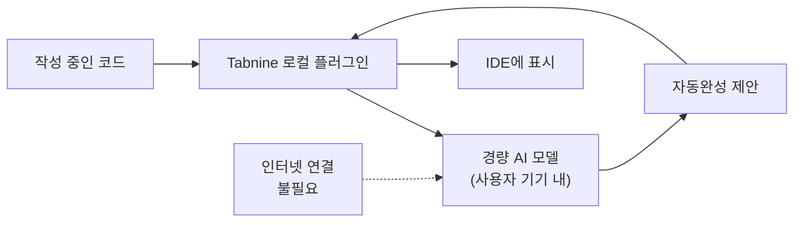
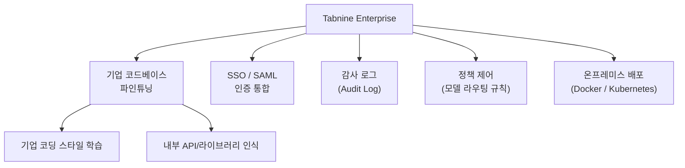
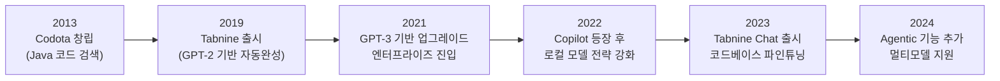
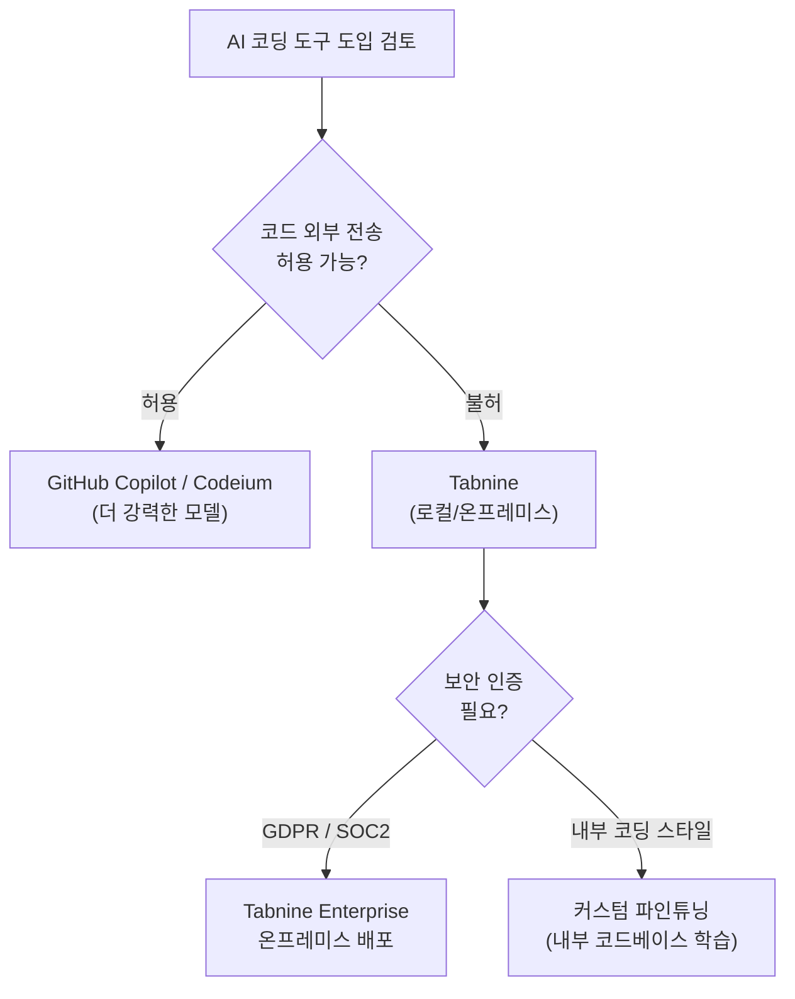

# Tabnine

## 정체성

| 항목 | 내용 |
|------|------|
| 이름 | Tabnine |
| 개발사 | Tabnine Ltd. (구 Codota) |
| 창업 | 2013년 (Codota), 2019년 (Tabnine 제품 출시) |
| 본사 | 이스라엘 텔아비브 |
| 라이선스 | 독점 (무료 플랜 / 유료 플랜) |
| 웹사이트 | tabnine.com |
| 가격 | 개인 무료 / Pro $12/월 / Enterprise 맞춤 계약 |
| 지원 IDE | VS Code, IntelliJ, PyCharm, Eclipse, Vim, Emacs 등 15+ |
| 지원 언어 | JavaScript, Python, TypeScript, Java, C++, Go, Rust 등 80+ |

Tabnine은 **AI 기반 코드 자동완성 도구 중 가장 오랜 역사를 가진 제품** 중 하나다. 2019년 GPT-2 기반으로 코드 완성 기능을 선보이며 AI 코딩 도구 시장을 선도했다. [[github-copilot|GitHub Copilot]]이 2021년 등장하기 전까지 가장 널리 사용된 AI 코딩 보조 도구였으며, 이후 **엔터프라이즈 프라이버시와 로컬 모델 실행**을 핵심 차별점으로 전환했다.

---

## 아키텍처 개요



Tabnine의 핵심 아키텍처 특징은 **하이브리드 실행 모델**이다. 민감한 코드는 로컬에서만 처리하고, 고품질 완성이 필요한 경우에만 클라우드를 사용하도록 정책을 설정할 수 있다.

---

## 핵심 기능

### 1. 전체 라인/전체 함수 완성

Tabnine의 기본 기능은 **현재 컨텍스트를 기반으로 한 코드 완성**이다:

- **단어 수준**: 변수명, 함수명, 키워드 자동완성
- **라인 수준**: 현재 줄을 완성하는 코드 제안
- **블록 수준**: 함수 본문, 클래스 메서드 전체 생성

```python
# 입력:
def calculate_fibonacci(n):
    # Tabnine이 다음을 제안:
    if n <= 1:
        return n
    return calculate_fibonacci(n - 1) + calculate_fibonacci(n - 2)
```

### 2. 로컬 모델 실행

Tabnine의 가장 강력한 차별점은 **코드가 인터넷으로 나가지 않는 로컬 실행 모드**다:



- 코드 데이터가 외부 서버로 전송되지 않음
- 오프라인 환경에서도 동작
- 금융, 의료, 방산 등 규제 산업에서 주로 선택

### 3. 엔터프라이즈 기능



- **커스텀 파인튜닝**: 기업 내부 코드베이스로 모델을 추가 학습
- **정책 기반 라우팅**: 민감한 프로젝트는 로컬만, 일반 작업은 클라우드 허용
- **팀 통계**: 코드 완성 채택률, 생산성 지표 대시보드
- **GDPR/SOC2 준수**: 유럽 규제 및 보안 인증 대응

### 4. 다중 IDE 지원

Tabnine이 초기에 빠르게 성장한 이유 중 하나는 **광범위한 IDE 지원**이다:

| IDE | 지원 방식 |
|-----|---------|
| VS Code | Marketplace 확장 |
| IntelliJ IDEA / PyCharm / GoLand | JetBrains Marketplace 플러그인 |
| Eclipse | Eclipse Marketplace |
| Neovim / Vim | VimPlug / Packer 플러그인 |
| Emacs | MELPA 패키지 |
| Sublime Text | Package Control |
| JupyterLab | pip 패키지 |

---

## Tabnine vs 경쟁 도구 비교

| 항목 | Tabnine | [[github-copilot|GitHub Copilot]] | [[codeium-completion|Codeium]] | [[supermaven-fast-completion|Supermaven]] |
|------|---------|----------------|----------|-----------|
| 창립 | 2013/2019 | 2021 | 2022 | 2024 |
| 무료 플랜 | 제한적 | 없음 (학생/OSS 제외) | 완전 무료 | 무료 플랜 있음 |
| 로컬 모델 | 핵심 기능 | 없음 | 없음 | 없음 |
| 엔터프라이즈 | 강점 | 강점 | 성장 중 | 약함 |
| 컨텍스트 창 | 중간 | 큼 | 큼 | 매우 큼 (1M) |
| IDE 지원 | 15+ | 주요 IDE | 40+ | VS Code 중심 |
| 응답 속도 | 빠름 | 빠름 | 빠름 | 매우 빠름 |
| 코드 채팅 | 있음 | Copilot Chat | 있음 | 제한적 |

---

## 역사와 진화



Tabnine이 AI 코딩 도구 시장에서 생존한 핵심 전략은 **경쟁보다는 틈새 집중**이었다. GitHub Copilot과 정면 경쟁 대신, 코드를 외부로 보낼 수 없는 엔터프라이즈 고객을 집중 공략했다.

---

## 실무 사용 가이드

### VS Code 설치

```bash
# VS Code 확장 마켓플레이스에서 "Tabnine" 검색 설치
# 또는 CLI:
code --install-extension TabNine.tabnine-vscode
```

### 로컬 모델 강제 설정

```json
// VS Code settings.json
{
  "tabnine.experimentalAutoImports": true,
  "tabnine.disable_line_regex": [],
  "tabnine.receiveAutomaticBlacklistUpdates": true
}
```

엔터프라이즈 정책에서 클라우드 비활성화는 관리자 콘솔에서 처리.

### 팀 내 채택률 측정

Tabnine Pro/Enterprise 대시보드에서 확인 가능한 지표:

| 지표 | 설명 |
|------|------|
| Completion acceptance rate | 제안된 완성 중 수락한 비율 |
| Characters saved | AI가 대신 타이핑한 문자 수 |
| Lines generated | 생성된 코드 라인 수 |
| Time saved | 예상 절약 시간 |

---

## 한계 / 트레이드오프

| 항목 | 내용 |
|------|------|
| 로컬 모델 품질 | 클라우드 모델 대비 완성 품질이 낮음. 특히 복잡한 추론 필요 시 |
| 컨텍스트 길이 | Supermaven의 1M 컨텍스트 대비 제한적 |
| 에이전트 기능 부재 | Cursor/Cline처럼 자율 코딩 에이전트 기능 없음 |
| UI/UX | 경쟁 도구 대비 인터페이스 구식 느낌 |
| 가격 | 무료 플랜 제한이 많아 실무 사용에는 유료 필요 |
| 커뮤니티 | GitHub Copilot, Cursor 대비 커뮤니티와 문서 빈약 |

---

## 엔터프라이즈 도입 시 고려사항



---

## 관련 문서

- [[github-copilot]] - GitHub/Microsoft의 AI 코드 완성 도구
- [[codeium-completion]] - 무료 AI 코드 완성 (Windsurf 모회사)
- [[supermaven-fast-completion]] - 초고속 1M 컨텍스트 코드 완성
- [[continue-vscode-extension]] - 오픈소스 모델 에그노스틱 코딩 보조
- [[cursor]] - AI 우선 코드 에디터
