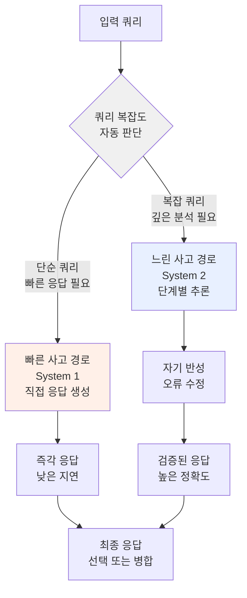
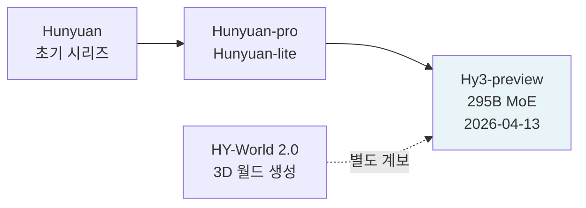

# Tencent Hunyuan 3 (Hy3) - 295B MoE 빠른-느린 사고 융합 추론 모델

Tencent Hunyuan 3(공식 명칭: Hy3-preview)는 2026년 4월 13일 Tencent가 출시한 295B 파라미터 MoE 언어 모델이다. 21B 활성 파라미터와 256K 컨텍스트를 지원하며, **빠른-느린 사고 융합(fast-and-slow-thinking fused)** 설계가 핵심 특징이다. Tencent AI 체제 전환(새 수장 Yao Shunyu 취임) 이후 첫 주요 모델 출시다.

## 개요

| 항목 | 내용 |
|------|------|
| 출시일 | 2026년 4월 13일 |
| 공식 명칭 | Hy3-preview |
| 개발사 | Tencent AI Lab |
| 전체 파라미터 | 295B |
| 활성 파라미터 | 21B |
| 컨텍스트 윈도우 | 256K 토큰 |
| 아키텍처 | MoE + 빠른-느린 사고 융합 |
| 허깅페이스 | `tencent/Hy3-preview` |

## 빠른-느린 사고 융합 (Fast-and-Slow Thinking Fused)

Hy3의 가장 독창적 설계는 빠른 사고(System 1)와 느린 사고(System 2)를 하나의 모델 내에서 통합한다는 점이다. 이는 인지과학의 [[dual-process-theory]] 개념을 LLM에 적용한 것이다.



이 설계는 단순한 질의에는 빠르게 응답하고, 복잡한 추론·코딩·에이전트 태스크에는 깊은 사고를 투입함으로써 **속도와 품질을 동시에 최적화**한다.

## MoE 구조: 295B / 21B

295B 전체 파라미터 중 21B만 활성화된다(활성화율 약 7.1%). 이는 [[mixture-of-experts]] 구조의 전형적 구성이다:

- **지식 용량**: 295B로 광범위한 도메인 커버
- **추론 효율**: 21B 활성으로 비교적 경제적 서빙
- **256K 컨텍스트**: 대형 코드베이스, 장문 문서 처리 가능

DeepSeek V4 Pro(490B 활성)나 Kimi K2.6(1T 전체)과 비교하면 상대적으로 중형 MoE에 해당하지만, 21B 활성은 중급 GPU 클러스터에서도 서빙 가능한 현실적 규모다.

## 설계 철학: 복잡 추론 특화

Hy3은 단순 텍스트 생성보다 **복잡 추론, 코딩, 에이전트 워크로드**에 최적화되어 있다:

### 대상 워크로드

1. **복잡 추론**: 다단계 수학 증명, 과학적 분석, 논리 추론
2. **코딩**: 알고리즘 설계, 버그 추적, 코드 리뷰
3. **에이전트 태스크**: 도구 사용, 멀티스텝 계획 실행

### 빠른-느린 사고의 실용적 가치

```python
# Hy3 빠른-느린 사고 제어 예시 (개략, 공식 API 확인 필요 [교차검증 필요])
import httpx

client = httpx.Client(base_url="https://api.hunyuan.cloud.tencent.com/v1")

# 빠른 응답 (단순 태스크)
fast_response = client.post("/chat/completions", json={
    "model": "hy3-preview",
    "messages": [{"role": "user", "content": "파이썬 quicksort 구현해줘"}],
    "thinking": {"type": "disabled"},  # 빠른 모드
})

# 느린 추론 (복잡 태스크)
slow_response = client.post("/chat/completions", json={
    "model": "hy3-preview",
    "messages": [{"role": "user", "content": "이 분산 시스템에서 데드락을 해결하는 방법을 설계해줘"}],
    "thinking": {"type": "enabled", "budget_tokens": 10000},  # 느린 모드
})
```

## Tencent Hunyuan 계보



Tencent의 Hunyuan 시리즈는 텍스트 LLM 외에도 이미지 생성(HunyuanDiT), 비디오 생성, 3D 월드 생성(HY-World 2.0) 등 멀티모달 AI 전반을 포괄하는 대형 포트폴리오다. Hy3은 그 중 텍스트 추론 분야의 플래그십이다.

## 조직 맥락: 새 수장 Yao Shunyu 체제

Hy3은 Tencent AI Lab의 새 수장 Yao Shunyu(요순 셔위) 체제 하에서 출시된 첫 주요 모델이다. Tencent가 중국 AI 경쟁(Baidu, ByteDance, Alibaba, 화웨이 등과의 경쟁)에서 격차를 줄이기 위한 전략적 출시로 평가된다.

## [[meta-llama]]와의 관계

Hy3은 내부 Tencent 아키텍처를 기반으로 하며, [[meta-llama]] 기반인지 여부는 명시되지 않았다. 그러나 현대 중국 AI 기업들은 공개 아키텍처(LLaMA, Mistral 등)를 참조하되 독자적 학습 파이프라인을 적용하는 경우가 많다 [교차검증 필요].

## 경쟁 포지셔닝

2026년 4월 기준 중국 AI 주요 모델과의 비교:

| 모델 | 파라미터 | 활성 | 컨텍스트 | 특화 |
|------|---------|------|---------|------|
| Hy3-preview | 295B | 21B | 256K | 추론/코딩/에이전트 |
| DeepSeek V4 Pro | 1.6T | 49B | 1M | 범용 오픈웨이트 |
| Qwen3.6-35B-A3B | 35B | 3B | 미공개 | 에이전트 코딩 |
| Kimi K2.6 | 1T | 미공개 | 미공개 | 에이전트 스웜 |

## 실무 활용 가능성

### API 서비스 접근

Hy3-preview는 HuggingFace Hub(`tencent/Hy3-preview`)에 모델 파일이 공개되며, Tencent Cloud의 Hunyuan API를 통해 서비스로도 접근 가능하다.

### 적합한 사용 사례

- **기업 코딩 도우미**: 빠른-느린 사고 전환으로 간단한 자동완성부터 복잡한 리팩토링까지
- **연구 분석 보조**: 긴 컨텍스트(256K)로 대규모 논문/보고서 분석
- **에이전트 파이프라인**: 복잡 추론 특화로 멀티스텝 에이전트 태스크 백본으로 적합

## 왜 중요한가

1. **빠른-느린 사고 융합**: 단일 모델에서 System 1/2 전환은 LLM 추론 효율화의 새 방향
2. **중국 AI 경쟁 심화**: Tencent가 자체 MoE 플래그십으로 DeepSeek, Alibaba에 도전
3. **295B/21B 균형**: 대형 지식 용량과 효율적 활성 파라미터의 실용적 균형
4. **에이전트 특화**: 코딩·추론·에이전트 워크로드 집중으로 기업 고객 타겟

## 관련 문서

- [[meta-llama]] - 비교 기준 오픈소스 LLM 아키텍처
- [[mixture-of-experts]] - MoE 아키텍처 개념
- [[dual-process-theory]] - 빠른-느린 사고의 인지과학 기반
- [[chain-of-thought]] - 느린 사고 경로의 기반 기법
- [[deepseek-v4-pro]] - 동시기 경쟁 중국 오픈웨이트 모델
- [[kimi-k2-6]] - 동시기 경쟁 에이전트 특화 모델
