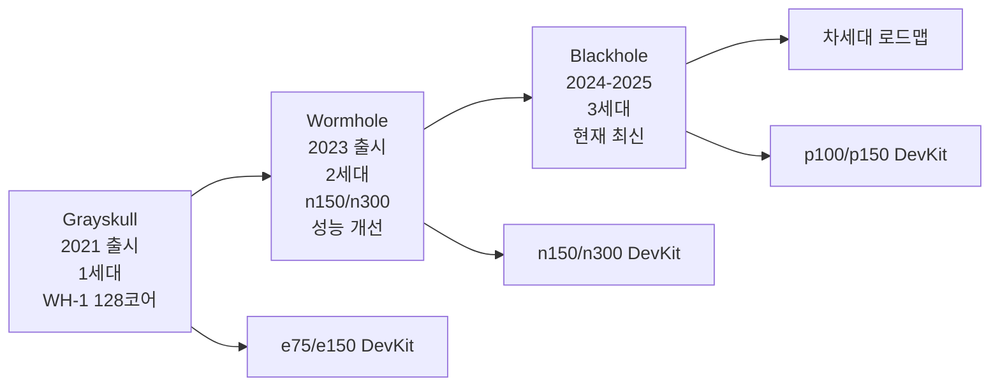
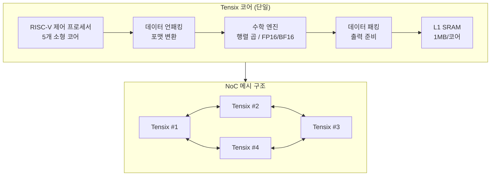
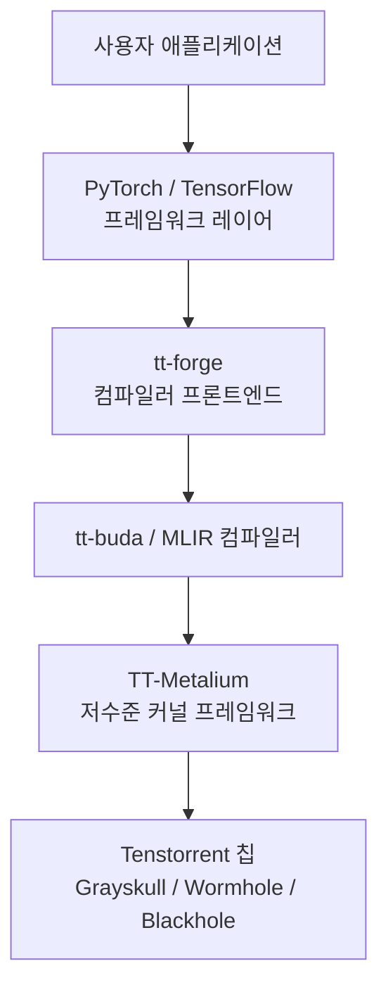
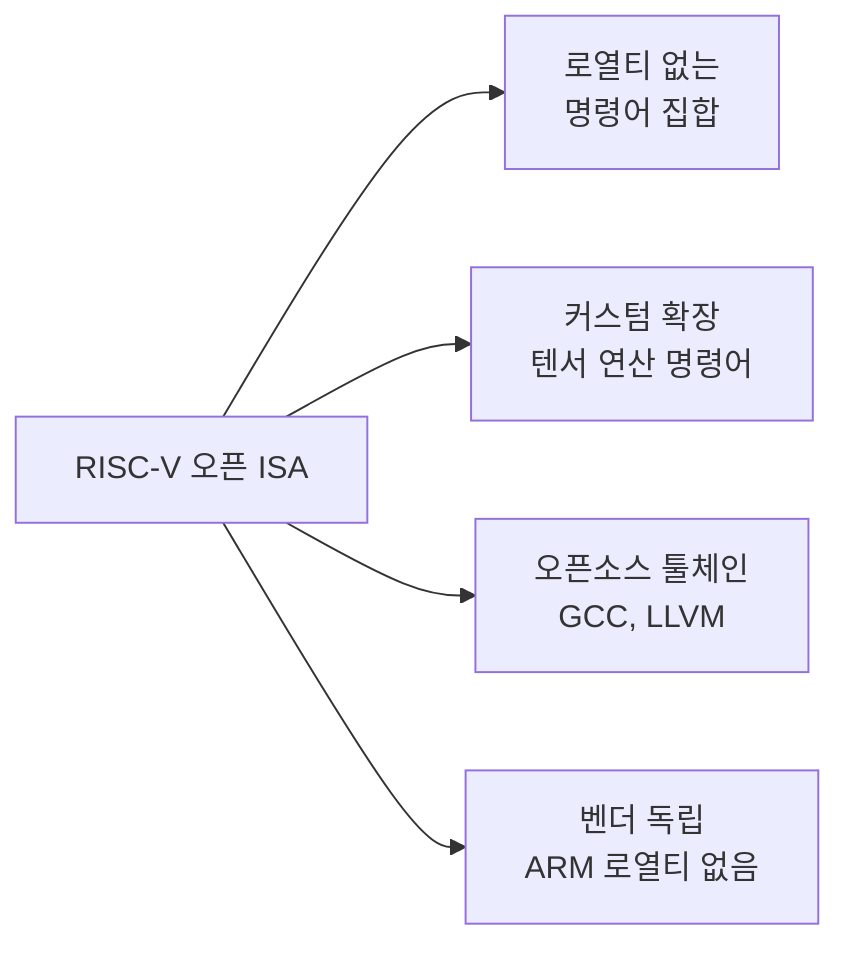

# Tenstorrent Grayskull / Wormhole

## 정체성

| 항목 | 내용 |
|------|------|
| 회사 | Tenstorrent (캐나다 토론토, 2016년 창립) |
| CEO/CTO | Jim Keller (AMD K8/K7, Apple A4/A5, Intel, Tesla FSD 설계자) |
| 제품 | Grayskull (1세대), Wormhole (2세대), Blackhole (3세대) |
| 제품 유형 | AI 가속기 칩 (추론+학습) |
| 라이선스 소프트웨어 | TT-Metalium (오픈소스, Apache 2.0) |
| 핵심 철학 | 오픈소스 소프트웨어 스택 + RISC-V 기반 |
| 웹사이트 | tenstorrent.com |

Tenstorrent는 전설적인 칩 설계자 **Jim Keller**가 이끄는 AI 가속기 스타트업이다. AMD K7/K8 아키텍처(Athlon/Opteron)와 Apple A4/A5 칩, Intel의 프로세서 로드맵 재건, Tesla의 FSD(Full Self-Driving) 칩을 설계한 Jim Keller가 CEO를 맡고 있어 반도체 업계에서 특별한 주목을 받는다.

Tenstorrent의 차별점은 크게 두 가지다: (1) **RISC-V 기반의 텐서 처리 코어**와 (2) **완전 오픈소스 소프트웨어 스택(TT-Metalium)**이다. NVIDIA의 CUDA 생태계에 갇히지 않는 오픈 대안을 표방한다.

## 제품 세대 진화



### Grayskull (1세대)

Tenstorrent의 첫 상용 칩. PCIe 카드(e75, e150)로 제공되며 개발자 키트 형태로 구매 가능하다.

- 코어: 120~128개 텐서 코어 (Tensix 코어)
- 메모리: LPDDR4 또는 GDDR6
- 인터페이스: PCIe 4.0
- 용도: 개발 테스트, 소규모 추론

### Wormhole (2세대)

성능을 크게 개선한 2세대 칩. n150(단일 카드), n300(듀얼 칩 카드)로 제공.

- n150: 단일 Wormhole 칩
- n300: 두 개의 Wormhole 칩 + Ethernet 연결
- 멀티카드 스케일링 지원 (Ethernet으로 직접 연결)

### Blackhole (3세대, 현재)

Tenstorrent의 현재 주력 제품. 이전 세대 대비 대폭 향상된 성능과 메모리를 제공한다.

[교차검증 필요] Blackhole의 세부 사양은 tenstorrent.com의 공식 데이터시트를 참조하라.

## 핵심 아키텍처: Tensix 코어

Tenstorrent 칩의 기본 연산 단위는 **Tensix 코어**다. Tensix는 범용 프로그래머블 코어로, RISC-V 프로세서와 행렬 연산 엔진을 결합한다.



Tensix 코어의 특징:
- RISC-V 기반으로 프로그래밍이 유연
- 코어들이 NoC(Network-on-Chip) 메시로 연결
- 코어당 1MB SRAM (온칩 캐시)
- FP16, BF16, INT8 등 다양한 수치 형식 지원

### NoC 메시 네트워크

칩 내부의 모든 Tensix 코어는 2D 메시(mesh) 토폴로지 NoC로 연결된다. 이는 기존 GPU의 계층적 캐시 구조와 달리, 코어 간 직접 통신과 데이터 이동이 유연하다.

## TT-Metalium: 오픈소스 소프트웨어 스택

Tenstorrent는 소프트웨어 스택을 **완전 오픈소스**로 제공한다. NVIDIA의 CUDA가 독점적인 것과 대조적이다.



- **TT-Metalium**: C++/Python 기반 저수준 커널 프레임워크. Apache 2.0 오픈소스.
- **tt-buda**: PyTorch 모델을 Tenstorrent 칩으로 컴파일하는 컴파일러.
- **tt-forge**: 최신 컴파일러 프론트엔드 (MLIR 기반).
- **GitHub**: github.com/tenstorrent 에서 전체 소스 공개.

## 실무 사용 가이드

### 설치 및 환경 구성

```bash
# TT-Metalium 설치 (Ubuntu 22.04 기준)
pip install tenstorrent-metalium

# 또는 소스 빌드
git clone https://github.com/tenstorrent/tt-metal
cd tt-metal
./build_metal.sh
```

### PyTorch 모델 실행 예시

```python
# tt-buda를 통한 PyTorch 모델 실행
import torch
import pybuda

# 일반 PyTorch 모델
model = torch.nn.Linear(512, 512)

# Tenstorrent 칩에서 실행
tt_model = pybuda.PyTorchModule("linear", model)
output = pybuda.run_inference(tt_model, inputs=torch.randn(1, 512))
```

[교차검증 필요] API 인터페이스는 버전에 따라 변경될 수 있다. 공식 문서(docs.tenstorrent.com)를 참조하라.

### Hugging Face 모델 실행

tt-buda는 Hugging Face Transformers 모델을 지원한다.

```python
from transformers import AutoModelForCausalLM
import pybuda

# HuggingFace 모델 로드
model = AutoModelForCausalLM.from_pretrained("facebook/opt-125m")

# Tenstorrent에서 추론
tt_model = pybuda.PyTorchModule("opt", model)
```

## RISC-V 기반의 의미

Tenstorrent가 RISC-V를 제어 코어로 채택한 것은 전략적 선택이다.



- **ARM**: 라이선스 비용 발생, Apple/Qualcomm처럼 독자 변형에 제약
- **x86**: Intel/AMD 특허, 라이선스 복잡
- **RISC-V**: 완전 오픈소스 ISA, 커스텀 확장 자유, 커뮤니티 툴체인

Tenstorrent는 RISC-V 코어 위에 자체적인 텐서 연산 확장을 추가해 Tensix 코어를 구성한다.

## Jim Keller의 역할과 비전

Jim Keller는 반도체 업계에서 "칩 위스퍼러"로 불리는 전설적인 설계자다.

| 역할 | 주요 기여 |
|------|----------|
| AMD (1998-1999) | K7/K8 아키텍처 설계, Athlon 성공 |
| Apple (2008-2012) | A4, A5 모바일 AP 설계 |
| AMD (2012-2015) | Zen 아키텍처 기반 마련 |
| Intel (2018-2020) | 10nm 전환 전략 |
| Tesla (2016-2018) | FSD 자율주행 칩 설계 주도 |
| Tenstorrent (2021~) | CEO로 AI 가속기 주도 |

Jim Keller의 Tenstorrent 합류는 이 스타트업에 대한 업계의 관심을 크게 높였다. 그는 NVIDIA 독점 체제에 도전하는 오픈 AI 하드웨어 생태계를 목표로 한다.

## 경쟁 포지셔닝

| 항목 | Tenstorrent | Cerebras | Groq | NVIDIA |
|------|-------------|---------|------|--------|
| 핵심 기술 | Tensix + NoC 메시 | WSE (웨이퍼스케일) | LPU 선형 실행 | CUDA 텐서코어 |
| 소프트웨어 | 오픈소스 (Apache 2.0) | 독점 | 독점 | 반독점 (CUDA) |
| 하드웨어 구매 | 가능 (DevKit) | CS-3 시스템 판매 | 없음 (서비스만) | 가능 |
| 가격 접근성 | 상대적 저가 DevKit | 매우 고가 | API 과금 | 고가~중가 |
| RISC-V | 있음 | 없음 | 없음 | 없음 |
| 오픈 하드웨어 | 부분 공개 | 없음 | 없음 | 없음 |

Tenstorrent의 독특한 포지션은 **개발자가 직접 구매해 실험할 수 있는 AI 가속기**라는 점이다. Grayskull e150 카드의 가격은 수백 달러 수준으로, 일반 연구자나 스타트업도 접근 가능하다.

## 한계 및 트레이드오프

### 현재 제약

- **소프트웨어 성숙도**: CUDA 생태계 대비 지원 모델과 라이브러리가 제한적
- **커뮤니티 규모**: NVIDIA 대비 압도적으로 작은 사용자 커뮤니티
- **추론 성능 벤치마크**: 독립적인 대규모 비교 데이터 부족
- **대형 모델 지원**: 405B급 모델 실행을 위한 멀티칩 스케일링 설정 복잡

### 장기 관전 포인트

- Blackhole 세대의 실제 성능과 가격경쟁력
- PyTorch/Hugging Face와의 통합 완성도
- 클라우드 서비스 형태의 출시 여부
- 오픈소스 생태계 성장 속도

## 관련 문서

- [[ai-accelerators]] -- GPU 외 AI 가속기 전체 생태계 개요
- [[cerebras-cloud-inference]] -- WSE-3 웨이퍼스케일 기반 초고속 추론
- [[sambanova-systems-cloud]] -- RDU 데이터플로우 칩 기반 엔터프라이즈 AI
- [[d-matrix-corsair]] -- 인메모리 컴퓨팅 기반 추론 전용 ASIC
- [[groq-cloud-api]] -- LPU 아키텍처 고속 추론 서비스
