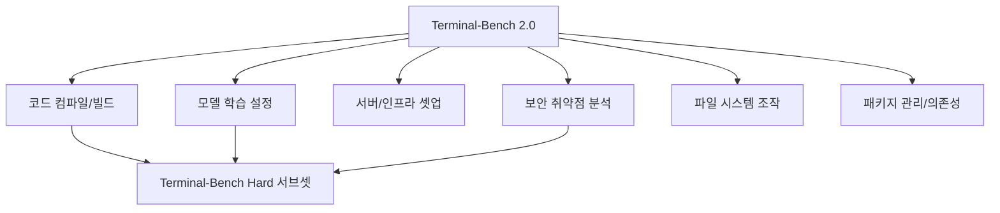

# Terminal-Bench 2.0

Stanford-Laude Institute가 만든 터미널 환경 에이전트 평가 벤치마크.

## 개요

Terminal-Bench는 LLM 에이전트가 실제 터미널 환경에서 시스템 관리, 소프트웨어 개발, 보안 관련 작업을 얼마나 잘 수행하는지 측정하는 벤치마크다. 2.0 버전은 89개 고난도 태스크로 구성되어 있으며, Harbor 기반 벤치마크 팩토리 아키텍처를 채택해 재현 가능성과 확장성을 보장한다.

## 평가 태스크 유형

Hard 서브셋은 일반 태스크 중 인간 전문가도 30분 이상 소요되는 항목만 추려낸 고난도 평가다.

## Harbor 아키텍처

Terminal-Bench의 핵심 설계는 **Harbor 기반 벤치마크 팩토리**다. Harbor는 격리된 Docker 컨테이너 환경을 태스크별로 스핀업하고, 에이전트의 셸 명령을 실시간으로 기록하며 채점한다.

- **격리성**: 태스크마다 깨끗한 환경에서 시작, 이전 태스크의 상태 오염 없음
- **재현성**: 동일 태스크를 다른 모델/날짜에 동일 환경으로 재실행 가능
- **확장성**: 새 태스크를 YAML 정의만으로 추가 가능

## 2026년 4월 리더보드 현황

| 순위 | 모델 | Terminal-Bench 2.0 점수 |
|---|---|---|
| 1 | Gemini 3.1 Pro | 68.5% |
| 2 | Claude Opus 4.6 / Sonnet 4.6 | 선두권 |
| ... | 기타 모델 | - |

[교차검증 필요] 정확한 최신 점수는 [공식 리더보드](https://llm-stats.com/benchmarks/terminal-bench-2)에서 확인 필요.

## SWE-bench와의 차이

| 항목 | Terminal-Bench | SWE-bench |
|---|---|---|
| 평가 대상 | 터미널/시스템 조작 능력 | 코드 수정·패치 능력 |
| 환경 | 실제 셸 세션 | Git 리포지토리 |
| 태스크 유형 | 명령 실행, 인프라 설정 | 이슈 해결, PR 생성 |
| 채점 방식 | 최종 상태/출력 검증 | 테스트 통과 여부 |

## 실무 적용 관점

에이전트 코딩 도구(Claude Code, Cursor 등)를 도입할 때, Terminal-Bench 점수는 단순 코드 완성 능력이 아니라 **환경 설정·빌드·배포·디버깅 전 주기를 자율 수행할 수 있는지**를 가늠하는 지표로 활용할 수 있다. vals.ai에서는 이미 포화 수준에 도달했다는 언급이 있어, [[swe-bench-pro|SWE-bench Pro]]처럼 더 어려운 버전으로 진화할 가능성이 있다.

## 왜 지금 중요한가

89개 고난도 태스크(코드 컴파일, 모델 훈련, 서버 셋업, 보안 등)로 구성된 2.0 버전이 2026년 에이전틱 코딩 표준으로 자리잡았다. Harbor 기반 벤치마크 팩토리 아키텍처로 새 태스크 추가가 용이한 설계가 특징이다.

## 대표 자료

- [Terminal-Bench Official Site](https://www.tbench.ai/)
- [Terminal-Bench 2.0 Leaderboard -- LLM Stats](https://llm-stats.com/benchmarks/terminal-bench-2)
- [Terminal-Bench Hard -- Artificial Analysis](https://artificialanalysis.ai/evaluations/terminalbench-hard)
- [Terminal-Bench -- Vals AI](https://www.vals.ai/benchmarks/terminal-bench)
- [Benchtalks #1: Alex Shaw -- Snorkel AI](https://snorkel.ai/blog/benchtalks-alex-shaw-terminal-bench-harbor-building-the-benchmark-factory/)

## 관련 문서

- [[swe-bench-pro|SWE-bench Pro]]
- [[arc-agi-2|ARC-AGI-2]]
- [[claude-opus-4-6|Claude Opus 4.6]]
