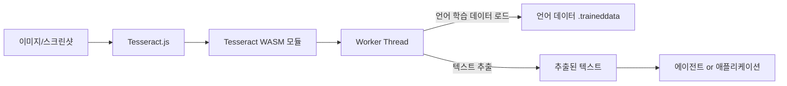
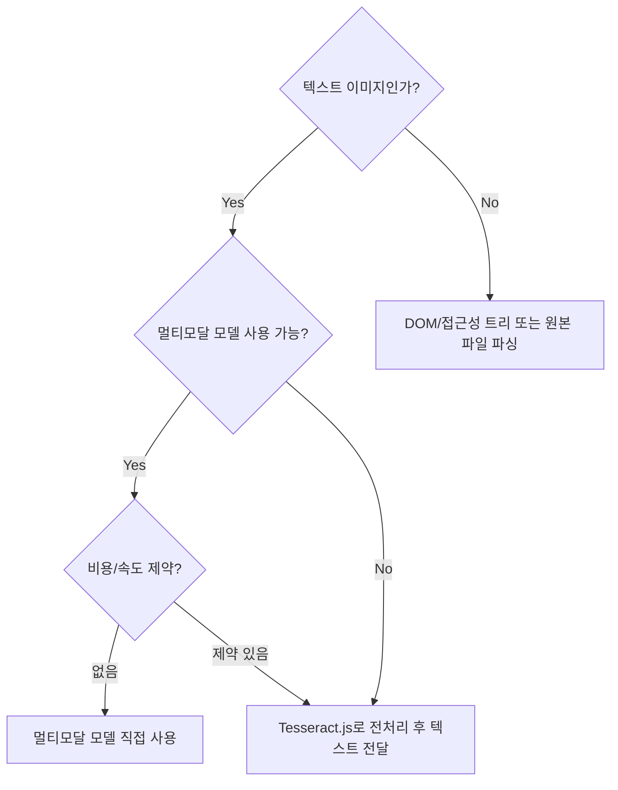

# Tesseract.js

브라우저와 Node.js에서 동작하는 OCR(Optical Character Recognition) 라이브러리다. Tesseract 엔진을 JavaScript/WASM 환경에서 활용할 수 있게 해, [[browser-automation-agents|에이전트]]가 이미지·스크린샷에서 텍스트를 읽는 실험에 자주 등장한다.

## 개요

Tesseract.js는 Google이 개발한 Tesseract OCR 엔진을 WebAssembly(WASM)로 컴파일하여 브라우저와 Node.js 양쪽에서 동작하게 만든 오픈소스 라이브러리다. 네이티브 바이너리 설치 없이 JavaScript 생태계에서 OCR을 사용할 수 있다는 점이 핵심 가치다.

## 아키텍처



## 주요 사양

| 항목 | 내용 |
|---|---|
| 실행 환경 | 브라우저 (Web Worker), Node.js |
| 기반 엔진 | Tesseract v4 (LSTM 기반) |
| 지원 언어 | 100개 이상 (언어 데이터 파일 별도 로드) |
| 비동기 처리 | Promise / async-await |
| 설치 | `npm install tesseract.js` |
| 저장소 | [naptha/tesseract.js](https://github.com/naptha/tesseract.js) |

## 기본 사용 예시

```javascript
import Tesseract from 'tesseract.js';

const { data: { text } } = await Tesseract.recognize(
  'screenshot.png',
  'kor+eng',  // 한국어 + 영어 동시 인식
  { logger: m => console.log(m) }
);

console.log(text);
```

## 에이전트 활용 맥락

코딩 에이전트가 Tesseract.js를 사용하는 주요 시나리오:

| 사용 장면 | 이유 | 한계 |
|---|---|---|
| 브라우저 자동화 스크린샷 판독 | DOM에서 바로 못 읽는 텍스트를 OCR로 보완 | 레이아웃이 복잡하면 정확도가 급격히 하락 |
| 문서/이미지 파이프라인 프로토타입 | 브라우저와 Node.js 양쪽에서 같은 라이브러리 사용 | 대량 처리 시 속도·메모리 비용 부담 |
| 멀티모달 모델의 fallback | 저해상도 텍스트를 선처리해서 모델에 전달 | 최신 멀티모달 모델이 더 간단한 경우도 많음 |
| PDF 텍스트 레이어 없는 문서 | 이미지로만 된 PDF에서 텍스트 추출 | 표·수식은 정확도 낮음 |

## 멀티모달 모델과의 관계

Claude Opus 4.6, GPT-4o 같은 최신 멀티모달 모델은 이미지를 직접 이해한다. 따라서 Tesseract.js가 항상 필요한 것은 아니다. 다음 기준으로 선택:



OCR을 붙이는 이유가 **정말 텍스트 추출 문제인지**, 아니면 DOM 접근/접근성 트리/원본 파일 파싱으로 해결 가능한지 먼저 확인한다.

## 성능 특성

- **초기 로딩**: WASM 모듈 + 언어 데이터 로드에 수 초 소요 (캐싱으로 완화)
- **처리 속도**: 일반 데스크탑 기준 A4 한 페이지에 수십 초 수준 (GPU 없음)
- **정확도**: 깨끗한 인쇄물 90% 이상, 손글씨·저화질에서 급격히 하락
- **메모리**: 브라우저 탭당 수십~수백 MB (언어 수에 따라 다름)

## 실무 팁

- 인식 전 이미지 전처리(회색조 변환, 이진화, 노이즈 제거)로 정확도 향상 가능
- 동일 페이지를 여러 각도로 회전해 시도하는 앙상블 전략이 효과적인 경우가 있음
- Node.js 환경에서는 `createWorker()`로 Worker pool을 구성하면 병렬 처리 가능

Simon Willison의 [Agentic Engineering Patterns](https://simonwillison.net/guides/agentic-engineering-patterns)에서 언급된 도구로, [[tool-contracts-for-agents|에이전트 도구 설계]] 맥락에서 읽으면 도움이 된다.

## 관련 문서

- [[browser-automation-agents|Browser Automation for Coding Agents]]
- [[hoard-things-you-know-how-to-do|Hoard Things You Know How To Do]]
