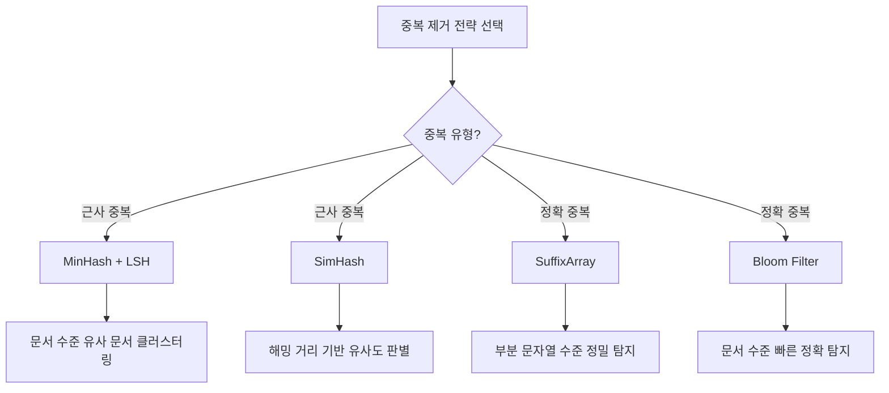

# text-dedup - 텍스트 중복 제거 도구

## 개요

text-dedup는 ChenghaoMou가 개발한 올인원(All-in-one) 텍스트 중복 제거 라이브러리이다. MinHash + LSH를 활용한 근사 중복 탐지(near-duplicate detection)부터 SimHash, SuffixArray, Bloom Filter를 이용한 정확 중복 제거(exact deduplication)까지 다양한 알고리즘을 단일 패키지에서 제공한다. TOML 기반 설정 파일로 모든 알고리즘의 파라미터를 통일적으로 관리할 수 있으며, HuggingFace Datasets 및 Spark 통합을 통해 수십억 개 문서 규모까지 확장 가능하다.

LLM 사전 학습에서 중복 데이터는 모델이 특정 패턴을 과도하게 학습하는 원인이 되며, [[pretraining-data-curation]]의 품질 파이프라인에서 중복 제거는 필수 단계이다. text-dedup는 이 단계를 독립적이고 재현 가능하게 수행할 수 있는 전문 도구이다.

## 지원 알고리즘

text-dedup는 네 가지 주요 알고리즘을 제공하며, 각각 서로 다른 중복 유형과 규모에 최적화되어 있다.

### MinHash + MinHashLSH (근사 중복)

MinHash는 문서를 소형 서명(signature)으로 압축하고, LSH(Locality-Sensitive Hashing)는 유사한 서명끼리 같은 버킷에 배치하여 탐색 공간을 좁힌다. Jaccard 유사도를 근사적으로 추정하며, 설정 가능한 주요 파라미터는 다음과 같다.

| 파라미터 | 설명 | 일반적 값 |
|---|---|---|
| num_perm | 해시 순열 수 (정밀도와 비용의 균형) | 128-256 |
| threshold | Jaccard 유사도 임계값 | 0.7-0.8 |
| ngram | n-gram 크기 | 5-13 |
| bands / rows | LSH 밴드/행 구성 | 자동 계산 |

대규모 웹 크롤 데이터에서 "거의 같은" 문서(boilerplate 변형, 미러 사이트 복사 등)를 탐지하는 데 가장 널리 사용된다.

### SimHash (근사 중복)

각 문서를 토큰화한 뒤 64비트 또는 128비트 이진 핑거프린트(fingerprint)를 생성한다. 의미적으로 유사한 문서는 해밍 거리(Hamming distance)가 작은 서명을 갖게 된다. MinHash 대비 메모리 효율이 높지만, 짧은 문서나 부분적 중복에는 민감도가 낮을 수 있다.

### SuffixArray (정확 부분 문자열 중복)

Suffix Array를 구축하여 부분 문자열 수준에서 정확한 중복을 탐지한다. 처리 흐름은 다음과 같다.

1. 텍스트 로드 및 전처리
2. Suffix Array 구축
3. 자기유사(self-similar) 영역 식별
4. 중복 구간 복원 및 제거
5. 결과 저장

Suffix Array 방식은 문서 전체가 아닌 부분 문자열 단위로 동작하므로, 긴 인용문이나 법률 조항처럼 문서의 일부만 중복된 경우를 포착할 수 있다. 다만, Suffix Array 구축 비용이 높아 대규모 데이터에서는 처리 시간이 길어진다.

### Bloom Filter (정확 문서 중복)

확률적 자료구조인 Bloom Filter를 사용하여 문서 수준 정확 중복을 빠르게 탐지한다. 설정 가능한 오류율(false positive rate)로 메모리와 정확도를 조절할 수 있으며, 단순 정확 매칭이 필요한 경우 가장 빠른 선택지이다.

## 알고리즘 비교

| 알고리즘 | 중복 유형 | 탐지 수준 | 확장성 | 정확도 |
|---|---|---|---|---|
| MinHash + LSH | 근사 | 문서 | 매우 높음 | 임계값 의존 |
| SimHash | 근사 | 문서 | 높음 | 해밍 거리 의존 |
| SuffixArray | 정확 | 부분 문자열 | 중간 | 매우 높음 |
| Bloom Filter | 정확 | 문서 | 높음 | FP율 설정 가능 |

## 사용 방식

text-dedup는 TOML 설정 파일을 통해 모든 알고리즘을 통일된 인터페이스로 제어한다. HuggingFace Datasets와 통합되어 `datasets.load_dataset()`으로 로드한 데이터에 직접 적용 가능하며, 대규모 데이터셋의 경우 Apache Spark 백엔드를 활용하여 분산 처리할 수 있다.

Spark 구현은 소규모 데이터셋에서는 오버헤드가 크므로, 충분한 컴퓨팅 자원과 TB 이상의 데이터셋에서 사용하는 것이 권장된다.

## 실전 활용 전략

대규모 LLM 학습 데이터 처리에서는 단일 알고리즘이 아닌 다단계 중복 제거 전략이 일반적이다.

1. **1차 -- Bloom Filter**: 정확히 동일한 문서를 빠르게 제거하여 후속 단계의 처리량을 줄임
2. **2차 -- MinHash + LSH**: 의미적으로 유사한 근사 중복 문서를 클러스터링하고 대표 문서만 보존
3. **3차 -- SuffixArray**: 나머지 문서에서 부분 문자열 수준 중복을 제거하여 보일러플레이트 텍스트 최종 정리

이 전략은 [[pretraining-data-curation]]의 품질 파이프라인에서 핵심적이며, DataTrove 같은 파이프라인 프레임워크 내에서 단계별로 조합하여 실행할 수 있다.

## 중복 제거가 학습에 미치는 영향

중복 데이터가 남아있는 코퍼스로 학습하면 다음과 같은 문제가 발생한다.

- **과적합(overfitting)**: 중복 패턴에 대한 손실이 과도하게 감소하여 일반화 능력 저하
- **편향 증폭**: 특정 도메인이나 스타일의 과대 대표로 출력 편향 발생
- **평가 오염**: [[data-decontamination]]에서 다루듯, 학습 데이터와 평가 데이터의 중복은 벤치마크 점수를 부풀림
- **분포 왜곡**: [[model-collapse-synthetic]]과 유사하게, 중복 데이터는 학습 분포의 일부를 인위적으로 부풀림

Llama 3의 학습 파이프라인에서는 MinHash 기반 URL 수준 + 문서 수준 중복 제거를 적용하여 전체 데이터를 약 4배 축소한 바 있다.

## 관련 페이지

- [[pretraining-data-curation]] - 사전 학습 데이터 큐레이션 전략
- [[data-decontamination]] - 평가 데이터 오염 제거
- [[synthetic-data-training]] - 합성 데이터 학습과 품질 관리
- [[model-collapse-synthetic]] - 합성 데이터 반복 학습 시 분포 붕괴
