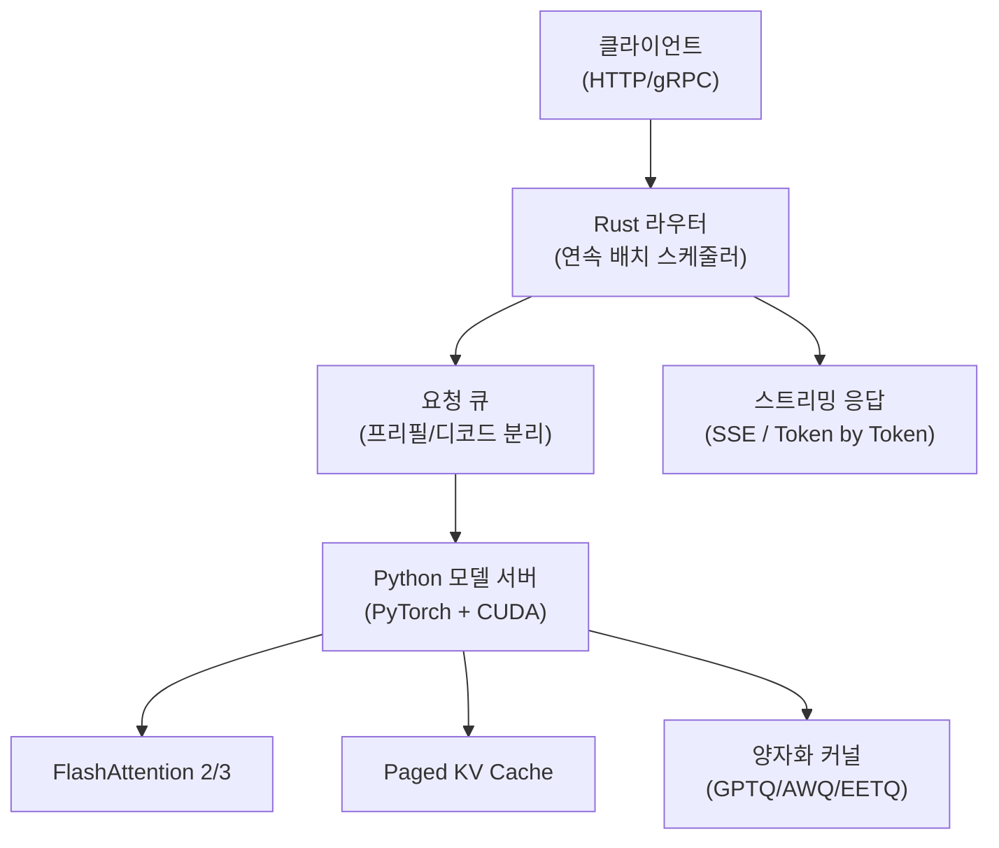
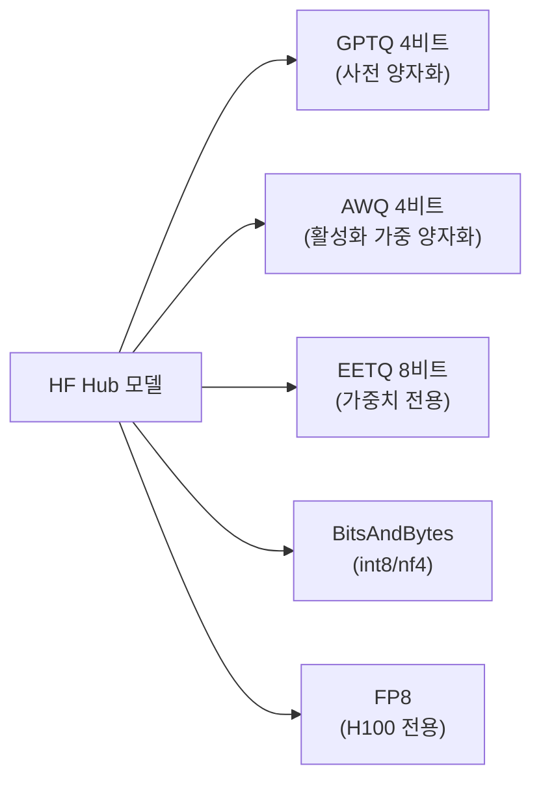

# TGI (Text Generation Inference)

## 정체성

| 항목 | 내용 |
|------|------|
| 이름 | Text Generation Inference (TGI) |
| 개발사 | HuggingFace |
| 라이선스 | Apache 2.0 (v2.0 이후 일부 상업적 사용 제한 조항 추가, 확인 필요) |
| GitHub | [huggingface/text-generation-inference](https://github.com/huggingface/text-generation-inference) |
| 출시 | 2022년 (공개 오픈소스 전환 2022년 말) |
| 언어/스택 | Rust (서버 코어), Python (모델 서버), CUDA/ROCm |
| 배포 방식 | Docker 이미지, AWS SageMaker, Google Vertex AI |

TGI는 HuggingFace Hub의 모델을 **프로덕션 수준에서 고효율로 서빙**하기 위한 공식 추론 엔진이다. Rust로 작성된 HTTP 서버가 낮은 지연시간을 보장하고, Python 기반 모델 서버가 CUDA 커널 최적화와 FlashAttention 통합을 담당한다. HuggingFace Inference Endpoints와 Inference API의 백엔드 엔진이기도 하다.

---

## 아키텍처 개요



---

## 핵심 기능

### 1. 연속 배치 처리 (Continuous Batching)

[[continuous-batching]]을 TGI의 핵심 처리 전략으로 채택. 기존 정적 배치(static batching)와 달리 완료된 시퀀스 자리에 즉시 새 요청을 삽입:

```
정적 배치 (GPU 낭비):
  [요청A (100 토큰)] [요청B (50 토큰)] [padding...]
                            |--- 요청B 완료 후 GPU 유휴 ---→

연속 배치 (TGI):
  [요청A] [요청B] → 요청B 완료 → [요청A] [요청C] 즉시 삽입
```

### 2. FlashAttention 통합

[[flash-attention]] 2/3를 기본 탑재. 메모리 IO 최소화로 긴 컨텍스트에서 특히 큰 성능 향상:

- FlashAttention-2: Ampere/Ada GPU (A100, RTX 3090/4090)
- FlashAttention-3: Hopper GPU (H100, H200) [TGI v2.x+]

### 3. 다중 모델 아키텍처 지원

| 모델 계열 | 지원 여부 |
|-----------|----------|
| Llama / Llama 2 / Llama 3 | O |
| Mistral / Mixtral MoE | O |
| Falcon | O |
| BLOOM | O |
| GPT-NeoX | O |
| StarCoder / StarCoder2 | O |
| Gemma / Gemma 2 | O |
| Qwen / Qwen 2 | O |
| Phi-2 / Phi-3 | O |

### 4. 양자화 지원



### 5. 텐서 병렬화 (Tensor Parallelism)

다중 GPU에서 모델을 수평 분할. 단일 GPU에 올라가지 않는 70B+ 모델 서빙:

```bash
# 4 GPU로 70B 모델 서빙
docker run --gpus all \
  -e CUDA_VISIBLE_DEVICES=0,1,2,3 \
  ghcr.io/huggingface/text-generation-inference:latest \
  --model-id meta-llama/Meta-Llama-3-70B-Instruct \
  --num-shard 4
```

### 6. 스트리밍 응답

Server-Sent Events(SSE)로 토큰 단위 실시간 스트리밍:

```python
import requests

response = requests.post(
    "http://localhost:8080/generate_stream",
    json={
        "inputs": "Python으로 피보나치 수열을 구현해줘",
        "parameters": {"max_new_tokens": 200, "temperature": 0.7},
    },
    stream=True,
)

for chunk in response.iter_lines():
    if chunk:
        print(chunk.decode().removeprefix("data:"), end="", flush=True)
```

---

## 배포 가이드

### Docker 빠른 시작

```bash
# Llama 3.1 8B 서빙 (HF 토큰 필요)
docker run --gpus all \
  -p 8080:80 \
  -v /tmp/tgi_cache:/data \
  -e HUGGING_FACE_HUB_TOKEN=hf_xxx \
  ghcr.io/huggingface/text-generation-inference:latest \
  --model-id meta-llama/Meta-Llama-3.1-8B-Instruct \
  --max-input-length 4096 \
  --max-total-tokens 8192
```

### OpenAI 호환 API

TGI v1.4.0+에서 OpenAI 호환 엔드포인트 제공:

```python
from openai import OpenAI

client = OpenAI(
    base_url="http://localhost:8080/v1",
    api_key="none",  # TGI는 인증 불필요 (자체 보안 구성 권장)
)

response = client.chat.completions.create(
    model="meta-llama/Meta-Llama-3.1-8B-Instruct",
    messages=[{"role": "user", "content": "안녕하세요!"}],
    stream=True,
)

for chunk in response:
    print(chunk.choices[0].delta.content or "", end="")
```

### 주요 시작 파라미터

| 파라미터 | 설명 | 기본값 |
|---------|------|--------|
| `--model-id` | HF Hub 모델 ID 또는 로컬 경로 | 필수 |
| `--num-shard` | 텐서 병렬 GPU 수 | 1 |
| `--max-input-length` | 최대 입력 토큰 수 | 1024 |
| `--max-total-tokens` | 최대 입력+출력 토큰 | 2048 |
| `--max-batch-prefill-tokens` | 프리필 배치 최대 토큰 | 4096 |
| `--quantize` | 양자화 방식 (gptq/awq/eetq/bitsandbytes) | 없음 |
| `--dtype` | 데이터 타입 (float16/bfloat16) | 자동 |

---

## TGI vs vLLM 비교

| 특성 | TGI | vLLM |
|------|-----|------|
| 개발사 | HuggingFace | UC Berkeley |
| 핵심 언어 | Rust + Python | Python |
| 연속 배치 | O | O |
| Paged Attention | 자체 구현 | 원조 (PagedAttention) |
| FlashAttention | 기본 통합 | 기본 통합 |
| HF Hub 통합 | 네이티브 | 지원 |
| OpenAI 호환 API | v1.4+ | v0.2+ |
| 멀티모달 (VLM) | Idefics, LLaVA 지원 | 더 넓은 지원 |
| 양자화 옵션 | GPTQ/AWQ/EETQ/BNB | GPTQ/AWQ/SqueezeLLM/FP8 |
| 분산 서빙 | Tensor Parallel | Tensor+Pipeline Parallel |
| 커스텀 모델 추가 | 어려움 | 상대적으로 용이 |
| 프로덕션 성숙도 | HF 인프라 검증 | 광범위한 커뮤니티 검증 |

**TGI 선택 시**: HuggingFace 생태계 통합이 중요할 때, Inference Endpoints 사용 시, Rust 기반 안정성이 필요할 때

**vLLM 선택 시**: 더 많은 모델 지원이 필요할 때, Python 수준 커스터마이즈가 필요할 때

---

## 성능 벤치마크 (대략적 수치)

### Llama 3.1 8B, A100 80GB, 입력 512/출력 256 토큰

| 방법 | 처리량 (req/s) | 레이턴시 P50 (ms) |
|------|--------------|------------------|
| 기본 서빙 (배치 없음) | ~5 | ~2000 |
| TGI 연속 배치 | ~50~100 | ~500~1000 |
| TGI + FlashAttention-2 | ~80~120 | ~400~800 |
| TGI + AWQ 4비트 | ~120~160 | ~300~600 |

(벤치마크는 환경에 따라 크게 달라질 수 있으므로 자체 측정 권장)

---

## 모니터링

TGI는 Prometheus 형식 메트릭을 `/metrics` 엔드포인트로 노출:

```
tgi_request_duration_seconds (요청 처리 시간)
tgi_queue_size (대기 큐 크기)
tgi_batch_current_size (현재 배치 크기)
tgi_generated_tokens_total (생성된 토큰 수)
```

Grafana 대시보드와 연동해 프로덕션 모니터링 구성.

---

## 한계 / 트레이드오프

### 모델 추가의 어려움

TGI는 지원 모델 목록이 명시적으로 관리되며, 새 아키텍처 모델을 추가하려면 Rust 서버 레이어 수정이 필요. vLLM 대비 모델 다양성에서 뒤처지는 경향.

### 윈도우/macOS 미지원

Linux + CUDA 전용. Apple Silicon이나 Windows 네이티브 실행 불가.

### 메모리 예측의 어려움

PagedAttention 구현이 있지만 vLLM만큼 정밀한 메모리 관리는 아니어서, 장시간 운용 시 OOM이 발생할 수 있음.

### 라이선스 변화

v2.0 이후 일부 사용 케이스에 상업적 조항이 추가. 프로덕션 배포 전 라이선스 조건을 공식 저장소에서 확인할 것. [교차검증 필요 - 공식 LICENSE 파일 참조]

---

## 실무 적용 관점

### 언제 TGI를 선택하는가

- HuggingFace Hub의 Llama, Mistral, Gemma 등 공식 지원 모델을 빠르게 서빙해야 할 때
- HuggingFace Inference Endpoints를 통한 관리형 서비스를 사용할 때
- 오픈소스 프로젝트나 연구 환경에서 안정적인 추론 서버가 필요할 때

### 언제 대안을 고려하는가

- 특수 모델 아키텍처 지원 필요: [[vllm]] (더 넓은 모델 커버리지)
- 더 공격적인 메모리 최적화 필요: [[vllm]] (PagedAttention 원조)
- 4비트 국내 모델 최적화: [[lmdeploy-internlm]] (TurboMind 백엔드)
- 완전 오프라인 경량 추론: [[llama-cpp]] (CPU 지원)

---

## 관련 문서

- [[vllm]] - UC Berkeley의 대안 추론 엔진 (PagedAttention 원조)
- [[continuous-batching]] - TGI의 핵심 배치 처리 전략
- [[flash-attention]] - TGI가 통합하는 주의 최적화
- [[lmdeploy-internlm]] - InternLM 팀의 추론 엔진
- [[quantization]] - 양자화 일반 개념
- [[bentoml]] - Python 기반 모델 서빙 프레임워크
