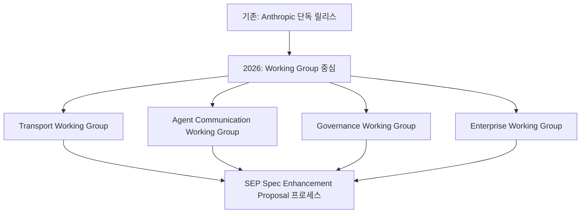
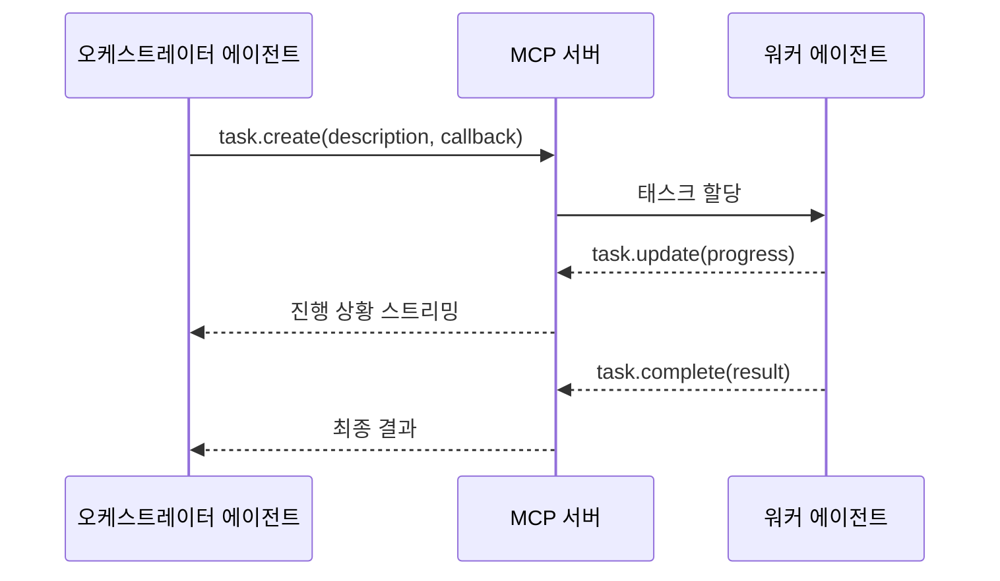

# The 2026 MCP Roadmap

[[model-context-protocol-mcp|MCP(Model Context Protocol)]] 프로젝트가 2026년에 무엇을 우선 과제로 두는지 설명하는 공식 로드맵 글 요약이다. release milestone보다 **priority area 중심**으로 재구성되었다는 점이 특징이다.

원문 URL: https://blog.modelcontextprotocol.io/posts/2026-mcp-roadmap/

## MCP 2026 전략 전환: Release에서 Working Group으로

MCP의 2026년 가장 큰 변화는 **거버넌스 방식의 전환**이다. 기존의 Anthropic 단독 주도 릴리스 모델에서 **Working Group 중심의 커뮤니티 표준화**로 이동한다. SEP(Spec Enhancement Proposal) 프로세스를 도입해 외부 기여자가 스펙 변경을 제안하고 검토받는 구조를 만든다.

## 4대 우선 영역

### 1. Transport Evolution and Scalability (전송 계층 진화)

현재 MCP의 전송 계층은 stdio(로컬)와 HTTP+SSE 두 가지다. 2026년에는 **Streamable HTTP**로의 전환이 핵심이다:

- SSE(Server-Sent Events)의 단방향 제약 극복
- 세션(session) 모델 도입으로 장기 연결 상태 관리
- 대규모 배포(수천 클라이언트)에서도 안정적인 확장성

### 2. Agent Communication / Tasks Primitive (에이전트 간 통신)

현재 MCP는 인간-AI 도구 연결에 최적화되어 있다. 2026년에는 **에이전트-에이전트 통신**을 위한 Tasks primitive를 도입한다:

이로써 MCP가 단순 도구 프로토콜에서 **멀티 에이전트 오케스트레이션 프로토콜**로 확장된다.

### 3. Governance Maturation (거버넌스 성숙)

- SEP(Spec Enhancement Proposal) 공식 프로세스 확립
- Working Group별 charter, 멤버십, 의사결정 규칙 정의
- 외부 스펙 기여자를 위한 명확한 참여 경로
- Spec 변경 이력과 하위 호환성 보장 정책

### 4. Enterprise Readiness (엔터프라이즈 대응)

- **인증(Authentication)**: OAuth 2.1 + PKCE 기반 서버 인증 ([관련 문서: [[mcp-authorization]]])
- **권한 관리(Authorization)**: 세밀한 리소스 접근 제어
- **감사 로그(Audit Logging)**: 에이전트 행동 기록·규정 준수
- **조직 배포**: 사내 MCP 서버 레지스트리, 관리 UI

## 현재 MCP 생태계 현황

| 항목 | 상태 (2026-04 기준) |
|---|---|
| 공식 SDK | Python, TypeScript, Kotlin, Go, C# |
| 전송 계층 | stdio, HTTP+SSE |
| 인증 | OAuth 2.1 + PKCE (베타) |
| 공개 서버 수 | 수천 개 (커뮤니티 + 공식) |
| 주요 클라이언트 | Claude Code, Cursor, Zed, Continue |

## 이 로드맵을 읽는 방법

roadmap을 확정 release schedule처럼 읽는 것은 오해다. **Working Group 중심의 우선순위 선언**으로 읽어야 한다. 각 영역은 실제 구현이 진행되기까지 스펙 논의, 파일럿 구현, 피드백 사이클을 거친다.

MCP를 도입하는 팀은 현재 스펙 기능뿐 아니라 이 로드맵 방향도 같이 봐야 한다. 특히 Enterprise Readiness 항목은 상용 배포 시 반드시 충족해야 하는 요구사항이 될 가능성이 높다.

## 왜 중요한가

MCP가 실험적 로컬 툴 연결을 넘어, **실제 조직 배포와 운영 가능한 프로토콜**로 이동하고 있음을 보여준다. Tasks primitive가 도입되면 MCP는 단순 도구 프로토콜이 아닌 멀티 에이전트 통신의 표준 레이어가 될 수 있다.

## 관련 문서

- [[model-context-protocol-mcp|Model Context Protocol (MCP)]]
- [[mcp-authorization|MCP OAuth 2.1 + PKCE Authorization]]
- [[pydantic-ai|Pydantic AI (MCP 통합 지원)]]
