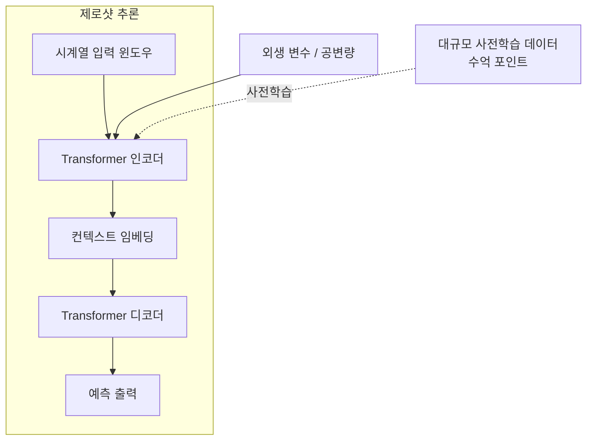

# TimeGPT

## 개요

TimeGPT는 Nixtla가 개발한 시계열(time-series) 전용 파운데이션 모델(FM)이다. 학습된 적 없는 새로운 데이터셋에 대해 **제로샷(zero-shot) 예측**을 수행할 수 있다는 점이 핵심 가치다. 전통적인 시계열 모델(ARIMA, Prophet 등)이나 데이터 특화 딥러닝 모델(LSTM, [[temporal-fusion-transformer|TFT]])은 각 데이터셋마다 별도로 학습해야 했지만, TimeGPT는 수억 개의 시계열 포인트로 사전학습된 단일 모델을 그대로 추론에 활용한다.

API 서비스 형태로 제공되어, 로컬 학습 인프라 없이도 기업이 즉시 사용할 수 있도록 설계되었다.

## 아키텍처 구조

TimeGPT는 [[time-series-forecasting-dl|딥러닝 기반 시계열 예측]] 패러다임 안에서 [[transformer-architecture|Transformer 아키텍처]]를 시계열 도메인에 맞게 적용했다.



- **입력 윈도우**: 과거 시계열 값과 선택적으로 외생 변수(exogenous variables)를 함께 받음
- **인코더-디코더 구조**: 입력 컨텍스트에서 패턴을 압축한 뒤 미래 시계열을 자기회귀(autoregressive) 또는 직접(direct) 방식으로 생성
- **사전학습 데이터**: 에너지, 금융, 날씨, 웹 트래픽 등 다양한 도메인의 수억 개 시계열 포인트

## 주요 기능

### 제로샷 예측
사전학습만으로 새로운 데이터셋에 즉시 예측을 수행한다. ARIMA 계열보다 동등하거나 우수한 정확도를 달성한다고 보고된다.

### 파인튜닝(Fine-tuning)
도메인 특화 데이터로 소량의 추가 학습이 가능하다. API를 통해 특정 데이터셋에 맞게 모델을 조정할 수 있어, 제로샷보다 높은 정확도를 기대할 수 있다.

### 이상 탐지(Anomaly Detection)
예측 구간(prediction interval)에서 크게 벗어나는 포인트를 이상치로 탐지하는 기능을 제공한다.

### 불확실성 정량화
예측 신뢰 구간(confidence interval)을 출력해 예측 불확실성을 수치화한다.

### 교차 학습(Cross-learning)
여러 시계열을 동시에 학습하거나 예측함으로써 시계열 간 패턴 공유 효과를 활용한다.

## Nixtla 생태계와 통합

TimeGPT는 Nixtla의 오픈소스 예측 라이브러리 생태계(StatsForecast, MLForecast, NeuralForecast)와 연동된다. Python SDK `nixtla`를 통해 API를 호출하며, Pandas DataFrame 형태의 입출력을 지원한다.

```python
from nixtla import NixtlaClient

client = NixtlaClient(api_key="your_key")
forecast = client.forecast(df=df, h=12, time_col="ds", target_col="y")
```

## 성능 벤치마크

Nixtla 공식 발표에 따르면, 다양한 공개 시계열 데이터셋(M4, M5, ETTh1 등)에서 전통적인 통계 모델 및 일부 딥러닝 모델을 제로샷 설정에서 능가한다고 주장한다. 단, 독립적인 재현 연구에서 결과가 다를 수 있어 [교차검증 필요] 태그를 붙여 둔다.

## 한계

- API 의존성: 온프레미스(on-premise) 배포가 어렵고, 데이터 프라이버시 우려 존재
- 블랙박스 특성: 예측 근거의 해석가능성(interpretability) 부족
- 긴 시계열에서의 성능: 수천~수만 스텝의 극장기(very long-horizon) 예측에서 검증 데이터 부족
- 비용: 대규모 배치 예측 시 API 호출 비용 발생

## 관련 문서

- [[time-series-forecasting-dl]] - 딥러닝 기반 시계열 예측 전반
- [[transformer-architecture]] - 기반 아키텍처 원리
- [[chronos-amazon]] - 동종의 시계열 파운데이션 모델 (Amazon)
- [[moirai-unified-forecasting]] - Salesforce의 통합 예측 모델
