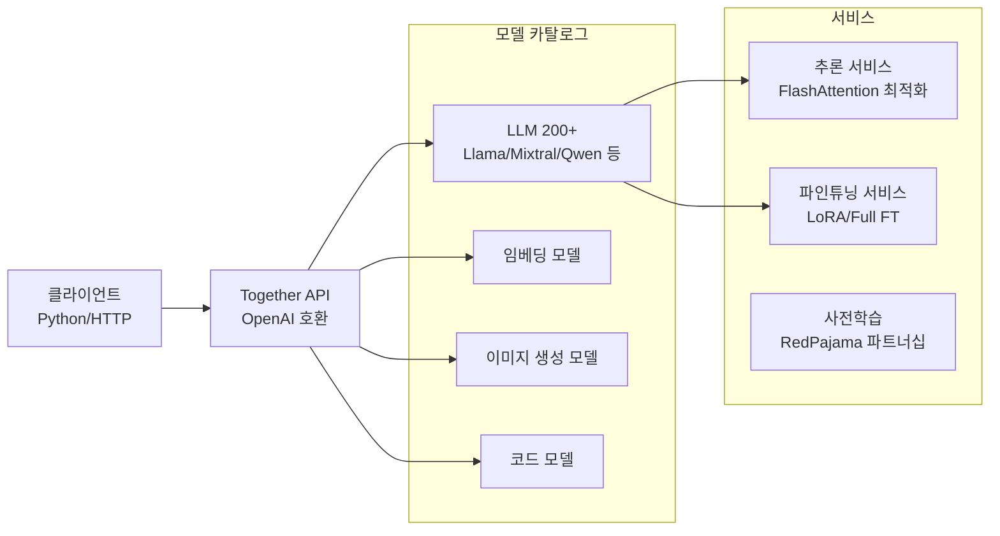
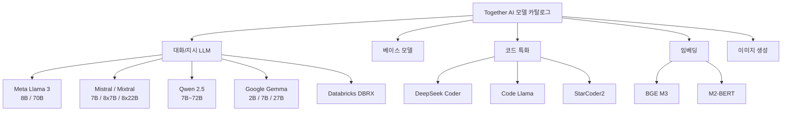
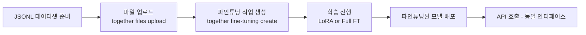
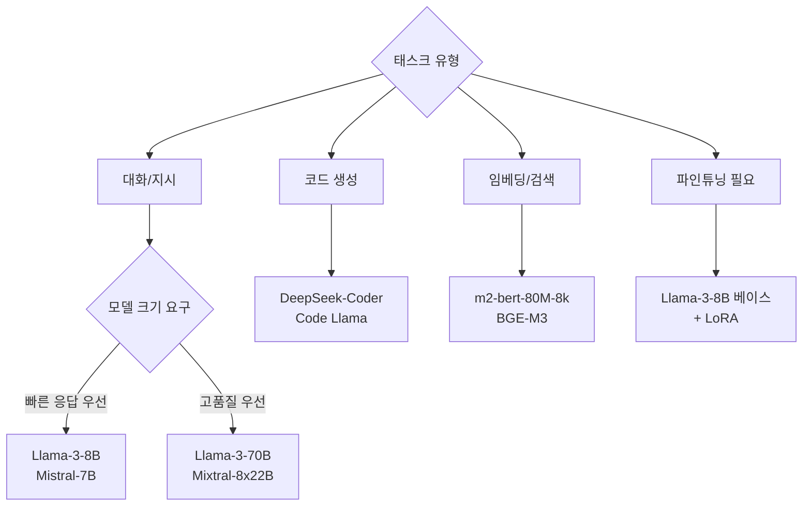

# Together AI - 오픈 모델 추론 플랫폼

Together AI는 200개 이상의 오픈소스 LLM(대형 언어 모델)을 단일 API로 제공하는 추론 플랫폼이다. OpenAI 호환 API 인터페이스, FlashAttention 등 최신 추론 최적화 기술, 그리고 파인튜닝(fine-tuning) 서비스까지 통합 제공한다. 오픈소스 학습 데이터셋인 RedPajama 프로젝트를 주도한 것으로도 알려져 있다.

## 플랫폼 개요



Together AI의 핵심 포지셔닝은 "OpenAI 드롭인(drop-in) 대체 + 오픈소스 모델"이다. 기존 OpenAI SDK를 그대로 사용하면서 베이스 URL만 바꿔 오픈모델로 전환할 수 있다.

## 핵심 기능

### OpenAI 호환 API

Together AI는 OpenAI API와 동일한 인터페이스를 제공한다. 기존 코드를 거의 수정하지 않고 모델만 교체할 수 있다:

```python
from openai import OpenAI

client = OpenAI(
    api_key="<together-api-key>",
    base_url="https://api.together.xyz/v1",
)

response = client.chat.completions.create(
    model="meta-llama/Llama-3-70b-chat-hf",
    messages=[
        {"role": "system", "content": "당신은 도움이 되는 AI 어시스턴트입니다."},
        {"role": "user", "content": "파이썬으로 피보나치 수열을 구현해줘."},
    ],
    max_tokens=1024,
    temperature=0.7,
)
print(response.choices[0].message.content)
```

Together 전용 Python SDK를 사용할 수도 있다:

```python
from together import Together

client = Together()

# Chat Completions
response = client.chat.completions.create(
    model="mistralai/Mixtral-8x7B-Instruct-v0.1",
    messages=[{"role": "user", "content": "MoE(Mixture of Experts) 아키텍처를 설명해줘."}],
)

# 스트리밍
stream = client.chat.completions.create(
    model="meta-llama/Llama-3-8b-chat-hf",
    messages=[{"role": "user", "content": "한국의 AI 생태계에 대해 설명해줘."}],
    stream=True,
)
for chunk in stream:
    print(chunk.choices[0].delta.content or "", end="", flush=True)
```

### 지원 모델 카탈로그

Together AI가 지원하는 주요 모델 패밀리:



### FlashAttention 추론 최적화

Together AI는 내부적으로 [[flashinfer]] 및 FlashAttention-2/3를 활용해 GPU 메모리 대역폭을 최대로 활용한다. 사용자 관점에서는 추가 설정 없이 고속 응답을 받을 수 있다.

Together AI가 공개한 추론 최적화 기술 스택:

| 기술 | 효과 |
|------|------|
| FlashAttention-2/3 | 어텐션 연산 IO 최적화, 메모리 효율 향상 |
| 연속 배칭(Continuous Batching) | GPU 유휴 시간 최소화, 처리량 향상 |
| 투기적 디코딩(Speculative Decoding) | 소형 드래프트 모델로 레이턴시 단축 |
| 양자화 (INT8/INT4) | 동일 GPU로 더 큰 모델 서빙 |
| KV 캐시 압축 | 긴 컨텍스트 처리 효율화 |

[[speculative-decoding]]과 [[kv-cache-optimization]] 기법의 실전 적용 사례다.

### 파인튜닝 서비스

Together AI는 업로드한 데이터셋으로 오픈소스 모델을 파인튜닝하는 서비스를 제공한다.



데이터셋 형식 (JSONL, OpenAI 호환):

```json
{"messages": [{"role": "user", "content": "질문"}, {"role": "assistant", "content": "답변"}]}
{"messages": [{"role": "user", "content": "질문2"}, {"role": "assistant", "content": "답변2"}]}
```

Python SDK로 파인튜닝 실행:

```python
from together import Together

client = Together()

# 파일 업로드
with open("training_data.jsonl", "rb") as f:
    file_response = client.files.upload(file=("training_data.jsonl", f))

file_id = file_response.id

# 파인튜닝 작업 생성
ft_response = client.fine_tuning.create(
    training_file=file_id,
    model="meta-llama/Llama-3-8b-hf",  # 베이스 모델
    n_epochs=3,
    learning_rate=1e-5,
    lora=True,         # LoRA 파인튜닝 활성화
    lora_r=16,
    lora_alpha=32,
)
print(ft_response.id)  # 작업 ID로 진행 상황 추적

# 완료 후 파인튜닝 모델로 추론
result = client.chat.completions.create(
    model=f"<username>/<ft-model-name>",
    messages=[{"role": "user", "content": "..."}],
)
```

지원하는 파인튜닝 방법:
- **LoRA (Low-Rank Adaptation)**: 파라미터 효율적 파인튜닝, 비용 저렴 [[peft-library]]
- **풀 파인튜닝(Full Fine-tuning)**: 모든 가중치 갱신, 더 높은 정확도 가능

### RedPajama 데이터셋

Together AI는 Meta, Slimfast 등과 협력하여 RedPajama 오픈 학습 데이터셋을 공개했다. LLaMA 학습에 사용된 데이터셋을 오픈소스로 재현한 것이 핵심이다.

| 버전 | 규모 | 특징 |
|------|------|------|
| RedPajama-v1 | 1.2T 토큰 | LLaMA 학습 데이터 재현 |
| RedPajama-v2 | 30T+ 토큰 | 품질 신호(quality signals) 포함, 필터링 유연성 제공 |

RedPajama-v2는 단순히 정제된 데이터를 제공하는 것이 아니라, 각 문서의 품질 신호(중복도, 언어 확률, 독성 점수 등)를 함께 포함해 연구자가 자신의 기준으로 필터링할 수 있게 설계됐다.

### 임베딩 API

텍스트 임베딩도 동일한 API로 제공한다:

```python
response = client.embeddings.create(
    model="togethercomputer/m2-bert-80M-8k-retrieval",
    input="Together AI 플랫폼에 대해 알고 싶습니다",
)
embedding = response.data[0].embedding
print(f"임베딩 차원: {len(embedding)}")  # 예: 768
```

[[rag]] 파이프라인에서 [[vector-database]]와 연동해 사용하는 패턴이 일반적이다.

## 경쟁 플랫폼과 비교

| 기능 | Together AI | [[fireworks-ai-platform\|Fireworks AI]] | [[groq-cloud-api\|Groq]] | [[anyscale-platform\|Anyscale]] |
|------|------------|--------------|------|----------|
| 오픈모델 수 | 200+ | 50+ | 제한적 | 제한적 |
| OpenAI 호환 | 완전 | 완전 | 완전 | 완전 |
| 파인튜닝 | 지원 (LoRA/Full) | 지원 | 미지원 | 지원 |
| 추론 속도 | 빠름 | 매우 빠름 | 최고속 | 빠름 |
| 오픈소스 기여 | RedPajama | - | - | Ray 창립 |
| 이미지 생성 | 지원 | 제한적 | 미지원 | 미지원 |
| 임베딩 | 지원 | 지원 | 미지원 | 지원 |
| 무료 크레딧 | 있음 | 있음 | 있음 | 있음 |

### Together AI vs Groq

- **Groq**는 전용 LPU(Language Processing Unit) 칩을 사용해 레이턴시 면에서 극도로 빠르지만, 지원 모델 수가 적다.
- **Together AI**는 더 다양한 모델 포트폴리오와 파인튜닝 기능에서 우위다.

### Together AI vs Fireworks AI

- 두 플랫폼 모두 OpenAI 호환 API와 오픈모델을 제공하는 직접 경쟁 관계.
- **Fireworks AI**는 구조화된 출력(JSON Schema)과 함수 호출 최적화에서 강점이 있다.
- **Together AI**는 모델 다양성과 RedPajama 같은 오픈소스 기여 생태계에서 앞선다.

## 실무 사용 가이드

### 모델 선택 가이드



### 환경 설정

```bash
# 설치
pip install together

# API 키 설정
export TOGETHER_API_KEY="<your-key>"

# 또는 .env 파일
echo "TOGETHER_API_KEY=<your-key>" >> .env
```

### 에러 처리 패턴

```python
from together import Together
from together.error import AuthenticationError, RateLimitError, APIError
import time

client = Together()

def safe_completion(messages: list, model: str, max_retries: int = 3) -> str:
    for attempt in range(max_retries):
        try:
            response = client.chat.completions.create(
                model=model,
                messages=messages,
                max_tokens=1024,
            )
            return response.choices[0].message.content
        except RateLimitError:
            wait_time = 2 ** attempt  # 지수 백오프
            time.sleep(wait_time)
        except AuthenticationError:
            raise  # API 키 문제는 재시도 무의미
        except APIError as e:
            if attempt == max_retries - 1:
                raise
            time.sleep(1)
    raise RuntimeError("최대 재시도 횟수 초과")
```

## 한계 / 트레이드오프

| 항목 | 내용 |
|------|------|
| 가용성(Uptime) | 상용 서비스 대비 SLA가 약할 수 있음 |
| 최신 모델 지연 | GPT-5, Claude 최신 버전은 제공 불가 |
| 레이턴시 | Groq 대비 느림 (GPU 기반 vs LPU) |
| 파인튜닝 비용 | 대규모 데이터셋 학습은 고비용 |
| 데이터 프라이버시 | 파인튜닝 데이터 보존 정책 확인 필요 |
| 모델 업데이트 | 공개 모델 버전 업데이트 주기가 불규칙 |

## 관련 문서

- [[fireworks-ai-platform]] - 고속 추론과 구조화 출력에 특화된 경쟁 플랫폼
- [[groq-cloud-api]] - LPU 기반 초고속 추론 플랫폼
- [[anyscale-platform]] - Ray 기반 분산 ML 플랫폼
- [[peft-library]] - LoRA 등 파라미터 효율적 파인튜닝 라이브러리
- [[flashinfer]] - FlashAttention 계열 추론 커널 라이브러리
- [[rag]] - 임베딩 API 활용 RAG 파이프라인 구축
