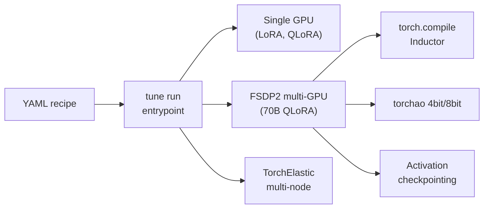

# torchtune - PyTorch native LLM fine-tuning / post-training

## 개요

torchtune은 Meta PyTorch팀이 개발한 PyTorch native LLM fine-tuning / post-training 라이브러리이다. **외부 wrapper 없이 PyTorch FSDP2/torch.compile/torchao를 직접 활용**하는 hackable recipe 철학과, YAML 기반 단일 진입점 (`tune run`)이 특징이다. 다양한 가속기 (NVIDIA / Intel XPU / AMD ROCm / Apple MPS / Ascend NPU)를 지원한다.

> **상태 안내**: v0.6.1 (2025-04-07) 이후 **wind-down 발표** — "torchtune is no longer actively maintained; torchtune development wound down in 2025." 신규 기능 추가는 지양된다.

- 공식 repo: [meta-pytorch/torchtune](https://github.com/meta-pytorch/torchtune)
- 운영 주체: Meta PyTorch팀
- 최신 버전: **v0.6.1** (2025-04-07)
- License: BSD-3-Clause

## 핵심 기여

1. **PyTorch native** — 외부 wrapper 없이 PyTorch FSDP2/torch.compile/torchao 직접 활용
2. **YAML 기반 recipe** — `tune run lora_finetune_distributed --config llama3_1/8B_lora`
3. **FSDP2 first-class** — QLoRA + FSDP2로 70B+ multi-GPU 학습 (FSDP1 대비 12% 토큰/sec 향상, init 3.2x 가속)
4. **다양한 가속기** — NVIDIA, Intel XPU, AMD ROCm, Apple MPS, Ascend NPU

## 지원 레시피

| 방법 | Single | Multi-Device | Multi-Node |
|------|--------|--------------|-----------|
| Full Fine-tune | yes | yes | yes |
| LoRA / QLoRA | yes | yes | yes |
| **DPO** | yes | yes | no |
| Knowledge Distillation | no | yes | no |
| **GRPO** | WIP | yes | yes |
| **PPO** | yes | no | no |

## 분산 / 인프라

- **FSDP2** (PyTorch ≥2.4): per-parameter sharding, eager mode 친화적
- 단일 노드 1~8 GPU LoRA finetune 기본
- 70B 모델은 QLoRA + FSDP2 필요
- Multi-node: TorchElastic + torchrun 기반

## RL 지원

- **DPO**: TRL과 유사한 API, FSDP2 지원
- **PPO**: 단일 device만 (분산 X)
- **GRPO**: WIP, multi-device + multi-node 지원 추가됨
- vLLM 통합은 외부 — TRL/OpenRLHF/verl 만큼 성숙하지 않음

## 메모리 / 처리량 최적화

- torch.compile (Inductor)
- torchao 4-bit / 8-bit quantization
- Activation checkpointing
- Memory-efficient optimizers (8-bit AdamW)

## 핵심 인용

> "torchtune is a PyTorch library for easily authoring, fine-tuning and experimenting with LLMs. ... PyTorch native post-training library." — README

> "By leveraging FSDP2, there is a speed up of 12% tokens/sec and a 3.2x speedup in model init over FSDP1 with LoRA." — v0.2.0 release notes

> "torchtune is no longer actively maintained; torchtune development wound down in 2025." — repo notice

## 한계

- RL post-training 영역은 [[trl-library]] / [[openrlhf]]에 비해 미성숙
- 2025년 wind-down 공지 — 신규 기능은 지양
- vLLM rollout 통합이 약함

## 운영 사례

- Meta 내부 Llama 시리즈 일부 fine-tuning 레시피
- 커뮤니티: 학계 연구실의 빠른 실험용 (단일 GPU LoRA)

## 관련 문서

- [[fsdp-vs-deepspeed]] - 분산 backend 비교
- [[trl-library]] - HuggingFace post-training (대안)
- [[direct-preference-optimization]] - 알고리즘
- [[rl-harness-frameworks-comparison]] - RL harness 통합 비교
