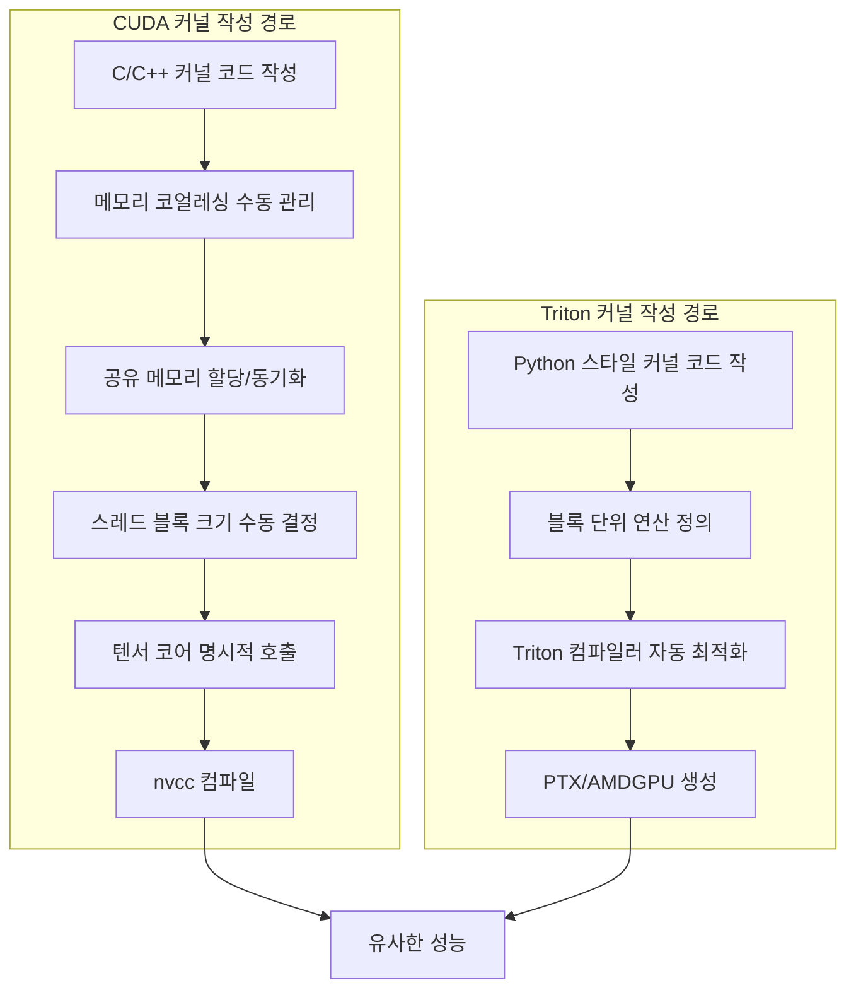
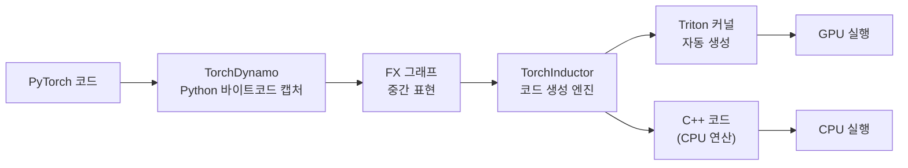

# Triton (OpenAI): Python으로 작성하는 GPU 커널

## 개요

Triton은 OpenAI가 개발한 오픈소스 GPU 프로그래밍 언어 겸 컴파일러다. Python과 유사한 문법으로 고성능 GPU 커널을 작성할 수 있으며, CUDA의 복잡한 저수준 세부사항(메모리 코얼레싱, 공유 메모리 동기화, 텐서 코어 스케줄링 등)을 자동으로 처리한다. 25줄 이내의 Triton 코드로 cuBLAS 수준의 FP16 행렬 곱셈 성능을 달성할 수 있다고 공식적으로 언급된다.

PyTorch 2.0 이후 `torch.compile`의 핵심 백엔드(TorchInductor)로 채택되어, PyTorch 코드가 자동으로 최적화된 Triton 커널로 변환된다. [[unsloth]]의 2-3배 학습 속도 향상, Flash Attention의 효율적 구현 등 고성능 ML 라이브러리의 커널 구현 언어로 널리 활용되고 있다.

**중요**: OpenAI Triton은 GPU 커널 프로그래밍 언어이며, NVIDIA Triton Inference Server(모델 배포/추론 서빙 플랫폼)와는 완전히 별개의 프로젝트다. 이름이 같아 혼동이 잦으므로 주의가 필요하다.

## CUDA와의 비교



| 특성 | CUDA | Triton |
|------|------|--------|
| 언어 | C/C++ | Python (DSL) |
| 추상화 수준 | 스레드(thread) 단위 | 블록(block) 단위 |
| 메모리 코얼레싱 | 수동 | 자동 |
| 공유 메모리 | 수동 할당/동기화 | 자동 관리 |
| 텐서 코어 활용 | 명시적 | 자동 |
| 코드량 | 많음 (수백 줄) | 적음 (수십 줄) |
| 학습 곡선 | 가파름 | 상대적으로 완만 |
| 최적 성능 | 전문가 수준에서 최고 | cuBLAS에 근접 |
| 하드웨어 지원 | NVIDIA 전용 | NVIDIA + AMD(ROCm) |

Triton의 핵심 설계 결정은 SIMT(Single Instruction, Multiple Thread) 모델 대신 **블록 단위 연산** 모델을 채택한 것이다. 개발자는 스레드 개별 동작을 관리하는 대신, 2의 거듭제곱 크기의 블록(작은 배열) 단위로 연산을 정의한다. 이로써 스레드 블록 내부의 동시성 문제를 컴파일러가 자동으로 처리한다.

## 핵심 API

Triton 커널은 `@triton.jit` 데코레이터로 정의하며, 데이터 이동의 기본 단위는 `tl.load`와 `tl.store`다.

### 기본 구조

```python
@triton.jit
def add_kernel(x_ptr, y_ptr, out_ptr, n, BLOCK: tl.constexpr):
    pid = tl.program_id(0)
    offs = pid * BLOCK + tl.arange(0, BLOCK)
    mask = offs < n
    x = tl.load(x_ptr + offs, mask=mask)
    y = tl.load(y_ptr + offs, mask=mask)
    tl.store(out_ptr + offs, x + y, mask=mask)
```

`tl.program_id`로 블록 ID를 얻고, `tl.load`/`tl.store`로 글로벌 메모리를 읽고 쓴다. `mask`로 경계 검사를 수행한다.

### 주요 API

| API | 역할 | 비고 |
|-----|------|------|
| `tl.load(ptr, mask)` | 글로벌 메모리에서 블록 단위 데이터 로드 | CUDA의 메모리 읽기 추상화 |
| `tl.store(ptr, val, mask)` | 연산 결과를 글로벌 메모리에 저장 | CUDA의 메모리 쓰기 추상화 |
| `tl.program_id(axis)` | 현재 블록(프로그램)의 ID 반환 | CUDA의 blockIdx에 해당 |
| `tl.arange(start, end)` | 연속 정수 범위 생성 | 오프셋 계산에 사용 |
| `tl.dot(a, b)` | 블록 행렬 곱셈 | 텐서 코어 자동 활용 |
| `tl.where(cond, x, y)` | 조건부 선택 | 마스킹 연산 |
| `tl.atomic_add(ptr, val)` | 원자적 덧셈 | 동시 접근 안전 |

## torch.compile 통합

PyTorch 2.0부터 `torch.compile`은 TorchDynamo(Python 바이트코드 캡처) + TorchInductor(코드 생성) 파이프라인을 통해 PyTorch 코드를 자동으로 최적화된 Triton 커널로 변환한다.



`torch.compile(model)`만으로 커널 퓨전(fusion), 메모리 접근 최적화 등이 자동 적용된다. 개발자가 직접 Triton 커널을 작성하지 않아도 Triton의 이점을 간접적으로 누릴 수 있다.

## 실제 활용 사례

### Unsloth -- 수제 Triton 커널로 2-3배 학습 가속

[[unsloth]]는 Transformer 레이어의 역전파(backpropagation) 수학을 수동으로 유도한 뒤, 해당 연산에 특화된 Triton 커널을 수작업으로 구현한다. RoPE(Rotary Position Embedding)와 MLP 전용 Triton 커널로 3배 빠른 학습 속도와 30% 추가 VRAM 절감을 달성한다. 범용 CUDA 커널 대비 특정 연산에 완전히 최적화된 Triton 커널의 위력을 보여주는 사례다.

### Flash Attention -- 퓨전 어텐션 커널

Flash Attention은 어텐션 연산의 전체 과정(Q*K^T, softmax, *V)을 하나의 퓨전 커널로 합쳐, N^2 크기의 어텐션 행렬을 GPU HBM에 실체화하지 않고 블록 단위로 처리한다. Triton으로 구현된 Flash Attention은 CUDA 버전과 유사한 성능을 달성하면서도 코드 가독성이 월등하다. 학습/추론 모두에서 메모리 사용량을 크게 줄이고 속도를 높인다.

## 하드웨어 지원

Triton은 NVIDIA GPU 전용이 아니다. 컴파일러 백엔드 추상화를 통해 NVIDIA(CUDA), AMD(ROCm), Intel(XPU) GPU를 지원한다. AMD ROCm 블로그에서 Triton 커널 개발 가이드를 제공하고, NVIDIA는 Blackwell 아키텍처에서 Triton 성능 최적화를 공식 지원한다. 특정 벤더에 종속되지 않는 크로스 플랫폼 GPU 프로그래밍 도구로 자리잡고 있다.

## 최신 동향 (2025-2026)

- **Meta Helion**: Triton으로 컴파일되는 상위 레벨 DSL. 커널 개발을 더 단순화하는 것이 목표
- **NVIDIA Blackwell 최적화**: OpenAI Triton on Blackwell이 NVIDIA 기술 블로그에서 공식 다뤄질 만큼 양사 협력 심화
- **triton-lang/triton**: GitHub 리포지토리가 `openai/triton`에서 이전, 커뮤니티 거버넌스 확대

## NVIDIA Triton Inference Server와의 구분

| 항목 | OpenAI Triton | NVIDIA Triton Inference Server |
|------|--------------|-------------------------------|
| **정체** | GPU 커널 프로그래밍 언어/컴파일러 | 모델 추론 서빙 플랫폼 |
| **용도** | GPU 커널 작성, torch.compile 백엔드 | 학습된 모델을 프로덕션에서 서빙 |
| **개발사** | OpenAI (현재 triton-lang 커뮤니티) | NVIDIA |
| **GitHub** | triton-lang/triton | triton-inference-server/server |
| **관련 기술** | CUDA 대안, [[mixed-precision-training]] 커널 | TensorRT, ONNX, 모델 배포 |

이름 충돌은 GitHub 이슈에서도 공식적으로 논의되었지만, 양쪽 모두 이름을 유지하고 있다. 문맥에서 "Triton 커널"이라 하면 OpenAI Triton, "Triton 서버"라 하면 NVIDIA Triton Inference Server를 가리킨다.

## 실전 도입 가이드

### 언제 Triton 커널을 직접 작성하는가

| 상황 | 접근법 |
|------|--------|
| 일반적인 모델 학습/추론 | `torch.compile`로 자동 최적화 (Triton 자동 생성) |
| 특정 연산의 극한 최적화 | Triton 커널 직접 작성 ([[unsloth]] 방식) |
| 새로운 어텐션 메커니즘 구현 | Triton으로 퓨전 커널 작성 (Flash Attention 방식) |
| 크로스 플랫폼 GPU 커널 | Triton (NVIDIA + AMD 동시 지원) |
| 최극한 성능, 하드웨어 제어 | CUDA C/C++ (Triton 추상화 한계 시) |

### 흔한 실수

- **블록 크기 미조정**: `BLOCK_SIZE`가 성능에 큰 영향. 2의 거듭제곱으로 설정하고 autotune으로 최적값 탐색
- **경계 검사 누락**: `mask` 없이 `tl.load`하면 범위 밖 메모리 접근으로 오류 발생
- **NVIDIA Triton Inference Server와 혼동**: `pip install triton`은 OpenAI Triton, `pip install tritonclient`는 NVIDIA Triton 클라이언트

## 관련 문서
- [[triton-gpu-programming]] -- Triton GPU 프로그래밍

- [[unsloth]] -- Triton 커널 활용의 대표 사례 (2-3배 학습 가속)
- [[mixed-precision-training]] -- Triton 커널의 FP16/BF16/FP8 연산 최적화
- [[training-profiling]] -- Triton 커널 성능 분석 (Nsight Compute)
- [[distributed-communication]] -- Triton 커널과 [[nccl]] 통신의 오버랩 최적화
- [[tensor-pipeline-parallelism]] -- Triton 기반 최적화 커널이 적용되는 병렬화 환경
- [[data-parallelism-fsdp]] -- torch.compile + Triton 자동 최적화 적용
