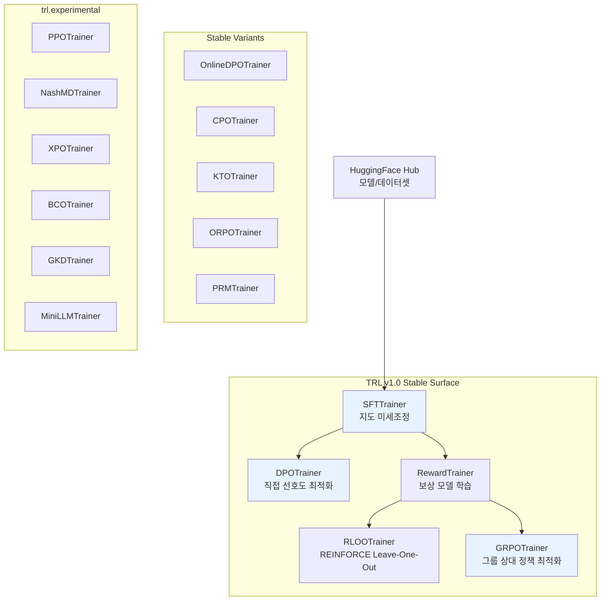
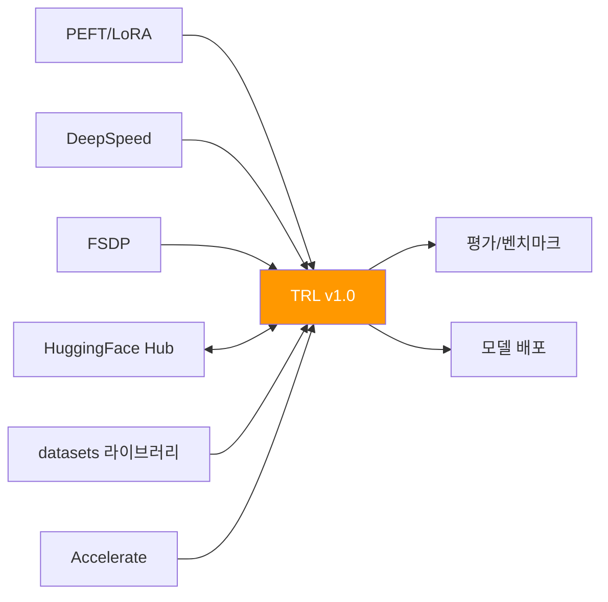

# TRL: HuggingFace 포스트트레이닝 풀스택 라이브러리

## 개요

TRL(Transformers Reinforcement Learning)은 HuggingFace가 개발한 오픈소스 포스트트레이닝(post-training) 라이브러리다. 2026년 4월 릴리스된 **v1.0**은 연구용 코드베이스에서 프로덕션 수준의 안정적 라이브러리로의 전환을 선언한 마일스톤이다. 현재 **75개 이상의 포스트트레이닝 기법**을 구현하고 있으며, [[supervised-fine-tuning]]부터 [[direct-preference-optimization]], [[ppo-for-llms]]까지 전체 파이프라인을 단일 라이브러리에서 처리할 수 있다.

## 아키텍처



## 핵심 Trainer 상세

### SFTTrainer -- 지도 미세조정

SFTTrainer는 포스트트레이닝 파이프라인의 첫 단계를 담당한다. 사전학습된 언어 모델을 지시-응답(instruction-response) 쌍으로 미세조정한다.

주요 기능:
- **Constant-length Packing**: 짧은 시퀀스 여러 개를 고정 길이 블록(예: 2048 토큰)으로 연결하여 거의 모든 토큰이 gradient 갱신에 기여하도록 보장
- **NEFTune**: 학습 중 임베딩에 노이즈를 추가하여 일반화 성능 향상
- HuggingFace Transformers의 Trainer API 기반 -- [[lora-qlora-finetuning]] 등 PEFT 기법과 원활한 통합

### DPOTrainer -- 직접 선호도 최적화

[[direct-preference-optimization]] 알고리즘을 구현한 Trainer로, Llama 3를 비롯한 다수 모델의 포스트트레이닝에 활용되었다. 보상 모델 없이 선호도 데이터만으로 정책을 직접 최적화한다.

- 참조(reference) 모델 관리 자동화
- 선호/비선호 쌍 데이터 형식 표준화
- OnlineDPOTrainer로 on-policy 변형도 지원

### GRPOTrainer -- 그룹 상대 정책 최적화

DeepSeek R1 학습에 사용된 GRPO 알고리즘을 구현한다. PPO 대비 메모리 효율이 높아 리소스 제약 환경에서 강화학습 기반 정렬(alignment)을 수행할 수 있다.

- 다중 보상 함수 지원 (규칙 기반 + 모델 기반 혼합 가능)
- 그룹 단위 상대 비교로 baseline 추정 불필요
- [[rlhf-pipeline]]의 PPO 대비 단순한 설정

### RewardTrainer / PRMTrainer -- 보상 모델 학습

[[reward-model-training]]을 위한 전용 Trainer. PRMTrainer는 프로세스 보상 모델(Process Reward Model)을 학습하여 단계별 추론 품질을 평가한다.

### PPOTrainer -- 근접 정책 최적화

"Fine-Tuning Language Models from Human Preferences" (Ziegler et al.)의 구조를 따르는 [[ppo-for-llms]] 구현체. v1.0에서는 `trl.experimental` 네임스페이스로 이동했다.

## v1.0 안정성 모델

TRL v1.0의 핵심 설계 결정은 **안정 영역(stable surface)**과 **실험 영역(experimental)**의 명시적 분리다:

| 영역 | Trainer | 호환성 보장 |
|------|---------|------------|
| Stable | SFTTrainer, DPOTrainer, RewardTrainer, RLOOTrainer, GRPOTrainer + 변형 | 하위 호환 유지 |
| Experimental | PPOTrainer, NashMDTrainer, XPOTrainer, BCOTrainer, GKDTrainer, MiniLLMTrainer | API 변경 가능 |

`trl.experimental` 네임스페이스는 최신 연구를 빠르게 반영하면서도 코어 라이브러리의 안정성을 보호한다.

## 전체 Trainer 목록

v1.0 기준 제공되는 주요 Trainer:

- **SFTTrainer** -- 지도 미세조정
- **DPOTrainer** -- 직접 선호도 최적화
- **OnlineDPOTrainer** -- 온라인(on-policy) DPO
- **GRPOTrainer** -- 그룹 상대 정책 최적화
- **RLOOTrainer** -- REINFORCE Leave-One-Out
- **RewardTrainer** -- 보상 모델 학습
- **PRMTrainer** -- 프로세스 보상 모델 학습
- **CPOTrainer** -- Contrastive Preference Optimization
- **KTOTrainer** -- Kahneman-Tversky Optimization (비쌍 선호도)
- **ORPOTrainer** -- Odds Ratio Preference Optimization
- **PPOTrainer** -- 근접 정책 최적화 (experimental)
- **NashMDTrainer** -- Nash Mirror Descent (experimental)
- **XPOTrainer** -- Exploratory Policy Optimization (experimental)
- **BCOTrainer** -- Binary Classifier Optimization (experimental)
- **GKDTrainer** -- Generalized Knowledge Distillation (experimental)
- **MiniLLMTrainer** -- 소형 모델 증류 (experimental)

## 생태계 통합



- **[[huggingface-hub]]**: 모델, 데이터셋, 학습 로그의 원활한 업로드/다운로드
- **PEFT**: [[lora-qlora-finetuning]] 등 파라미터 효율적 기법과 네이티브 통합
- **Accelerate/DeepSpeed/FSDP**: 분산 학습 백엔드 지원
- **datasets**: 학습 데이터 로딩 및 전처리 파이프라인

## 다른 도구와의 비교

| 특성 | TRL | Axolotl | LLaMA-Factory | Unsloth |
|------|-----|---------|---------------|---------|
| 주요 강점 | 포스트트레이닝 기법 폭 | YAML 설정 편의성 | 100+ 모델 지원 | 속도/메모리 최적화 |
| Trainer 수 | 16+ | 제한적 | 중간 | SFT/DPO/GRPO |
| 안정성 모델 | stable/experimental 분리 | 통합 | 통합 | 통합 |
| HF 생태계 | 네이티브 | 의존 | 부분 | 의존 |

## 주요 활용 사례

### 추론(Reasoning) 모델 학습

GRPOTrainer를 활용하면 DeepSeek R1 스타일의 추론 모델을 학습할 수 있다. 규칙 기반 보상(정답 일치, 포맷 준수 등)과 모델 기반 보상을 혼합하여 단계적 사고 능력을 부여한다.

### 안전성 정렬(Safety Alignment)

[[rlhf-pipeline]]의 전체 단계를 TRL 내에서 처리할 수 있다:
1. SFTTrainer로 기본 대화 능력 학습
2. RewardTrainer로 인간 선호도 기반 보상 모델 구축
3. GRPOTrainer 또는 PPOTrainer로 보상 기반 정렬

### 지식 증류(Knowledge Distillation)

GKDTrainer와 MiniLLMTrainer를 통해 대형 모델의 지식을 소형 모델로 전이할 수 있다. [[mixed-precision-training]]과 결합하여 효율적인 증류가 가능하다.

## 설치 및 시작

```bash
pip install trl
```

기본 SFT 예시:

```python
from trl import SFTTrainer, SFTConfig

training_args = SFTConfig(
    output_dir="./sft_output",
    max_seq_length=2048,
    packing=True,
)
trainer = SFTTrainer(
    model="meta-llama/Llama-3-8B",
    args=training_args,
    train_dataset=dataset,
)
trainer.train()
```

## 참고 자료

- 공식 문서: https://huggingface.co/docs/trl
- GitHub: https://github.com/huggingface/trl
- v1.0 블로그: https://huggingface.co/blog/trl-v1
