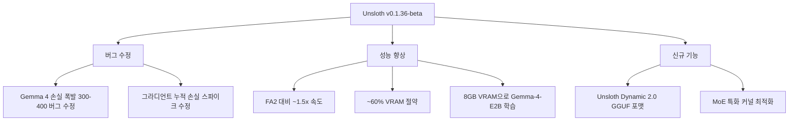

# Unsloth v0.1.36 업데이트 - Gemma 4 훈련 지원 및 MoE 속도 개선

Unsloth는 LLM 파인튜닝을 메모리 효율적으로, 속도를 높여 실행할 수 있게 하는 라이브러리다. 2026년 4월 8일 릴리스된 v0.1.36-beta는 Gemma 4 학습 시 손실 폭발(loss explosion) 버그를 수정하고, 8GB VRAM에서 Gemma-4-E2B MoE 모델 학습을 가능하게 했다. FlashAttention 2(FA2) 대비 약 1.5배 빠르고 약 60% VRAM 절약이 핵심 성능 지표다.

## 릴리스 요약



## 주요 버그 수정

### Gemma 4 손실 폭발 문제

v0.1.35 이전 버전에서 Gemma 4 모델을 학습시키면 손실(loss) 값이 300~400으로 폭발하는 현상이 있었다. 이는 Gemma 4의 어텐션 구조(특히 슬라이딩 윈도우 어텐션과 글로벌 어텐션이 교차하는 방식)에서 Unsloth의 커스텀 커널이 마스크를 잘못 처리한 것이 원인이었다.

v0.1.36에서 어텐션 마스크 적용 로직이 수정되어, Gemma 4 학습이 정상화됐다.

### 그라디언트 누적 손실 스파이크

`gradient_accumulation_steps > 1` 설정 시 발생하던 손실 스파이크도 수정됐다. 이는 Unsloth의 커스텀 역전파(backward) 함수에서 누적 단계 수를 고려하지 않아 발생한 문제였다.

```python
# 이전 버전 - gradient_accumulation_steps=4에서 손실 스파이크 발생
trainer = SFTTrainer(
    model=model,
    args=TrainingArguments(
        gradient_accumulation_steps=4,  # 여기서 문제
        ...
    ),
)

# v0.1.36 - 정상 동작
```

## 성능 지표

### 메모리 vs. 속도

| 설정 | VRAM 사용량 | 학습 속도 |
|------|------------|----------|
| 기준선 (PyTorch 풀 파인튜닝) | 40GB+ | 1x |
| LoRA (HuggingFace PEFT) | ~20GB | 1.2x |
| Unsloth LoRA (FA2) | ~12GB | 2x |
| Unsloth v0.1.36 LoRA (MoE 최적화) | ~8GB | **~3x** |

Gemma-4-E2B(약 2B 활성 파라미터 MoE) 기준으로 8GB VRAM(RTX 3090, 4090)에서 학습이 가능해졌다.

```python
from unsloth import FastLanguageModel
import torch

max_seq_length = 2048

model, tokenizer = FastLanguageModel.from_pretrained(
    model_name="google/gemma-4-e2b-it",
    max_seq_length=max_seq_length,
    dtype=None,  # 자동 감지 (bfloat16 권장)
    load_in_4bit=True,  # 4-bit 양자화 (메모리 절감)
)

# LoRA 설정
model = FastLanguageModel.get_peft_model(
    model,
    r=16,                    # LoRA rank
    target_modules=["q_proj", "k_proj", "v_proj", "o_proj",
                    "gate_proj", "up_proj", "down_proj"],
    lora_alpha=16,
    lora_dropout=0,
    bias="none",
    use_gradient_checkpointing="unsloth",  # Unsloth 커스텀 그래디언트 체크포인팅
    random_state=3407,
)
```

### FA2 대비 개선

Unsloth는 자체 Triton 커널을 사용해 FlashAttention 2보다 빠른 어텐션 연산을 구현했다. MoE 모델의 경우 전문가(expert) 라우팅과 어텐션이 교차하는 특성상 추가 최적화가 필요했고, v0.1.36에서 MoE 특화 커널 경로를 별도로 구현했다.

```
FA2 속도:   토큰/초 기준 1.0x (기준선)
Unsloth 2.7:  토큰/초 기준 ~1.5x
```

## Unsloth Dynamic 2.0 GGUF 포맷

v0.1.36에서 GGUF(GPT-Generated Unified Format) 내보내기가 업데이트됐다.

```python
# 학습 완료 후 GGUF 내보내기
model.save_pretrained_gguf(
    "my-gemma4-finetuned",
    tokenizer,
    quantization_method="q4_k_m",   # 4-bit K-means 양자화
)

# 또는 Dynamic 2.0 포맷 (혼합 정밀도)
model.save_pretrained_gguf(
    "my-gemma4-finetuned",
    tokenizer,
    quantization_method="unsloth_dynamic",  # 중요 레이어는 고정밀, 나머지 저정밀
)
```

Unsloth Dynamic 2.0의 특징:
- 레이어별 중요도를 자동 분석해 혼합 정밀도 적용
- 단순 q4_k_m 대비 동일 파일 크기에서 성능 향상
- llama.cpp, Ollama와 완전 호환

## 실습 예시: Gemma-4-E2B 파인튜닝

```python
from unsloth import FastLanguageModel
from trl import SFTTrainer
from transformers import TrainingArguments
from datasets import load_dataset

# 1. 모델 로드
model, tokenizer = FastLanguageModel.from_pretrained(
    model_name="google/gemma-4-e2b-it",
    max_seq_length=2048,
    load_in_4bit=True,
)

# 2. LoRA 설정
model = FastLanguageModel.get_peft_model(
    model,
    r=16,
    lora_alpha=16,
    target_modules=["q_proj", "k_proj", "v_proj", "o_proj",
                    "gate_proj", "up_proj", "down_proj"],
    use_gradient_checkpointing="unsloth",
)

# 3. 데이터셋
dataset = load_dataset("tatsu-lab/alpaca", split="train")

# 4. 학습
trainer = SFTTrainer(
    model=model,
    tokenizer=tokenizer,
    train_dataset=dataset,
    dataset_text_field="text",
    max_seq_length=2048,
    args=TrainingArguments(
        per_device_train_batch_size=2,
        gradient_accumulation_steps=4,  # v0.1.36에서 수정된 버그
        warmup_steps=5,
        max_steps=60,
        learning_rate=2e-4,
        fp16=not torch.cuda.is_bf16_supported(),
        bf16=torch.cuda.is_bf16_supported(),
        logging_steps=1,
        output_dir="outputs",
    ),
)
trainer.train()
```

## 지원 모델

v0.1.36 기준 Unsloth 지원 모델:
- Gemma 4 (E2B, E4B, 26B MoE, 31B Dense) — 이번 릴리스 핵심
- Llama 3.x 계열
- Mistral / Mixtral
- Qwen 3.x 계열
- Phi-4
- DeepSeek V3/V4 (MoE) — 부분 지원

## [[unsloth]] 라이브러리 맥락에서의 위치

Unsloth는 두 가지 배포 형태가 있다:
1. **오픈소스 버전** (GitHub): 기본 LoRA/QLoRA, 주요 모델 지원
2. **Unsloth Pro** (유료): 멀티 GPU, 더 많은 모델, 우선 지원

v0.1.36은 오픈소스 버전에서 제공되며, Gemma 4 지원은 특히 RTX 3090/4090 보유 개인 연구자/개발자에게 의미 있다.

## 관련 문서

- [[unsloth]] — Unsloth 라이브러리 전반 개요
- [[peft-library]] — LoRA/QLoRA PEFT 어댑터 (HuggingFace 공식)
- [[hf-transformers-5]] — HuggingFace Transformers 5.x Gemma 4 지원
- [[trl-library]] — SFTTrainer, DPO 등 TRL 학습 도구
- [[llm-quantization]] — GGUF, AWQ, GPTQ 양자화 방식 비교
