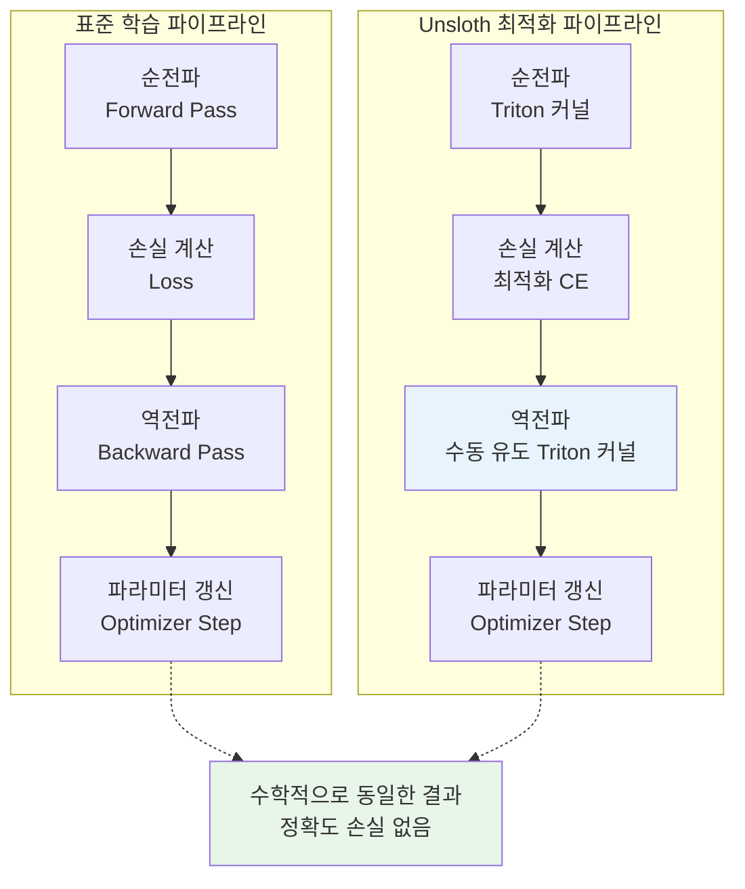
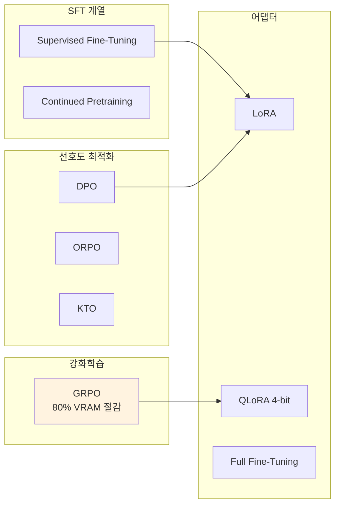

# Unsloth: 2배 빠른 LLM 파인튜닝, 70% 메모리 절감

## 개요

Unsloth는 LLM 파인튜닝의 속도와 메모리 효율을 극한까지 최적화한 오픈소스 라이브러리다. 핵심 기술은 트랜스포머 레이어의 역전파(backpropagation) 수학을 수동으로 유도한 뒤, 이를 **수제 Triton 커널**로 재구현하는 것이다. 결과적으로 표준 학습과 **수학적으로 동일한 연산**을 수행하면서도 **2배 빠른 속도**와 **70% 메모리 절감**을 달성한다.

소비자급 GPU에서도 대형 모델을 파인튜닝할 수 있게 해주어, [[lora-qlora-finetuning]] 생태계의 접근성을 크게 높였다.

## 핵심 기술: 수제 Triton 커널



### 왜 Triton인가

일반적인 딥러닝 프레임워크는 범용 CUDA 커널을 사용한다. Unsloth 개발자들은 트랜스포머의 각 연산(어텐션, MLP, RoPE 등)에 대해:

1. 역전파 수학을 처음부터 수동으로 유도
2. 해당 연산에 특화된 Triton 커널을 작성
3. 메모리 할당/해제 패턴을 최적화

이 접근법이 정확도 트레이드오프 없이 속도와 메모리를 동시에 개선하는 비결이다.

### RoPE & MLP Triton 커널

최근 추가된 RoPE(Rotary Position Embedding)와 MLP 전용 Triton 커널은:

- **3배 빠른 학습 속도**
- **30% 추가 VRAM 절감**

## 성능 벤치마크

Transformers v4.36 (PyTorch 2.1.1, SDPA 네이티브 통합) 대비:

| 메트릭 | 개선폭 |
|--------|--------|
| 학습 속도 | 최대 **2.7배** 빠름 |
| VRAM 사용량 | 최대 **74% 절감** |
| 정확도 | **동일** (수학적으로 동치) |

### 시퀀스 패킹 병용 시

`packing=True` 설정으로 시퀀스 패킹 활성화 시:

- 추가 **1.1-2배 속도 향상**
- 추가 **30% 메모리 절감**
- 기본 Unsloth 최적화와 중첩 적용

### MoE 모델 지원

Mixture-of-Experts 모델에서는 최대 **12배 빠른 학습**을 달성한다.

## 지원 학습 방법



### GRPO -- 추론 모델 학습

DeepSeek R1에서 사용된 GRPO(Group Relative Policy Optimization) 알고리즘을 Unsloth 최적화와 결합한다:

- 기존 대비 **80% VRAM 절감**
- 별도 critic 모델 불필요
- 소비자급 GPU에서 추론(reasoning) 모델 학습 가능
- [[ppo-for-llms]] 대비 설정이 단순

### TRL 통합

Unsloth는 [[supervised-fine-tuning]]과 [[direct-preference-optimization]]에 HuggingFace TRL 라이브러리의 Trainer를 직접 활용한다. `FastLanguageModel`로 모델을 로딩한 뒤 TRL의 SFTTrainer, DPOTrainer 등에 전달하는 구조다.

## Unsloth Studio

2026년 3월 출시된 Unsloth Studio는 로컬 환경에서 실행되는 노코드 웹 UI다.

### 주요 기능

- 시각적 학습 설정 및 실행
- 실시간 학습 모니터링
- 모델 평가 및 채팅 테스트
- 다중 포맷 내보내기

### 모델 내보내기

Unsloth의 강력한 기능 중 하나는 다양한 포맷으로의 내보내기 지원이다:

| 포맷 | 설명 | 용도 |
|------|------|------|
| GGUF | llama.cpp 호환 양자화 포맷 | Ollama, llama.cpp 추론 |
| safetensors (16-bit) | HuggingFace 표준 포맷 | vLLM, TGI 추론 |
| LoRA 어댑터 | 기본 모델 + 어댑터 분리 | 어댑터 공유/전환 |
| 병합 모델 | 어댑터가 병합된 전체 모델 | 최종 배포 |

Full fine-tune 모델도 GGUF로 내보낼 수 있다 (LoRA/PEFT 외 지원 확대).

## 지원 모델

주요 지원 아키텍처:

- **Llama 계열**: Llama 2, Llama 3, Llama 3.1, Llama 4
- **Qwen 계열**: Qwen2, Qwen2.5, Qwen3, Qwen3.5
- **Gemma 계열**: Gemma, Gemma 2, Gemma 4
- **DeepSeek**: DeepSeek-V2, DeepSeek-V3
- **Mistral**: Mistral, Mixtral, Pixtral
- **Microsoft**: Phi-3, Phi-4
- **기타**: gpt-oss 등 신규 오픈 모델

## 설치 및 사용

```bash
pip install unsloth
```

기본 사용 예시:

```python
from unsloth import FastLanguageModel

# 모델 로딩 (4-bit 양자화)
model, tokenizer = FastLanguageModel.from_pretrained(
    model_name="unsloth/Llama-3-8B-bnb-4bit",
    max_seq_length=2048,
    load_in_4bit=True,
)

# LoRA 어댑터 추가
model = FastLanguageModel.get_peft_model(
    model,
    r=16,
    target_modules=["q_proj", "k_proj", "v_proj",
                     "o_proj", "gate_proj", "up_proj", "down_proj"],
    lora_alpha=16,
    lora_dropout=0,
)

# TRL SFTTrainer로 학습
from trl import SFTTrainer, SFTConfig

trainer = SFTTrainer(
    model=model,
    tokenizer=tokenizer,
    train_dataset=dataset,
    args=SFTConfig(
        output_dir="outputs",
        per_device_train_batch_size=2,
        max_seq_length=2048,
        packing=True,  # 시퀀스 패킹으로 추가 속도 향상
    ),
)
trainer.train()

# GGUF 내보내기
model.save_pretrained_gguf("model-gguf", tokenizer, quantization_method="q4_k_m")
```

## 다른 도구와의 비교

| 특성 | Unsloth | TRL | Axolotl | LLaMA-Factory |
|------|---------|-----|---------|---------------|
| 핵심 강점 | **속도/메모리** | 기법 폭 | YAML 설정 | Web UI + 모델 폭 |
| 학습 속도 | 2-2.7x 빠름 | 기준선 | ~1x | ~1x |
| VRAM 절감 | 70% | 기준선 | 중간 | 중간 |
| 분산 학습 | 제한적 | FSDP/DeepSpeed | FSDP/DeepSpeed | DeepSpeed |
| GGUF 내보내기 | 내장 | 외부 도구 | 외부 도구 | 내장 |
| GPU 요구 | 소비자급 가능 | 서버급 권장 | 서버급 권장 | 서버급 권장 |

## [[huggingface-hub]] 통합

- [[lora-qlora-finetuning]] 어댑터를 Hub에 직접 업로드
- Hub의 모델/데이터셋 원활한 로딩
- TRL Trainer 기반으로 HuggingFace 생태계와 자연스러운 호환
- [[gradient-accumulation-checkpointing]]과 함께 사용하여 추가 메모리 절감

## 참고 자료

- 공식 문서: https://docs.unsloth.ai
- GitHub: https://github.com/unslothai/unsloth
- HuggingFace 블로그: https://huggingface.co/blog/unsloth-trl
