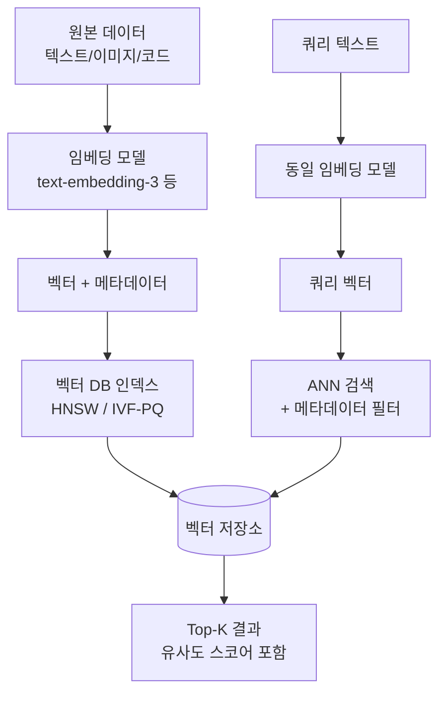
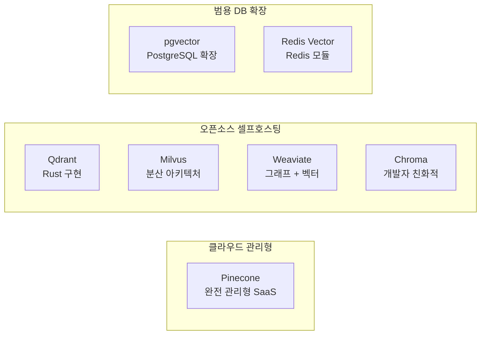
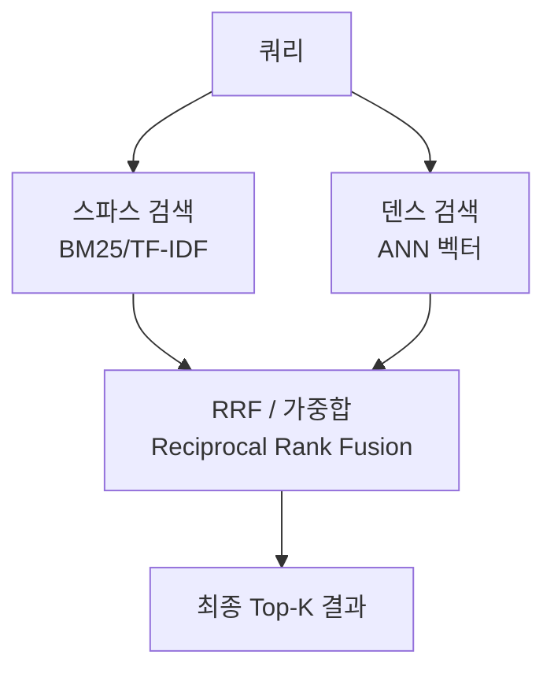

# 벡터 데이터베이스 (Vector Database)

벡터 데이터베이스는 고차원 벡터(임베딩)를 저장하고, 주어진 쿼리 벡터에 대해 가장 유사한 벡터를 빠르게 검색하도록 설계된 특수 목적 데이터베이스다. 텍스트, 이미지, 오디오 등을 [[embedding-models]]로 변환한 결과를 색인하여 의미 기반 검색(semantic search)을 가능하게 한다.

전통적인 RDBMS나 키-값 저장소는 정확 일치(exact match)나 범위 검색을 위한 것이지만, 벡터 데이터베이스는 "이 벡터와 가장 비슷한 Top-K 항목을 찾아라"는 근사 최근접 이웃 검색(ANN: Approximate Nearest Neighbor Search)에 특화돼 있다.

## 왜 벡터 데이터베이스가 필요한가

[[rag|RAG (Retrieval-Augmented Generation)]] 파이프라인의 핵심은 "관련 문서 청크를 빠르게 찾아 LLM에 넘기는 것"이다. 수백만~수억 개의 벡터를 대상으로 브루트포스(brute-force)로 코사인 유사도를 계산하면 쿼리당 초~분 단위 시간이 걸린다. 벡터 데이터베이스는 ANN 인덱스를 통해 정확도를 약간 희생하면서 밀리초 단위 응답을 달성한다.

```
왜 중요한가?
- LLM은 컨텍스트 창이 제한적 → 관련 청크만 선택적으로 주입해야 함
- 실시간 검색 요구사항 (p99 < 100ms)
- 수백만 개 이상의 문서 처리 시 브루트포스 불가
```

## 핵심 아키텍처



위 흐름은 벡터 DB의 두 가지 주요 경로를 보여준다: (1) 문서 인제스트 시 임베딩 생성 후 인덱싱, (2) 쿼리 시 동일 모델로 벡터화 후 ANN 검색.

## ANN 인덱스 알고리즘

### HNSW (Hierarchical Navigable Small World)

[[hnsw-graph-index|HNSW]]는 현재 가장 널리 사용되는 ANN 인덱스 알고리즘이다. 그래프 기반 방식으로, 여러 레이어의 스몰 월드 그래프를 계층적으로 구성한다.

**핵심 아이디어:**
- 최상위 레이어: 희소한 롱 레인지 연결 (빠른 탐색)
- 하위 레이어: 밀집한 숏 레인지 연결 (정밀 검색)
- 쿼리 시 최상위에서 시작해 탐욕적(greedy)으로 하강

**파라미터:**
- `M`: 각 노드의 최대 연결 수 (16~64 일반적). 클수록 정확도 향상, 메모리 증가
- `ef_construction`: 인덱스 빌드 시 탐색 깊이. 클수록 인덱스 품질 향상, 구축 시간 증가
- `ef`: 쿼리 시 탐색 깊이. 클수록 재현율(recall) 향상, 레이턴시 증가

**특성:**
- 시간복잡도: $O(\log n)$ 쿼리
- 메모리: 벡터 크기 × N × (1 + M/2) 바이트 수준
- 삽입: 온라인 삽입 가능 (삭제는 일부 구현만)
- Recall@10: 0.99 수준까지 달성 가능 (ef 조정으로)

### IVF-PQ (Inverted File Index + Product Quantization)

[[ivf-pq-vector-index|IVF-PQ]]는 메모리 효율을 극대화하기 위한 압축 인덱스다.

**IVF (Inverted File Index):**
1. K-Means로 벡터 공간을 `nlist`개 클러스터로 분할
2. 각 벡터를 가장 가까운 클러스터 센트로이드에 할당
3. 쿼리 시 `nprobe`개 클러스터만 탐색 (전체 탐색 X)

**PQ (Product Quantization):**
1. 벡터를 $m$개 서브스페이스로 분할
2. 각 서브스페이스를 $k$개 코드워드로 양자화
3. 전체 벡터 대신 $m$개의 코드 인덱스로 압축 저장

```
예: 1536차원 float32 벡터 (6KB)
→ PQ64: 64개 서브공간 × 8비트 = 64바이트 (96배 압축)
```

**특성:**
- 메모리 대폭 절감 (10~100배)
- 정확도 일부 손실 (ADC 재랭킹으로 보완 가능)
- 빌드 시간이 HNSW보다 짧음 (K-Means 클러스터링 필요)
- 수억 벡터 이상 대규모 데이터에 적합

### FLAT (브루트포스)

인덱스 없이 모든 벡터와 비교. 100% 정확도지만 $O(n)$ 쿼리. 수천~수만 벡터의 소규모 데이터나 정확도가 최우선일 때만 사용.

### ScaNN (Google)

Google이 개발한 Two-pass 알고리즘. 1차 ANISOTROPIC 양자화로 후보 선별, 2차 정확 점수 계산으로 재랭킹. HNSW 대비 일부 시나리오에서 우월한 처리량-정확도 균형 제공.

## 유사도 메트릭

| 메트릭 | 수식 | 특성 | 주요 사용처 |
|--------|------|------|-----------|
| 코사인 유사도 | $\frac{u \cdot v}{\|u\| \|v\|}$ | 크기 무관, 방향만 비교 | 텍스트 임베딩 (가장 일반적) |
| 내적 (dot product) | $u \cdot v$ | L2 정규화 벡터에서 코사인과 동일 | 정규화된 임베딩, MIPS |
| L2 거리 (유클리드) | $\|u - v\|_2$ | 절대 위치 비교 | 이미지 임베딩, 클러스터링 |
| 해밍 거리 | 비트 XOR 합 | 이진 벡터 전용, 매우 빠름 | 해시 기반 임베딩 |

> 실무 팁: OpenAI `text-embedding-3` 계열은 L2 정규화가 적용돼 있어 코사인/내적 모두 동일 결과. 직접 학습한 임베딩은 정규화 여부 확인 필수.

## 메타데이터 필터링

순수 벡터 검색만으로는 충분하지 않다. 실무에서는 필터 조건과 함께 ANN 검색이 필요하다.

```python
# 예: 날짜 범위 + 언어 조건으로 필터링 후 유사도 검색
results = collection.query(
    query_embeddings=[query_vector],
    n_results=10,
    where={
        "$and": [
            {"language": {"$eq": "ko"}},
            {"created_at": {"$gte": "2024-01-01"}}
        ]
    }
)
```

**구현 방식의 트레이드오프:**

- **Pre-filtering**: 메타데이터 조건으로 먼저 후보 집합을 줄인 후 ANN 검색. 후보가 너무 적으면 recall 급감
- **Post-filtering**: ANN으로 Top-K × factor 가져온 후 메타데이터 필터 적용. 결과 수 불안정
- **Hybrid filtering** (Qdrant, Weaviate 등): 인덱스 단계에서 메타데이터를 고려해 구조화. 최적 균형

## 주요 제품 비교



| 제품 | 배포 방식 | 인덱스 | 필터링 | 특징 | 적합 규모 |
|------|-----------|--------|--------|------|-----------|
| **Pinecone** | SaaS 완전 관리 | HNSW 기반 | 메타데이터 필터 | 무인프라, 빠른 시작 | 중~대규모 |
| **Qdrant** | 셀프호스트/클라우드 | HNSW | Payload 필터 | Rust 고성능, 리치 API | 소~대규모 |
| **Milvus** | 셀프호스트/Zilliz | HNSW/IVF-PQ/FLAT 등 | 복합 필터 | 분산 처리, 다양한 인덱스 | 대~초대규모 |
| **Weaviate** | 셀프호스트/클라우드 | HNSW | GraphQL 쿼리 | 벡터+심볼릭 하이브리드 | 소~대규모 |
| **Chroma** | 로컬/서버 | HNSW (hnswlib) | 메타데이터 필터 | 개발/프로토타입 용이 | 소규모 |
| **pgvector** | PostgreSQL 확장 | IVFFlat/HNSW | SQL 전체 기능 | 기존 PG 스택 통합 | 소~중규모 |

### Pinecone

완전 관리형 서비스로, 인프라 없이 즉시 시작할 수 있다. Serverless 아키텍처로 저장과 연산을 분리해 비용 최적화. 단, 벤더 종속성이 생기며 VPC 내부 데이터 요구사항이 있는 경우 부적합.

```python
from pinecone import Pinecone, ServerlessSpec

pc = Pinecone(api_key="YOUR_KEY")
index = pc.Index("my-index")

# Upsert
index.upsert(vectors=[
    {"id": "doc1", "values": [0.1, 0.2, ...], "metadata": {"source": "wiki"}}
])

# Query
results = index.query(vector=[0.1, 0.2, ...], top_k=10, filter={"source": "wiki"})
```

### Qdrant

Rust로 작성된 고성능 벡터 DB. 풍부한 페이로드(payload) 필터링, 스파스 벡터 지원, 양자화 옵션(Scalar/Binary/Product)을 제공한다. Docker 단일 컨테이너로 시작 가능.

```python
from qdrant_client import QdrantClient
from qdrant_client.models import Distance, VectorParams, PointStruct

client = QdrantClient(url="http://localhost:6333")
client.create_collection(
    collection_name="docs",
    vectors_config=VectorParams(size=1536, distance=Distance.COSINE),
)

client.upsert(
    collection_name="docs",
    points=[PointStruct(id=1, vector=[0.1, 0.2, ...], payload={"lang": "ko"})]
)

results = client.search(
    collection_name="docs",
    query_vector=[0.1, 0.2, ...],
    query_filter={"must": [{"key": "lang", "match": {"value": "ko"}}]},
    limit=10,
)
```

### Milvus

분산 아키텍처 (Milvus Distributed)와 단일 노드 (Milvus Lite/Standalone) 모두 지원. IVF-PQ, HNSW, DiskANN 등 다양한 인덱스 타입 선택 가능. GPU 가속 인덱싱 지원. 수억~수십억 벡터 처리가 필요한 엔터프라이즈 환경에 적합.

### Weaviate

벡터 검색과 심볼릭 검색(BM25 등)을 통합한 하이브리드 검색이 강점. GraphQL API로 복잡한 쿼리 표현 가능. 멀티-벡터(multi-vector) 저장 및 Modules 시스템으로 임베딩 모델 통합.

### Chroma

Python 우선 API, SQLite 기반 로컬 모드, HTTP 서버 모드 지원. LangChain/LlamaIndex와 긴밀한 통합. 프로토타입에서 소규모 프로덕션까지 적합. 초대규모 환경에는 부적합.

```python
import chromadb

client = chromadb.Client()  # 인메모리, 또는 PersistentClient("./chroma_db")
collection = client.create_collection("docs")

collection.add(
    documents=["문서 내용..."],
    embeddings=[[0.1, 0.2, ...]],
    ids=["doc1"],
    metadatas=[{"source": "wiki"}]
)

results = collection.query(
    query_embeddings=[[0.1, 0.2, ...]],
    n_results=5,
    where={"source": "wiki"}
)
```

## 하이브리드 검색 (Hybrid Search)

순수 벡터 검색(dense retrieval)만으로는 키워드 정확 매칭, 고유명사, 희귀어 처리가 약하다. 실무에서는 **BM25(sparse) + 벡터(dense)를 결합한 하이브리드 검색**이 일반적으로 더 나은 성능을 보인다.



**RRF (Reciprocal Rank Fusion):**

$$\text{RRF}(d) = \sum_{r \in R} \frac{1}{k + r(d)}$$

여기서 $k$는 상수 (보통 60), $r(d)$는 검색기 $r$에서 문서 $d$의 순위.

## 벡터 DB 선택 기준

| 상황 | 권장 선택 |
|------|-----------|
| 프로토타입/소규모 (<100만 벡터) | Chroma 또는 pgvector |
| 완전 관리형, 빠른 출시 | Pinecone Serverless |
| 셀프호스트, 고성능, 복잡한 필터 | Qdrant |
| 수억 벡터 이상 대규모 분산 | Milvus |
| 기존 PostgreSQL 스택 통합 | pgvector |
| 벡터 + 심볼릭 하이브리드 | Weaviate |

## 성능 최적화 팁

**인덱스 파라미터 튜닝:**
```
HNSW:
- 배치 처리: ef_construction=200, M=32 (빌드 품질 ↑)
- 실시간 쿼리: ef=100-200 (recall 0.99+ 목표)
- 메모리 제한: M=16, ef_construction=100

IVF-PQ:
- nlist = 4 * sqrt(N) (N: 벡터 수)
- nprobe = nlist * 0.05 ~ 0.1 (쿼리 정확도-속도 균형)
```

**배치 삽입:** 단건 삽입보다 배치 업서트가 10~100배 빠름.

**Pre-filtering vs 인덱스:** 메타데이터 필터가 90%+ 데이터를 걸러낼 경우 FLAT + 필터가 HNSW + 후처리보다 빠를 수 있음.

**양자화:** Qdrant Scalar Quantization(INT8)으로 메모리 4배 절감, 속도 향상, 정확도 미미한 손실.

## RAG 파이프라인에서의 위치

```mermaid
flowchart LR
    DOC[문서 수집] --> CHUNK[청킹\n텍스트 분할]
    CHUNK --> EMB[임베딩 생성\n[[embedding-models]]]
    EMB --> IDX[벡터 DB 인덱싱]

    Q[사용자 쿼리] --> QEMB[쿼리 임베딩]
    QEMB --> SEARCH[ANN 검색\n+ 메타데이터 필터]
    IDX --> SEARCH
    SEARCH --> RERANK[리랭킹\n선택적]
    RERANK --> LLM[LLM 컨텍스트 주입]
```

벡터 DB는 [[rag|RAG]] 파이프라인의 "검색 엔진" 역할이며, 품질은 청킹 전략, 임베딩 모델 선택, 인덱스 파라미터의 복합 결과다.

## 관련 문서

- [[hnsw-graph-index]] - HNSW 알고리즘 심화
- [[ivf-pq-vector-index]] - IVF-PQ 양자화 메커니즘
- [[embedding-models]] - 임베딩 모델 선택 가이드
- [[rag]] - RAG 파이프라인 전체 구조
- [[bge-m3-embedding]] - BGE-M3 스파스+덴스 복합 임베딩
