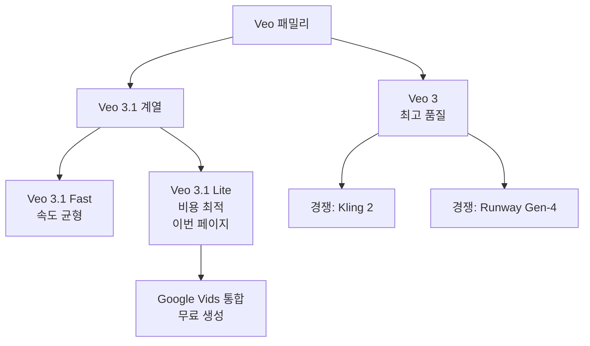

# Veo 3.1 Lite

Veo 3.1 Lite는 Google이 2026년 출시한 비디오 생성 모델로, Veo 3.1 Fast 대비 50% 저렴한 비용에 텍스트-투-비디오(Text-to-Video) 및 이미지-투-비디오(Image-to-Video) 기능을 제공한다. [[ai-video-generation]] 분야에서 비용 효율 구간을 공략하는 경량 버전이며, [[gemini-models]] 에코시스템과 밀접하게 연동된다.

---

## Veo 패밀리 위치



Veo 3.1 Lite는 Veo 3.1 패밀리 내 가장 저렴한 티어로, 전문 영상 제작보다는 프레젠테이션, 교육 자료, 소셜 미디어 콘텐츠 제작을 주요 대상으로 한다.

---

## 핵심 사양

| 항목 | 값 |
|------|-----|
| 출시일 | 2026년 3월 31일 |
| 입력 방식 | 텍스트, 이미지 |
| 출력 해상도 | 720p, 1080p |
| 화면 비율 | 16:9 (가로), 9:16 (세로, 모바일) |
| 접근 경로 | Gemini API (유료 티어), Google AI Studio |
| 비용 | Veo 3.1 Fast 대비 50% 절감 |

---

## 기능 상세

### Text-to-Video

텍스트 프롬프트만으로 영상 클립을 생성한다.

```python
import google.generativeai as genai

# [교차검증 필요 - 실제 Veo API 엔드포인트는 공식 Gemini API 문서 확인]
model = genai.ImageGenerationModel("veo-3.1-lite")
response = model.generate_video(
    prompt="일몰 때 도시 스카이라인을 드론으로 촬영한 영상, 시네마틱 스타일",
    aspect_ratio="16:9",
    resolution="1080p",
)
```

**프롬프트 작성 팁**
- 카메라 무브먼트 명시: "팬 샷", "달리 인", "조감도"
- 분위기/조명 설명: "황금 시간대", "안개 낀 아침"
- 피사체 행동 동사 사용: "걷다", "날다", "변환되다"

### Image-to-Video

정지 이미지에 움직임을 추가하는 기능이다. 마케팅 배너 애니메이션, 제품 쇼케이스, 소셜 미디어 콘텐츠 제작에 유용하다.

- 입력 이미지의 콘텐츠를 보존하면서 자연스러운 움직임 생성
- 배경 움직임(바람에 흔들리는 나무, 흐르는 물) 자동 추가
- 인물 표정 변화, 걷기 동작 생성 가능

---

## Google Vids 통합

2026년 4월 2일, Google Vids(Google Workspace의 AI 영상 편집 도구)에 Veo 3.1 생성 기능이 통합됐다.


**주요 의미**: Google Workspace 계정(개인 포함)을 가진 모든 사용자가 Veo 3.1 기반 영상 생성을 무료로 체험할 수 있다. 생성 횟수 제한은 계정 티어에 따라 다르다. [교차검증 필요 - 정확한 무료 할당량]

---

## Gemini API 연동

[[gemini-models]] 에코시스템의 일부로, Gemini API를 통해 접근한다.

- **유료 티어 전용**: 무료 API 키로는 Veo 모델 접근 불가
- **Google AI Studio**: 프롬프트 테스트 및 프로토타이핑
- **Vertex AI**: 프로덕션 배포 및 엔터프라이즈 거버넌스

---

## 비용 모델

Veo 3.1 Lite는 생성된 영상의 **초당(second-based) 과금** 방식을 따른다. 정확한 단가는 공식 Google AI Studio 가격 페이지에서 확인해야 한다. [교차검증 필요 - 가격 상세]

**Veo 3.1 Fast 대비 50% 절감**이 핵심 포지셔닝이며, 품질과 비용의 트레이드오프를 인정한 설계다. 빠른 이터레이션이 필요한 컨셉 검증 단계나 대량 콘텐츠 생성 파이프라인에 적합하다.

---

## 경쟁 모델 비교

| 모델 | 벤더 | 특징 | 비용 구간 |
|------|------|------|----------|
| Veo 3.1 Lite | Google | Google Vids 통합, Gemini API | 중저가 |
| Veo 3.1 Fast | Google | 속도·품질 균형 | 중가 |
| Kling 2 | Kuaishou | 자연스러운 움직임 | 중가 |
| Runway Gen-4 | Runway | 크리에이티브 특화 | 고가 |
| Sora (OpenAI) | OpenAI | 서사적 일관성 | 고가 |

Veo 3.1 Lite는 가격 경쟁력에서 강점을 보이며, 특히 Google Workspace 통합을 통한 기업 내부 콘텐츠 생성 시나리오에서 차별화된다.

---

## 실무 활용 시나리오

1. **B2B 세일즈 자료**: 텍스트 설명에서 제품 데모 영상 자동 생성
2. **eLearning 콘텐츠**: 강의 슬라이드를 영상 설명으로 변환
3. **소셜 미디어 마케팅**: 이미지 자산을 짧은 숏폼 영상으로 변환
4. **프로토타이핑**: 스토리보드 텍스트를 영상 목업으로 빠르게 시각화

---

## 관련 문서

- [[gemini-models]] - Veo가 통합된 Gemini 에코시스템
- [[ai-video-generation]] - 비디오 생성 AI 일반 개념 및 모델 비교
- [[gemini-2-5-flash-thinking]] - 동일 Gemini API로 접근하는 언어 모델
