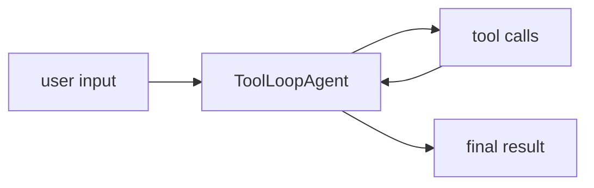
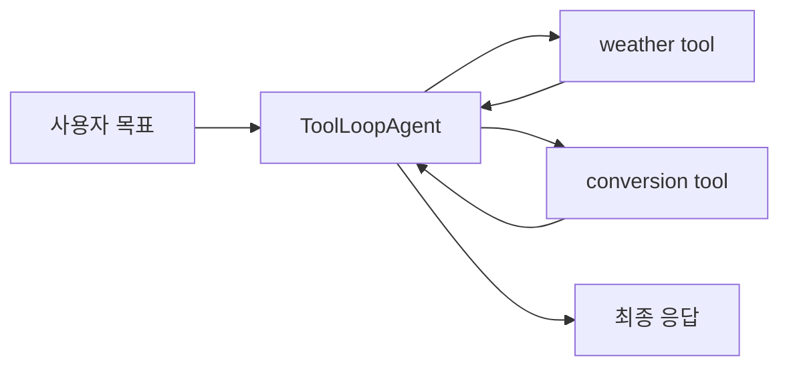

# Vercel AI SDK Agents Overview

[[vercel-ai-sdk|Vercel AI SDK 6]] Agents의 공식 overview 문서 요약이다. ToolLoopAgent와 structured workflows를 중심으로 agent 레이어의 설계 의도를 정리한다.

## 구조도

Vercel AI SDK의 agent 레이어는 무거운 프레임워크라기보다, core primitives 위에 반복 도구 호출 루프를 얹는 얇은 abstraction이다.

## 핵심 구조

`ToolLoopAgent`는 LLM, tools, loop 세 구성요소를 한 class 안에서 다룬다.
- **LLM**: 입력을 처리하고 다음 action을 결정
- **tools**: 파일 읽기, API 호출, database write 등 텍스트 생성 바깥의 능력
- **loop**: context management와 stopping condition 관리

원문 예시는 weather tool과 Fahrenheit-to-Celsius conversion tool을 등록하고, agent가 tool 호출을 자동 진행하는 흐름을 보여 준다. 개발자가 message array와 반복 호출을 직접 관리하지 않아도 된다.

agent는 유연하지만 non-deterministic하다. 명시적인 branch, reusable function, error handling, explicit control flow가 필요하면 core functions로 structured workflow pattern을 만들라고 안내한다.

## 도입 판단표

| 판단 축 | 내용 |
|---|---|
| 핵심 용어 | ToolLoopAgent, LLM/tools/loop, context management, stopping conditions, structured workflows |
| 잘 맞는 상황 | 간단하거나 중간 규모의 tool loop를 기존 Vercel AI SDK 코드에서 점진적으로 agent화하려는 팀 |
| 피해야 할 오해 | ToolLoopAgent를 deterministic workflow engine처럼 쓰거나, long-horizon memory/subagent isolation을 모두 맡기는 것 |

## 프레임워크 비교

| 프레임워크 | agent 추상화 성격 | 적합한 상황 |
| --- | --- | --- |
| Vercel AI SDK Agents | 얇은 ToolLoopAgent abstraction | 기존 TS 앱의 점진적 agent화 |
| [[openai-agents-sdk|OpenAI Agents SDK]] | 공식 multi-agent runtime surface | SDK 중심 orchestration |
| [[langgraph|LangGraph]] / Deep Agents | 더 무거운 상태/하네스 중심 | 장기 작업, 복잡한 흐름 |
| [[mastra|Mastra]] | TypeScript app framework 성격 | TS 앱 통합 중심 |

## 관련 문서

- [[vercel-ai-sdk|Vercel AI SDK 6]]
- [[openai-agents-sdk|OpenAI Agents SDK]]
- [[langgraph|LangGraph 1.0 / 2.0 (Agent Orchestration Framework)]]
