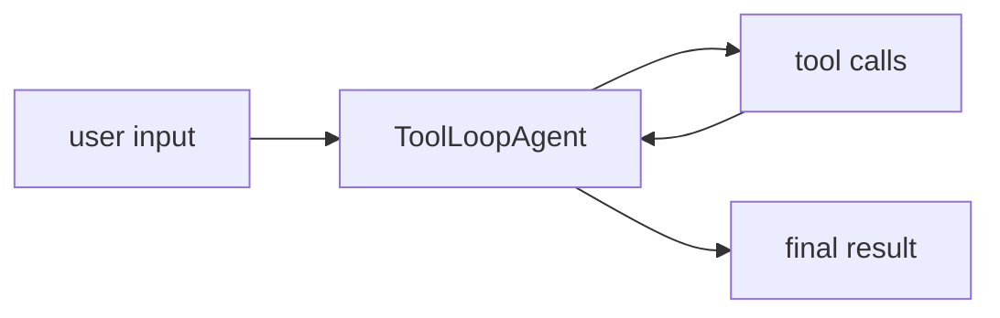

# Vercel AI SDK Agents Overview

Vercel AI SDK Agents의 공식 overview 문서 요약이다. ToolLoopAgent와 structured workflows를 중심으로 agent 레이어의 설계 의도를 정리한다.

## 구조도

Vercel AI SDK의 agent 레이어는 무거운 프레임워크라기보다, core primitives 위에 반복 도구 호출 루프를 얹는 얇은 abstraction이다.

## 핵심 구조

- overview는 Agents를 ToolLoopAgent 중심으로 설명하며, 왜 이런 추상화가 필요한지와 structured workflow 관점을 함께 제시한다.
- 즉 Vercel은 완전히 새로운 runtime을 만들기보다 core primitives 위에 반복 실행 제어를 얹는 방향을 택한다.
- 이 점이 다른 agent 프레임워크와의 큰 차이다.

## 왜 중요한가

- TS 개발자는 필요 이상으로 무거운 orchestration을 도입하지 않고도 agent loop를 구현하고 싶어 한다. ToolLoopAgent는 그 타협점이다.
- 따라서 Vercel AI SDK는 “점진적 에이전트화”에 강하다. 기존 generate/stream 코드에서 agents로 올라가기 쉽다.
- 문서가 structured workflows를 강조하는 이유도 여기에 있다.

## 실무 관점

- 짧은 tool loop, UI 중심 앱, 기존 Next.js 프로젝트에는 이 얇은 agent 레이어가 잘 맞는다.
- 반대로 복잡한 long-horizon memory/subagent isolation이 필요하면 LangGraph나 Deep Agents류가 더 적합할 수 있다.
- 그래서 이 페이지는 [[openai-agents-sdk|OpenAI Agents SDK]], [[langgraph|LangGraph 1.0 / 2.0 (Agent Orchestration Framework)]], [[mastra|Mastra]]와 비교해 읽기 좋다.

## 관련 문서

- [[vercel-ai-sdk|Vercel AI SDK 6]]
- [[openai-agents-sdk|OpenAI Agents SDK]]
- [[langgraph|LangGraph 1.0 / 2.0 (Agent Orchestration Framework)]]
