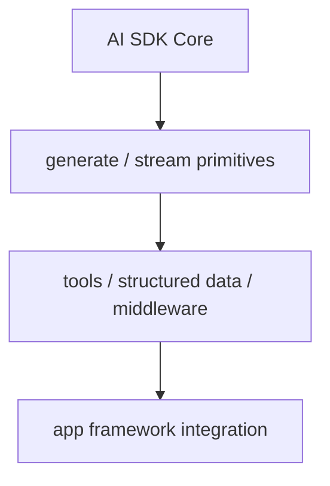

# AI SDK Core Overview

AI SDK Core의 공식 overview 문서 요약이다. Vercel AI SDK의 핵심 함수, 사용 경계, build/scale/secure 관점을 입문용으로 정리한다.

## 구조도

AI SDK Core는 agent abstraction보다 아래층에서, 생성·스트리밍·도구 호출 같은 기본 primitives를 제공하는 핵심 계층이다.

## 핵심 구조

- overview는 AI SDK Core를 Vercel AI SDK의 기반 primitives 레이어로 소개한다.
- 개발자는 여기서 generate, stream, structured data, tool integration 같은 핵심 building block을 이해하게 된다.
- 즉 상위 agent abstraction을 쓰더라도 결국 이 core layer가 밑단 실행 표면이 된다.

## 왜 중요한가

- Core를 이해해야 Vercel AI SDK를 어디까지 라이브러리로 쓰고 어디서부터 자체 orchestration을 올릴지 판단할 수 있다.
- 이 문서는 Vercel AI SDK를 “챗 UI 도구”가 아니라, 생성·스트리밍·도구 호출을 조합하는 TS runtime으로 보게 만든다.
- 특히 React/Next.js 바깥에서도 쓸 수 있는 범용성을 인식하게 해 준다.

## 실무 관점

- 앱이 아직 복잡한 agent loop를 필요로 하지 않는다면, Core primitives만으로도 충분히 강한 제품을 만들 수 있다.
- 반대로 tool calling, MCP, multi-step loop가 필요해지면 상위 docs로 내려가야 한다.
- 따라서 이 문서는 [[vercel-ai-sdk-agents-overview|Vercel AI SDK Agents Overview]], [[vercel-ai-sdk-tool-calling|Vercel AI SDK Tool Calling]], [[vercel-ai-sdk-mcp-tools|Vercel AI SDK MCP Tools]]의 기반 문서다.

## 관련 문서

- [[vercel-ai-sdk|Vercel AI SDK 6]]
- [[vercel-ai-sdk-agents-overview|Vercel AI SDK Agents Overview]]
- [[vercel-ai-sdk-tool-calling|Vercel AI SDK Tool Calling]]

## 읽는 순서

1. 이 문서로 Core primitives 층을 이해한다.
2. [[vercel-ai-sdk-tool-calling|Vercel AI SDK Tool Calling]]으로 runtime 제어 규칙을 본다.
3. [[vercel-ai-sdk-agents-overview|Vercel AI SDK Agents Overview]]로 상위 agent abstraction을 읽는다.
4. 외부 capability 연결이 필요하면 [[vercel-ai-sdk-mcp-tools|Vercel AI SDK MCP Tools]]까지 내려간다.

## 비교 메모

| 층위 | 역할 | 대표 질문 |
| --- | --- | --- |
| Core | generate/stream/tools primitives | 어떤 building block이 있나? |
| Agents | 반복 실행 abstraction | 얼마나 agent화할 것인가? |
| MCP | 외부 capability 연결 | 어떤 context/tool을 붙일 것인가? |

