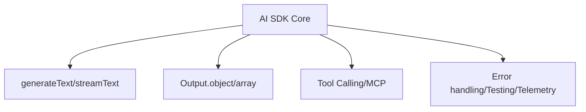

# AI SDK Core Overview

[[vercel-ai-sdk|Vercel AI SDK 6]] Core의 공식 overview 문서 요약이다. 핵심 함수, 사용 경계, build/scale/secure 관점을 입문용으로 정리한다.

## 구조도

AI SDK Core는 agent abstraction보다 아래층에서, 생성·스트리밍·도구 호출 같은 기본 primitives를 제공하는 핵심 계층이다.

## 핵심 구조

- `generateText`: 자동화 작업, 이메일 초안, 웹페이지 요약, tool-using agent 같은 non-interactive use case에 적합
- `streamText`: chatbot이나 content streaming처럼 토큰 도착을 보아야 하는 interactive use case에 적합
- 두 함수 모두 `output` 속성을 통해 `Output.object()`, `Output.array()` 같은 structured output을 지원

Core는 "모델 provider 호출 wrapper"로만 읽으면 부족하다. 원문 navigation 범위에는 generating text, structured data, tool calling, [[vercel-ai-sdk-mcp-tools|MCP]], prompt engineering, settings, embeddings, reranking, image generation, language-model middleware, provider/model management, error handling, testing, telemetry가 함께 포함된다.

## 도입 판단표

| 판단 축 | 내용 |
|---|---|
| 핵심 용어 | `generateText`, `streamText`, `Output.object`, structured output, middleware, provider/model management |
| 잘 맞는 상황 | Next.js나 TypeScript 앱에서 모델 호출·스트리밍·structured extraction을 표준화하고 싶은 팀 |
| 피해야 할 오해 | Core를 chatbot UI helper로만 보거나, 모든 agent orchestration을 Core 한 층에서 직접 만들려는 것 |

## 읽는 순서

1. 이 문서로 Core primitives 층을 이해한다.
2. [[vercel-ai-sdk-tool-calling|Vercel AI SDK Tool Calling]]으로 runtime 제어 규칙을 본다.
3. [[vercel-ai-sdk-agents-overview|Vercel AI SDK Agents Overview]]로 상위 agent abstraction을 읽는다.
4. 외부 capability 연결이 필요하면 [[vercel-ai-sdk-mcp-tools|Vercel AI SDK MCP Tools]]까지 내려간다.

## 관련 문서

- [[vercel-ai-sdk|Vercel AI SDK 6]]
- [[vercel-ai-sdk-agents-overview|Vercel AI SDK Agents Overview]]
- [[vercel-ai-sdk-tool-calling|Vercel AI SDK Tool Calling]]
