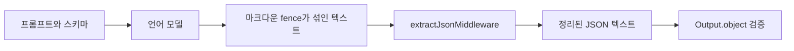

# Vercel AI SDK extractJsonMiddleware

`extractJsonMiddleware()`는 [[vercel-ai-sdk|Vercel AI SDK 6]]의 AI SDK Core reference에 포함된 제품별 API다. 이 문서는 일반적인 JSON 파싱 개념을 새로 정의하려는 문서가 아니라, AI SDK에서 `wrapLanguageModel`과 함께 쓰는 language-model middleware를 어떻게 읽어야 하는지 정리한 project-internal 노드다. 원래 빈 placeholder는 AI SDK 공식 문서 내 `/docs/reference/ai-sdk-core/extract-json-middleware` 링크에서 파생된 것으로 보이며, 실제 위키에서는 이 API가 [[vercel-ai-sdk-core-overview|AI SDK Core Overview]], [[vercel-ai-sdk-tool-calling|Vercel AI SDK Tool Calling]], 구조화 출력, streaming 응답 처리 사이의 작은 연결점 역할을 한다.

## 핵심 정의

공식 문서 기준으로 `extractJsonMiddleware`는 모델이 JSON 응답을 markdown code fence 안에 감싸서 반환할 때, 그 fence와 주변 포맷을 벗겨내기 위한 middleware다. 특히 `Output.object()`처럼 스키마 기반 구조화 출력을 기대하는 경로에서 모델이 ```json 같은 fence를 붙이면, downstream parser는 순수 JSON 대신 마크다운 텍스트를 받게 된다. 이 middleware는 그런 모델 출력 습관을 AI SDK 쪽에서 완충한다.

중요한 점은 이 기능이 “모델에게 JSON을 더 잘 쓰게 만드는 프롬프트”가 아니라 “모델이 이미 낸 텍스트를 SDK boundary에서 정리하는 후처리 계층”이라는 점이다. 그래서 책임 경계는 분명하다. 프롬프트와 schema는 여전히 올바른 구조를 요구해야 하고, middleware는 fence 제거와 custom transform 적용을 맡는다. JSON 구조 자체가 깨졌거나 스키마와 맞지 않는 문제까지 자동으로 고쳐 주는 만능 복구 장치로 읽으면 안 된다.

## 사용 위치



이 흐름은 middleware가 모델 앞이 아니라 모델 뒤, 그리고 structured output 검증 앞에 놓인다는 점을 보여준다. 즉 이 노드는 [[tool-contracts-for-agents|도구 계약]]처럼 입력 계약을 설계하는 문제와도 연결되지만, 실제 성격은 AI SDK 내부 응답 정규화 계층에 더 가깝다.

## API 표면

공식 reference의 핵심 표면은 간단하다. `extractJsonMiddleware`는 `ai` 패키지에서 import하고, 기본 호출은 인자 없이 `extractJsonMiddleware()` 형태로 사용한다. 더 세밀한 처리가 필요할 때는 `transform?: (text: string) => string` 형태의 custom transform을 넘길 수 있다. 기본 transform은 markdown code fence를 벗겨내는 역할을 하며, custom transform은 prefix, suffix, 모델별 wrapper 문구처럼 프로젝트에서 관찰한 특수 포맷을 제거하는 데 쓴다.

이 API는 보통 `wrapLanguageModel`과 함께 사용된다. `generateText`나 `streamText`를 호출할 때 원래 모델을 그대로 넘기는 대신, 모델을 middleware로 감싼 language model로 전달한다. 그 결과 호출부는 `Output.object()` 같은 구조화 출력 선언을 유지하면서, 모델이 fence를 붙이는 문제를 SDK 레벨에서 흡수할 수 있다.

## streaming과 non-streaming의 차이

non-streaming 경로에서는 middleware가 전체 모델 응답을 받은 뒤 transform을 적용한다. 전체 문자열을 이미 확보했으므로 prefix와 suffix를 제거하는 작업이 단순하다. 반면 streaming 경로에서는 fence 시작과 종료가 여러 chunk에 걸쳐 나뉘어 도착할 수 있다. 그래서 공식 문서는 초기 content를 buffer하여 fence prefix를 감지하고, streaming 모드로 전환한 뒤, 닫는 fence를 처리하기 위한 작은 suffix buffer를 유지한다고 설명한다.

이 차이는 실무적으로 중요하다. stream UI에서 partial object를 즉시 보여 주려면 너무 큰 buffer를 잡으면 지연이 늘고, 너무 작은 buffer를 잡으면 닫는 fence를 놓칠 수 있다. AI SDK가 이 middleware를 공식 API로 제공한다는 것은, 구조화 출력과 streaming을 같이 쓰는 경로에서 이런 edge case를 application code마다 반복 구현하지 말라는 신호로 읽을 수 있다.

## 언제 쓰는가

| 상황 | 판단 |
|---|---|
| 모델이 JSON을 ```json fence 안에 감싼다 | 사용 후보 |
| `Output.object()`가 순수 JSON 대신 markdown wrapper 때문에 실패한다 | 사용 후보 |
| streaming structured output을 유지해야 한다 | 사용 후보 |
| JSON 값 자체가 잘못되거나 schema가 불안정하다 | middleware만으로 부족 |
| provider별로 prefix/suffix가 다르다 | custom transform 검토 |

이 표에서 핵심은 실패 원인을 분리하는 것이다. fence 제거 문제라면 `extractJsonMiddleware`가 맞지만, schema 설계가 약하거나 모델이 필드를 누락하는 문제라면 [[vercel-ai-sdk-tool-calling|tool calling]], schema, retry, eval 쪽에서 해결해야 한다.

## ingest 판단

이 문서는 `page_type: project-internal`로 분류했다. JSON extraction 자체는 일반 개념으로 확장할 수 있지만, 여기서 다루는 내용은 Vercel AI SDK의 특정 export, `wrapLanguageModel`, `Output.object()`, streaming 처리 방식에 묶여 있다. 따라서 `concept` 노드로 분리하지 않고 [[vercel-ai-sdk|Vercel AI SDK]] 하위 API 노드로 둔다.

또한 이 노드는 “빈 문서 정리” 관점에서 보존 가치가 있다. 기존 placeholder는 단순히 제목만 있는 문서였지만, 실제 공식 문서에는 구조화 출력 실패를 줄이는 구체적 API가 있었기 때문이다. 삭제만 하면 AI SDK reference corpus의 coverage가 빠지고, 반대로 일반 JSON 파싱 개념으로 승격하면 특정 SDK 구현 디테일이 concept 영역을 오염시킨다. 그래서 product-specific API note로 위키화하는 것이 적절하다.

## 운영 해석 보강

이 API를 적용할 때 가장 먼저 확인할 것은 “모델이 왜 fence를 붙였는가”가 아니라 “그 fence가 어느 boundary에서 문제를 일으키는가”다. 프롬프트를 더 강하게 써서 JSON만 내라고 요구하는 방식도 가능하지만, 실제 운영에서는 provider, model family, sampling setting, system prompt, tool instruction이 조금만 바뀌어도 출력 포맷이 흔들릴 수 있다. 그러므로 structured output pipeline에서는 모델 출력의 작은 포맷 변동을 application logic 전체로 퍼뜨리지 않는 완충 계층이 필요하다. `extractJsonMiddleware`는 바로 그 완충 계층 중 하나다.

다만 이 middleware를 넣었다고 해서 검증 책임이 사라지는 것은 아니다. schema validation은 여전히 `Output.object()` 이후 단계에서 실패할 수 있고, 실패 로그는 별도로 남겨야 한다. 특히 custom transform을 사용할 때는 transform이 정상 JSON 안의 문자열까지 과도하게 바꾸지 않는지 확인해야 한다. prefix와 suffix 제거는 안전해 보이지만, 모델이 본문 안에 동일한 토큰을 포함할 경우 의도치 않은 손상이 생길 수 있다. 그래서 custom transform은 정규식 범위를 최대한 좁히고, representative fixture를 두어 regression test를 만드는 것이 좋다.

AI SDK 문맥에서 이 노드는 [[vercel-ai-sdk-mcp-tools|Vercel AI SDK MCP Tools]]처럼 큰 통합 기능을 다루는 문서가 아니라, 작은 failure mode를 흡수하는 “경계 정리” 문서다. 그러나 이런 작은 API가 실제 agentic application에서는 중요하다. 장기 실행 에이전트나 multi-step tool call 흐름은 한 번의 출력 포맷 실패가 전체 trajectory 실패로 번질 수 있기 때문이다. 따라서 이 노드는 [[tool-contracts-for-agents|Tool Contracts & Writing Tools for Agents]]를 읽은 뒤, 구체적인 SDK 구현에서 contract drift를 어떻게 줄이는지 확인할 때 함께 읽는 것이 좋다.


## 회귀 테스트 관점

이 middleware를 도입한 뒤에는 최소 두 종류의 fixture를 남기는 것이 좋다. 첫째는 모델이 순수 JSON만 반환하는 정상 사례이고, 둘째는 동일 JSON을 markdown fence로 감싼 사례다. 두 fixture가 같은 `Output.object()` 결과로 수렴하면 middleware의 목적이 충족된다. 여기에 streaming chunk가 fence 경계에서 잘리는 사례를 추가하면, 공식 문서가 강조한 buffering 동작까지 더 안전하게 검증할 수 있다. 이런 테스트는 API 자체를 재구현하려는 것이 아니라, application이 이 API를 적용한 위치가 올바른지 확인하는 얇은 regression guard다.

## 관련 문서

- [[vercel-ai-sdk|Vercel AI SDK 6]] — 상위 제품 허브
- [[vercel-ai-sdk-core-overview|AI SDK Core Overview]] — Core primitive 맥락
- [[vercel-ai-sdk-tool-calling|Vercel AI SDK Tool Calling]] — structured output 주변의 tool contract
- [[tool-contracts-for-agents|Tool Contracts & Writing Tools for Agents]] — 에이전트용 도구 계약 설계 관점

