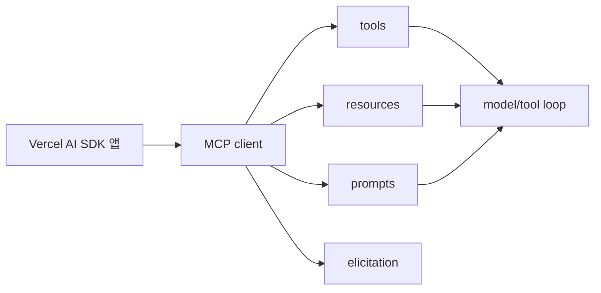

# Vercel AI SDK MCP Tools

[[vercel-ai-sdk-core-overview|AI SDK Core]]의 [[model-context-protocol-mcp|MCP]] tools 문서 요약이다. MCP client 초기화, tools/resources/prompts 사용, elicitation handling을 중심으로 Vercel 방식의 MCP 통합을 설명한다.

## 구조도

Vercel AI SDK의 MCP 통합은 tools만이 아니라 resources와 prompts까지 같은 client surface로 다루는 점이 특징이다.

## 핵심 구조

문서 구조: MCP client 초기화 → MCP tools 사용 → MCP resources 사용 → MCP prompts 사용 → elicitation request handling

- **tools**: 모델이 호출 가능한 외부 capability
- **resources**: 외부 context를 읽는 표면
- **prompts**: server가 제공하는 prompt template/interface
- **elicitation**: MCP server가 사용자나 host에게 추가 정보를 요청하는 흐름 -- UI와 approval 설계가 중요해진다

## 실무 관점

- Vercel 기반 앱에서 MCP를 붙일 때는 client lifecycle과 사용자 승인 UI를 같이 설계해야 한다.
- [[mcp-architecture|MCP Architecture]]를 읽은 뒤에 보는 것이 좋다. host/client/server 경계를 이해하지 못하면 AI SDK의 helper가 어떤 책임을 대신하는지 혼동하기 쉽다.
- resource와 prompt 노출 범위를 제한하는 것이 보안·비용에 직접 연결된다.

## 비교 메모

| 표면 | 의미 | 실무 질문 |
| --- | --- | --- |
| tools | 실행 가능한 기능 | 무엇을 호출하게 할까? |
| resources | 읽기 컨텍스트 | 무엇을 노출해야 하나? |
| prompts | 재사용 지시/템플릿 | 어떤 기본 지시를 공유할까? |

## 운영 체크리스트

- MCP client lifecycle을 누가 관리하는가?
- 사용자 승인 UI가 필요한 도구가 있는가?
- resources/prompts 노출 범위를 제한했는가?
- tool, resource, prompt별 감사 로그를 남길 수 있는가?

## 관련 문서

- [[vercel-ai-sdk|Vercel AI SDK 6]]
- [[model-context-protocol-mcp|Model Context Protocol (MCP)]]
- [[mcp-architecture|MCP Architecture]]
