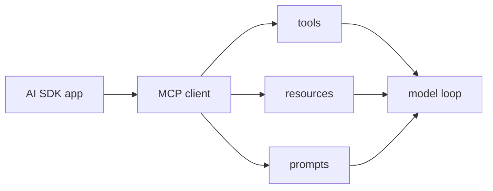

# Vercel AI SDK MCP Tools

AI SDK Core의 MCP tools 문서 요약이다. MCP client 초기화, tools/resources/prompts 사용, elicitation handling을 중심으로 Vercel 방식의 MCP 통합을 설명한다.

## 구조도

Vercel AI SDK의 MCP 통합은 tools만이 아니라 resources와 prompts까지 같은 client surface로 다루는 점이 특징이다.

## 핵심 구조

- 문서는 MCP client 초기화에서 시작해 tools, resources, prompts, elicitation request handling까지 설명한다.
- 즉 MCP를 단순 tool registry가 아니라 richer context interface로 본다.
- 이것은 AI SDK Core가 generated text뿐 아니라 external capability orchestration을 중요한 층으로 본다는 뜻이다.

## 왜 중요한가

- MCP는 이제 TS 프레임워크에서도 핵심 통합면이 되었고, Vercel AI SDK는 이를 app-friendly하게 포장한다.
- resources와 prompts까지 같이 다루는 점은 “도구만 붙이면 끝”이라는 단순화를 깨 준다.
- 결국 MCP 통합은 tool use, context provisioning, approval를 함께 다루는 문제다.

## 실무 관점

- Vercel 기반 앱에서 MCP를 붙일 때는 client lifecycle과 사용자 승인 UI를 같이 설계해야 한다.
- 또한 어떤 resource와 prompt를 모델에 노출할지 선택하는 것이 보안과 비용에 직접 연결된다.
- 이 문서는 [[model-context-protocol-mcp|Model Context Protocol (MCP)]], [[mcp-architecture|MCP Architecture]]와 같이 읽는 것이 좋다.

## 관련 문서

- [[vercel-ai-sdk|Vercel AI SDK 6]]
- [[model-context-protocol-mcp|Model Context Protocol (MCP)]]
- [[mcp-architecture|MCP Architecture]]
