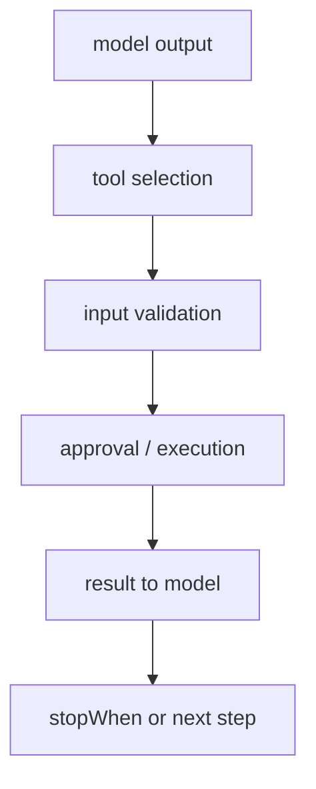

# Vercel AI SDK Tool Calling

AI SDK Core의 tool calling 문서 요약이다. strict mode, input examples, tool execution approval, multi-step calls를 중심으로 실제 도구 호출 운영 규칙을 정리한다.

## 구조도

Vercel AI SDK의 tool calling은 단순 함수 연결이 아니라 validation, approval, multi-step control을 포함한 운영 표면이다.

## 핵심 구조

- 문서는 tool calling을 strict mode, input examples, execution approval, stopWhen 기반 multi-step calls 등으로 세분화해 설명한다.
- 이 구조는 도구 호출을 단순 부가기능이 아니라 핵심 runtime concern으로 다룬다는 신호다.
- 특히 approval와 lifecycle hooks는 제품 운영에서 매우 중요하다.

## 왜 중요한가

- 대부분의 agent 실패는 tool selection이나 tool execution 경계에서 발생한다. 이 문서는 그 경계를 체계적으로 다루게 해 준다.
- Vercel이 tool input lifecycle hooks까지 문서화하는 점은, 개발자가 observability와 policy를 붙일 여지를 준다.
- 즉 tool calling은 prompt trick이 아니라 interface engineering이다.

## 실무 관점

- 승인(approval)과 strict validation은 특히 실제 사용자 자원에 접근하는 앱에서 필수다.
- stopWhen 같은 multi-step 제어 규칙은 무한 loop와 비용 폭주를 막는 데 중요하다.
- 이 문서는 [[writing-effective-tools-for-agents|Writing Effective Tools for Agents]]와 함께 읽으면 더욱 유용하다.

## 관련 문서

- [[vercel-ai-sdk|Vercel AI SDK 6]]
- [[vercel-ai-sdk-mcp-tools|Vercel AI SDK MCP Tools]]
- [[writing-effective-tools-for-agents|Writing Effective Tools for Agents]]

## 운영 체크리스트

- strict mode를 어디에 기본 적용할지 정했는가?
- approval이 필요한 도구와 자동 실행 가능한 도구를 구분했는가?
- stopWhen 같은 multi-step 종료 규칙이 있는가?
- tool input/output lifecycle을 관측할 수 있는가?

## 읽는 순서

- 이 문서로 tool execution policy를 정리한다.
- [[writing-effective-tools-for-agents|Writing Effective Tools for Agents]]로 tool 인터페이스 설계를 보강한다.
- 외부 서버형 도구가 필요하면 [[vercel-ai-sdk-mcp-tools|Vercel AI SDK MCP Tools]]로 확장한다.

