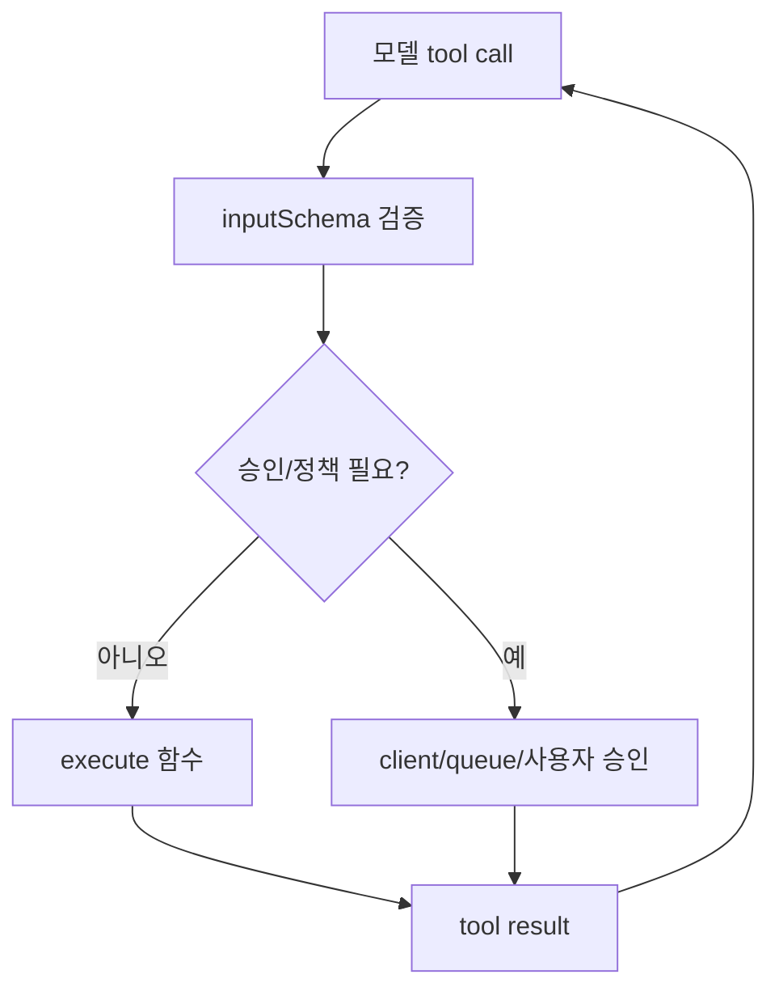

# Vercel AI SDK Tool Calling

[[vercel-ai-sdk-core-overview|AI SDK Core]]의 tool calling 문서 요약이다. strict mode, input examples, tool execution approval, multi-step calls를 중심으로 실제 도구 호출 운영 규칙을 정리한다.

## 구조도

Vercel AI SDK의 tool calling은 단순 함수 연결이 아니라 validation, approval, multi-step control을 포함한 운영 표면이다.

## 핵심 구조

tool 구성요소:
- `description`: 모델이 언제 도구를 고를지에 영향
- `inputSchema`: Zod schema 또는 JSON schema로 입력 정의. LLM에 전달될 뿐 아니라 실제 validation에도 사용
- `execute`: optional. tool call을 client나 queue로 넘기고 같은 process에서 실행하지 않을 수도 있다
- `strict`: provider가 지원할 때 schema에 맞는 tool call만 생성 (신뢰도 개선 옵션이지 보안 경계가 아님)

## 도입 판단표

| 판단 축 | 내용 |
|---|---|
| 핵심 용어 | tool object, description, inputSchema, execute, strict mode, approval, stopWhen, dynamic tools, tool call repair |
| 잘 맞는 상황 | 모델이 외부 API나 사용자 자원에 접근해야 하고, schema validation과 execution policy를 명시해야 하는 앱 |
| 피해야 할 오해 | `execute`가 optional이라는 점을 무시하고 모든 tool call을 서버 process에서 즉시 실행하도록 고정하는 것 |

## 운영 체크리스트

- strict mode를 어디에 기본 적용할지 정했는가?
- approval이 필요한 도구와 자동 실행 가능한 도구를 구분했는가?
- `stopWhen` 같은 multi-step 종료 규칙이 있는가?
- tool input/output lifecycle을 관측할 수 있는가?

## 읽는 순서

1. 이 문서로 tool execution policy를 정리한다.
2. [[writing-effective-tools-for-agents|Writing Effective Tools for Agents]]로 tool 인터페이스 설계를 보강한다.
3. 외부 서버형 도구가 필요하면 [[vercel-ai-sdk-mcp-tools|Vercel AI SDK MCP Tools]]로 확장한다.

## 관련 문서

- [[vercel-ai-sdk|Vercel AI SDK 6]]
- [[vercel-ai-sdk-mcp-tools|Vercel AI SDK MCP Tools]]
- [[writing-effective-tools-for-agents|Writing Effective Tools for Agents]]
